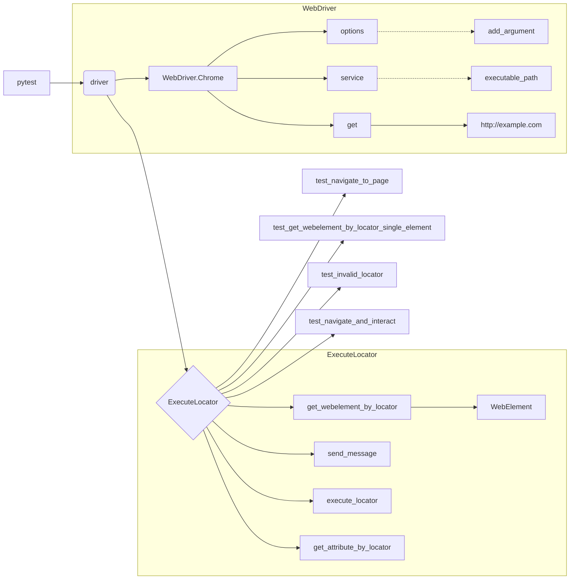

# <input code>

```python
## \file hypotez/src/webdriver/_pytest/test_driver_executor.py
# -*- coding: utf-8 -*-\n#! venv/Scripts/python.exe\n#! venv/bin/python/python3.12\n\n"""
.. module: src.webdriver._pytest 
	:platform: Windows, Unix
	:synopsis:

"""
MODE = 'dev'


"""
	:platform: Windows, Unix
	:synopsis:

"""


"""
	:platform: Windows, Unix
	:synopsis:

"""


"""
  :platform: Windows, Unix

"""
"""
  :platform: Windows, Unix
  :platform: Windows, Unix
  :synopsis:
"""MODE = 'dev'
  
""" module: src.webdriver._pytest """


""" Общий тест для driver и executor
test_navigate_to_page: Проверяет, что WebDriver корректно загружает указанную страницу.
test_get_webelement_by_locator_single_element: Проверяет, что метод get_webelement_by_locator корректно возвращает элемент по локатору.
test_get_webelement_by_locator_no_element: Проверяет, что метод get_webelement_by_locator возвращает False, если элемент не найден.
test_send_message: Проверяет, что метод send_message корректно отправляет сообщение элементу.
test_get_attribute_by_locator: Проверяет, что метод get_attribute_by_locator корректно возвращает атрибут элемента.
test_execute_locator_event: Проверяет, что метод execute_locator корректно выполняет событие на локаторе.
test_get_locator_keys: Проверяет, что метод get_locator_keys возвращает правильные ключи локатора.
test_navigate_and_interact: Проверяет последовательность навигации и взаимодействия с элементами на другой странице.
test_invalid_locator: Проверяет обработку некорректных локаторов и соответствующее исключение.
"""


import pytest
from selenium import webdriver
from selenium.webdriver.chrome.service import Service
from selenium.webdriver.common.by import By
from selenium.webdriver.chrome.options import Options
from selenium.webdriver.remote.webelement import WebElement
from selenium.webdriver.common.action_chains import ActionChains
from selenium.webdriver.support.ui import WebDriverWait
from selenium.webdriver.support import expected_conditions as EC
from src.webdriver.executor import ExecuteLocator
from src.logger.exceptions import ExecuteLocatorException

@pytest.fixture(scope="module")
def driver():
    """Fixture to set up and tear down the WebDriver."""
    options = Options()
    options.add_argument("--headless")  # Run headless browser for testing
    service = Service(executable_path="/path/to/chromedriver")  # Path to your chromedriver
    driver = webdriver.Chrome(service=service, options=options)
    driver.get("http://example.com")  # URL for the tests
    yield driver
    driver.quit()

@pytest.fixture
def execute_locator(driver):
    """Fixture to initialize the ExecuteLocator instance."""
    return ExecuteLocator(driver)

# Примеры тестов для взаимодействия с WebDriver и ExecuteLocator
# ... (тестовые функции)
```

# <algorithm>

**Шаг 1:** **Инициализация драйвера:**
    - Создается экземпляр `webdriver.Chrome` с опцией `headless` (для работы без графического интерфейса).
    - Устанавливается путь к `chromedriver` (`executable_path`).
    - Переходит на страницу `http://example.com`.
    - Возвращает драйвер.
    - Закрывает драйвер.


**Шаг 2:** **Инициализация `ExecuteLocator`:**
    - Создается экземпляр класса `ExecuteLocator`, передавая в конструктор `driver`.
    - Возвращает экземпляр `ExecuteLocator`.


**Шаг 3:** **Тестирование методов `ExecuteLocator`:**
    - Выполняются различные тестовые функции (`test_navigate_to_page`, `test_get_webelement_by_locator_single_element`, и т.д.) для проверки работы методов класса `ExecuteLocator` с помощью драйвера.

Пример: `test_get_webelement_by_locator_single_element`:
- Передается локатор (`locator`) для поиска элемента `<h1>`.
- Вызывается метод `execute_locator.get_webelement_by_locator` для поиска элемента.
- Проверяется, что возвращаемое значение `isinstance(element, WebElement)`.
- Проверяется значение `element.text` и сравнивается с ожидаемым значением.


**Шаг 4:** **Обработка исключений:**
    - В `test_invalid_locator` тестируется обработка исключений `ExecuteLocatorException` при передаче некорректного локатора.


**Шаг 5:** **Тестирование навигации и взаимодействия:**
    - `test_navigate_and_interact` демонстрирует навигацию на новую страницу (`https://www.wikipedia.org/`) и взаимодействие с элементами на этой странице.


**Пример перемещения данных:**
Функция `driver` возвращает объект `driver` (WebDriver), который затем используется в `execute_locator`.  Функция `execute_locator` возвращает объект `ExecuteLocator`, работающий с полученным `driver`. Тестовые функции (например, `test_navigate_to_page`) используют `driver` и `execute_locator`, передавая данные между ними.

# <mermaid>



**Объяснение зависимостей (mermaid):**

- `pytest` запускает тесты.
- `driver` (WebDriver) отвечает за взаимодействие с браузером. Внутри `driver` есть зависимости от:
    - `options`: для настройки браузера (например, `headless`).
    - `service`: для управления `chromedriver`.
    - `executable_path`: путь к исполняемому файлу `chromedriver`.
- `ExecuteLocator` использует `driver` для взаимодействия с веб-элементами.


# <explanation>

**Импорты:**

- `pytest`: фреймворк для написания и запуска тестов.
- `selenium`, `webdriver`, `Service`, `By`, `Options`, `WebElement`, `ActionChains`, `WebDriverWait`, `expected_conditions`: библиотеки Selenium для автоматизации браузера.
- `ExecuteLocator`: класс из пакета `src.webdriver.executor` для выполнения действий с веб-элементами.
- `ExecuteLocatorException`: класс исключения из пакета `src.logger.exceptions` для обработки ошибок при взаимодействии с локаторами.

Связь с другими частями проекта: `ExecuteLocator` напрямую зависит от `src.webdriver.executor` и использует `src.logger.exceptions`.


**Классы:**

- `ExecuteLocator`: класс для выполнения действий с веб-элементами (напр., клик, ввод текста).  Он содержит методы для поиска элементов, отправки сообщений, получения атрибутов и т.д.


**Функции:**

- `driver()`: фикстура для инициализации и завершения сессии WebDriver.
- `execute_locator()`: фикстура для инициализации экземпляра класса `ExecuteLocator`.
- Все функции тестов (например, `test_navigate_to_page`) содержат проверки поведения `WebDriver` и `ExecuteLocator` в определенных сценариях.


**Переменные:**

- `MODE`: строковая переменная со значением "dev", скорее всего, используется для выбора режима работы.
- `locator`: словарь, хранящий информацию о локаторах веб-элементов (`"by"`, `"selector"`).
- `message`: строка, содержащая информацию о типе действия (например, "click" или строка для ввода).

**Возможные ошибки и улучшения:**

- **Пути к chromedriver:** Путь к chromedriver (`/path/to/chromedriver`) должен быть корректным для вашей системы. Лучше использовать абсолютный путь или хранить этот путь в переменной окружения.
- **Более подробная проверка:**  Тесты могли бы быть улучшены добавлением более подробной проверки найденных элементов (например, тип элемента, ожидаемое значение атрибута).
- **Исключение некорректного типа локатора:** Проверка на некорректный тип локатора могла бы быть выполнена при передаче `locator` в методы.
- **Логирование:** Добавление логирования улучшило бы отладку тестов и предоставление дополнительной информации об их ходе.
- **Управление временем ожидания:** Использование `WebDriverWait` и `expected_conditions` для определения ожидаемых элементов позволит сделать тесты более надежными и гибкими.
- **Модульная проверка locator:**  Добавление проверки корректности локатора (например, `by` должен быть строкой, `selector` — правильным xpath) в самом `ExecuteLocator`  сделает код более robust.
- **typing:** Использование аннотаций типов позволит указать типы переменных, что сделает код более читабельным и легко проверяемым.