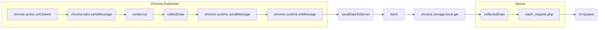

# Анализ кода background.js

**1. <input code>**

```javascript
// background.js

chrome.action.onClicked.addListener((tab) => {
    chrome.tabs.sendMessage(tab.id, { action: 'collectData', url: tab.url });
});

/**
 * This function listens for messages sent from other parts of the extension, 
 * such as content scripts or other background scripts, using the `chrome.runtime.sendMessage()` method.
 * 
 * Here's a breakdown of what each part does:
 * 
 * - `chrome.runtime.onMessage.addListener()`: This function sets up a listener for messages sent from other parts of the extension.
 * - `(message, sender, sendResponse) => { ... }`: This is an arrow function that defines what should happen when a message is received. It takes three parameters:
 *   - `message`: The message object sent from the sender.
 *   - `sender`: Information about the sender of the message, such as its ID and whether it is a tab or another extension.
 *   - `sendResponse`: A function that can be used to send a response back to the sender if needed.
 * - `if (message.action === 'collectData') { ... }`: This condition checks if the received message has a property named `action` with a value of `'collectData'`. This is often used to determine the purpose or type of the message.
 * - `sendDataToServer(message.url)`: If the received message has an action of `'collectData'`, this function calls another function named `sendDataToServer()` and passes the URL from the message as an argument. This typically triggers some action or behavior in response to the received message.
 * 
 * In summary, this function listens for messages with the action `'collectData'`, and when such a message is received, it triggers the `sendDataToServer()` function, presumably to collect data and send it to a server.
 */
chrome.runtime.onMessage.addListener((message, sender, sendResponse) => {
    if (message.action === 'collectData') {
        sendDataToServer(message.url);
    }
});

function sendDataToServer(url) {
    const serverUrl = 'http://127.0.0.1/hypotez/catch_request.php'; // Change to your server endpoint
    chrome.storage.local.get('collectedData', (result) => {
        const collectedData = result.collectedData;
        if (collectedData) {
            fetch(serverUrl, {
                method: 'POST',
                headers: {
                    'Content-Type': 'application/json'
                },
                body: JSON.stringify(collectedData)
            })
                .then(response => {
                    if (!response.ok) {
                        throw new Error('Failed to send data to server');
                    }
                    console.log('Data sent to server successfully');
                })
                .catch(error => {
                    console.error('Error sending data to server:', error);
                });
        } else {
            console.error('No collected data found');
        }
    });
}
```

**2. <algorithm>**

```mermaid
graph TD
    A[Кнопка расширения кликнута] --> B{Обработка нажатия};
    B -- tab.id --> C[Отправка сообщения];
    C --> D{Получение сообщения};
    D -- message.action === 'collectData' --> E[sendDataToServer(message.url)];
    E --> F[Получение данных из chrome.storage.local];
    F -- collectedData --> G{Данные существуют?};
    G -- Да --> H[Отправка данных на сервер];
    G -- Нет --> I[Ошибка: нет данных];
    H --> J[Успешная отправка];
    I --> K[Ошибка отправки];
    J --> L[Завершение];
    K --> L;
```

**3. <mermaid>**



**4. <explanation>**

* **Импорты:** Нет прямых импортов. Код использует API Chrome Extensions.
* **Классы:** Нет определённых классов.
* **Функции:**
    * `chrome.action.onClicked.addListener()`:  Функция-обработчик события клика на иконку расширения. Отправляет сообщение в активную вкладку для сбора данных.
    * `chrome.runtime.onMessage.addListener()`:  Слушает сообщения, отправленные из других частей расширения, например, из `content.js`. Обрабатывает сообщения с действием `collectData` вызывая `sendDataToServer`. Важно, что эта функция возвращает `true` для поддержки асинхронных ответов.
    * `sendDataToServer(url)`: Отправляет собранные данные (из chrome.storage.local) на сервер по указанному `url`. Использует `fetch` для отправки POST запроса с данными. Обрабатывает успешную и неуспешную отправку данных.

* **Переменные:**
    * `serverUrl`: Строка, содержащая URL сервера. Важно использовать константу.
    * `collectedData`: Данные, которые должны быть отправлены на сервер. Хранятся в хранилище `chrome.storage.local`.
* **Возможные ошибки и улучшения:**
    * **Обработка ошибок `fetch`:** Необходимо более детально обрабатывать ошибки при отправке данных на сервер, чтобы понимать, что происходит при сбоях. Например, добавить проверку статуса ответа.
    * **Логирование:**  Больше логирования ошибок, особенно при отсутствии данных в хранилище.
    * **Асинхронность:**  Важно обработать асинхронность `fetch` запроса.
    * **Безопасность:** Убедитесь, что `serverUrl`  получен из надёжного источника и не подставляется напрямую из пользовательского ввода.
    * **Детализация данных:**  В идеале `collectedData` должен быть более структурированным объектом для лучшей обработки на стороне сервера.

**Цепочка взаимосвязей:**

Расширение (background.js) получает данные из активной вкладки (content.js). Собирает данные и отправляет их на сервер.  Происходит взаимодействие через API Chrome Extensions.  `content.js` (если он есть) собирает необходимые данные на стороне вкладки и отправляет их в `background.js`.   `catch_request.php` (или подобный скрипт) - это серверный код, который обрабатывает POST-запросы.


**Примечание:** Код `content.js` (скрипт контента), который собирает данные, отсутствует в предоставленном фрагменте.  Он необходим для инициализации процесса сбора данных.