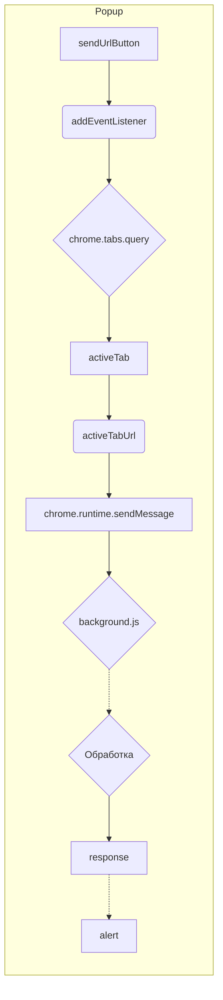

```MD
# Анализ кода popup.js

**1. <input code>**

```javascript
document.getElementById("sendUrlButton").addEventListener("click", () => {
    alert("Hello, world!");
    chrome.tabs.query({ active: true, currentWindow: true }, (tabs) => {
        let activeTab = tabs[0];
        let activeTabUrl = activeTab.url;
        
        chrome.runtime.sendMessage({ action: "sendUrl", url: activeTabUrl }, (response) => {
            if (response.status === "success") {
                alert("URL sent successfully!");
            } else {
                alert("Failed to send URL.");
            }
        });
    });
});
```

**2. <algorithm>**

**Блок-схема:**

```mermaid
graph TD
    A[Клик по кнопке "sendUrlButton"] --> B{Получить активную вкладку};
    B -- success --> C[Получить URL активной вкладки];
    B -- fail --> F[Ошибка получения вкладки];
    C --> D[Отправить сообщение в background script];
    D -- success --> E[Получить ответ];
    D -- fail --> G[Ошибка отправки сообщения];
    E -- success --> H[Успешная отправка URL];
    E -- fail --> I[Неудачная отправка URL];
    F --> I;
    G --> I;
    H --> J[Вывести сообщение об успехе];
    I --> K[Вывести сообщение об ошибке];
```

**Примеры:**

* **A:** Пользователь нажимает на кнопку "sendUrlButton".
* **B:** `chrome.tabs.query` запрашивает активную вкладку. Пример ответа: `tabs = [{id: 1, url: 'https://www.example.com'}]`.
* **C:** `activeTabUrl` принимает значение `'https://www.example.com'`.
* **D:** `chrome.runtime.sendMessage` отправляет сообщение в `background.js` с данными `action: "sendUrl"` и `url: 'https://www.example.com'`.
* **E:** `background.js` обрабатывает сообщение и возвращает ответ. Пример ответа: `{status: 'success'}`
* **H:** Показывается диалоговое окно "URL sent successfully!".
* **I:** Показывается диалоговое окно "Failed to send URL."

**Перемещение данных:**

Данные (URL) перемещаются от активной вкладки к функции `chrome.tabs.query`, затем передаются в функцию `chrome.runtime.sendMessage`, где и происходит их дальнейшее использование в `background.js`.

**3. <mermaid>**



**Описание зависимостей:**

* `chrome.tabs.query`:  Зависит от API браузера Chrome для взаимодействия с вкладками.
* `chrome.runtime.sendMessage`:  Зависит от API браузера Chrome для взаимодействия с `background.js`

**4. <explanation>**

* **Импорты:**  Нет явных импортов. Код использует встроенные API Chrome.

* **Классы:** Нет классов.

* **Функции:**
    * `document.getElementById("sendUrlButton").addEventListener("click", ...)`:  Обработчик события клика по кнопке. При клике вызывается анонимная функция.
    * `chrome.tabs.query(...)`: Запрос активной вкладки в текущем окне. Возвращает массив вкладок.
    * `chrome.runtime.sendMessage(...)`: Отправка сообщения в background script, который выполняется в отдельном процессе.

* **Переменные:**
    * `activeTab`: Содержит объект активной вкладки.
    * `activeTabUrl`: Хранит URL активной вкладки.
    * `response`: Содержит ответ от `background.js`.

* **Возможные ошибки и улучшения:**

    * Отсутствует обработка ошибок в `chrome.tabs.query`. Если вкладка не найдена, код может выдать ошибку.
    * Отсутствует проверка, что `tabs` не пустой массив (`if (tabs.length > 0) { ... }`)
    * В случае ошибки `chrome.runtime.sendMessage` нет обработки и выводящего сообщения об ошибке.
    * Отсутствует обработка случаев, когда пользователь не открыл вкладку или находится в другом браузере.
    * Лучше использовать try-catch для обработки возможных исключений.
    * Для повышения читаемости, можно использовать константы для строк `success` и `failed`.

**Цепочка взаимосвязей:**

Пользовательский интерфейс (popup.js) отправляет запрос (URL) в background.js.  Background.js обрабатывает запрос и выполняет последующие действия (например, сохраняет URL, взаимодействует с другими сервисами).  Результаты обработки передаются обратно в popup.js.