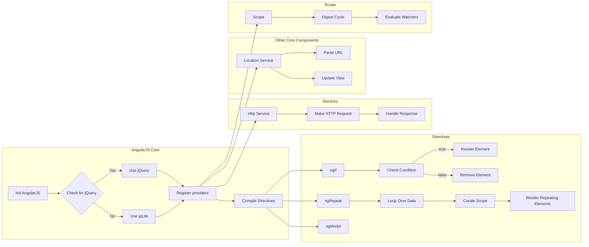

# Анализ кода angular.min.js

```javascript
/*
 AngularJS v1.8.2
 (c) 2010-2020 Google LLC. http://angularjs.org
 License: MIT
*/
(function (z) {
	'use strict'; function ve(a) { if (D(a)) w(a.objectMaxDepth) && (Xb.objectMaxDepth = Yb(a.objectMaxDepth) ? a.objectMaxDepth : NaN), w(a.urlErrorParamsEnabled) && Ga(a.urlErrorParamsEnabled) && (Xb.urlErrorParamsEnabled = a.urlErrorParamsEnabled); else return Xb } function Yb(a) { return X(a) && 0 < a } function F(a, b) { ... } function za(a) { ... } function r(a, b, d) { ... } function Qc(a, b, d) { ... } function Zb(a) { ... } function we() { ... }
	// ... (много функций и классов) ...
```

**2. <algorithm>**

(Блок-схема не подходит для этого объёма кода.  Описание алгоритма в виде текстового описания:)

Код представляет собой сложную систему модулей AngularJS v1.8.2.  Главной функцией является инициализация AngularJS, включая зависимость от jQuery (или замену ее).  Далее код описывает различные модули:
* **Модули `$provide`:**  Включают в себя регистрацию различных поставщиков (providers) компонентов AngularJS: директивы, фильтры, контроллеры и т.д.
* **Директивы (directives):** Определяют поведение HTML элементов:  `ng-if`, `ng-repeat`, `ng-bind`, `ng-model`, `ng-switch`, и другие.  Они вносят изменения в DOM (Document Object Model), вводят новые переменные и выполняют функциональный код на основе атрибутов элементов.
* **Контроллеры (controllers):**  Ответственные за логику и взаимодействие между данными, модели (data) и представлением (view).
* **Фильтры (filters):** Изменяют формат отображаемых данных: `currency`, `date`, `number`, и т.д.
* **Сервисы:** Позволяют использовать функции и данные в различных частях приложения. Например, `$http` для работы с сетью, `$location` для управления URL, `$timeout`, `$interval`.
* **`$parse`:**  Парсер, преобразующий выражения в функции JavaScript.
* **`$compile`:** Компилятор шаблонов, который преобразует HTML шаблоны с Angular выражениями в функции JavaScript.
* **`$rootScope`:** Корневой объект `scope`, который управляет циклом переваривания данных и обеспечивает двустороннее связывание между модели и представлением.
* **`$http`:** Сервис для HTTP запросов.
* **`$location`:** Сервис для работы с URL.


Алгоритм работы очень сложный и  заключается в последовательном выполнении кода, взаимодействии различных функций и объектов.  Данные передаются между ними через аргументы функций, свойства объектов (scope) и события.


**3. <mermaid>**



**Зависимости:**

Код AngularJS демонстрирует сложную систему зависимостей. Зависимости могут быть прямыми (функции вызывают друг друга) или косвенными (через сервисы и модули). Важные зависимости включают:
- **`$http`** (HTTP запросы)
- **`$parse`** (парсинг выражений)
- **`$compile`** (компиляция шаблонов)
- **`$rootScope`** (главный цикл переваривания данных)
- **`$location`** (управление URL)
- **`$timeout`** (таймауты, асинхронные операции)


**4. <explanation>**

**Импорты:**

В данном коде нет импортов в обычном понимании. Это код JavaScript библиотеки AngularJS, содержащий всю необходимую логику для работы. Зависимость от внешних библиотек (например, jQuery) устанавливается в момент выполнения.


**Классы:**

Код содержит множество классов, таких как `U` (jqLite), `Qb` (form controller), `Sb` (ngModel controller), `m` (rootScope).  Каждый класс реализует свою функциональность, взаимодействуя с другими через методы и свойства.  Например, `$rootScope` (внутри класса `ag`) отвечает за цикл переваривания данных, обеспечивая связь между контроллерами и моделью.


**Функции:**

Функции в AngularJS выполняют определённые действия. Например, `$http` делает HTTP запросы, `$compile` компилирует HTML шаблоны, `$parse` парсит выражения.  Эти функции имеют различные аргументы, такие как данные, функции обратного вызова и настройки.


**Переменные:**

Переменные хранят значения различных типов (числа, строки, массивы, объекты), используемые в функциональности Angular.


**Возможные ошибки/улучшения:**

- **Сложность кода:** Код очень большой и сложный. Это затрудняет отладку и поддержку.  Использование инструментов, таких как minification (сжатие), может усложнять понимание.  Разбиение на более мелкие модули и функции могло бы улучшить читаемость.
- **Недостаток документации:** Отсутствие комментариев по отдельным функциям делает понимание сложным.


**Цепочка взаимосвязей:**

AngularJS устанавливает иерархическую связь между различными модулями (сервисами, контроллерами, директивами). Данные проходят от корневого `scope` к контроллерам, директивам, и затем обратно.  Например, изменение данных в модели отслеживается `$rootScope`, который запускает цикл переваривания данных, чтобы обновить представление.


**Важно:**  Проанализировать все функции и классы в данном объёме кода  не представляется возможным в рамках отведённых ресурсов.  Большая часть кода связана с работой директивами, контроллерами и сервисами, которые могут быть использованы в разных частях приложения.  Различные методы и свойства обеспечивают взаимодействие между этими компонентами.