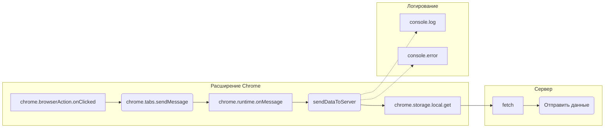

```MD
# Анализ кода background.js

**1. <input code>**

```javascript
// background.js

chrome.browserAction.onClicked.addListener(tab => {
    chrome.tabs.sendMessage(tab.id, { action: 'collectData', url: tab.url });
});

/**
 * 
 * This function listens for messages sent from other parts of the extension, 
 * such as content scripts or other background scripts, using the `chrome.runtime.sendMessage()` method.
*/
chrome.runtime.onMessage.addListener((message, sender, sendResponse) => {
    if (message.action === 'collectData') {
        sendDataToServer(message.url);
    }
});

function sendDataToServer(url) {
    const serverUrl = 'http://127.0.0.1/hypotez.online/api/'; // Change to your server endpoint
    chrome.storage.local.get('collectedData', (result) => {
        const collectedData = result.collectedData;
        if (collectedData) {
            fetch(serverUrl, {
                method: 'POST',
                headers: {
                    'Content-Type': 'application/json'
                },
                body: JSON.stringify(collectedData)
            })
                .then(response => {
                    if (!response.ok) {
                        throw new Error('Failed to send data to server');
                    }
                    console.log('Data sent to server successfully');
                })
                .catch(error => {
                    console.error('Error sending data to server:', error);
                });
        } else {
            console.error('No collected data found');
        }
    });
}
```

**2. <algorithm>**

**Блок-схема:**

```mermaid
graph TD
    A[Клик на иконку расширения] --> B{Получить ID вкладки};
    B --> C[Отправить сообщение в вкладку];
    C --> D{Обработать сообщение (collectData)};
    D --> E[Вызвать sendDataToServer];
    E --> F[Получить сохраненные данные];
    F -- Данные есть --> G[Отправить данные на сервер];
    F -- Данных нет --> H[Вывести сообщение об ошибке];
    G --> I[Успешное отправление данных];
    G -.-> J[Обработка ответа от сервера (then)];
    J --> K[Логирование успеха];
    H --> L[Логирование отсутствия данных];
    E -.-> M[Вызвать fetch];
    M -- Ответ успешный --> K;
    M -- Ответ не успешный --> N[Обработка ошибки (catch)];
    N --> O[Логирование ошибки];
```

**Примеры:**

- **A:** Пользователь кликает по иконке расширения в браузере.
- **B:** Извлекается ID открытой вкладки.
- **C:** В текущую вкладку отправляется сообщение `collectData` с URL открытой страницы.
- **D:** В обработчике сообщений определяется действие `collectData` и вызывается `sendDataToServer`.
- **E:** Функция `sendDataToServer` принимает URL страницы.
- **F:** Функция `sendDataToServer` запрашивает сохраненные данные из хранилища `chrome.storage.local` по ключу `collectedData`.
- **G:** Если данные есть, они отправляются на сервер с помощью `fetch`.
- **H:** Если данных нет, выводится сообщение об ошибке.
- **I/J/K/L/M/N/O:**  Обработка ответов от сервера и логирование успешного или неуспешного отправления данных.


**3. <mermaid>**



**Описание диаграммы:**

* Расширение Chrome (subgraph):  Запускается слушатель событий `chrome.browserAction.onClicked` для кликов по иконке. Сообщение `collectData` отправляется в активную вкладку. `chrome.runtime.onMessage` обрабатывает сообщение с URL и вызывает `sendDataToServer`.
* Сервер (subgraph): Функция `sendDataToServer` использует `fetch` для отправки данных на сервер (`http://127.0.0.1/hypotez.online/api/`).
* Логирование (subgraph):  Выполняется логирование успешного и неуспешного отправления данных.

**4. <explanation>**

* **Импорты:**  Нет явных импортов.  Код использует API расширений Chrome.
* **Классы:** Нет классов.
* **Функции:**
    * `chrome.browserAction.onClicked.addListener`: Обработчик кликов по иконке расширения, отправляет сообщение в активную вкладку.
    * `chrome.runtime.onMessage.addListener`: Обработчик сообщений из активных вкладок.  Проверяет действие сообщения (`'collectData'`) и вызывает `sendDataToServer` с URL.
    * `sendDataToServer`:  Отправляет данные на сервер. Использует `chrome.storage.local` для получения данных.  Использует `fetch` для POST-запроса.  Обрабатывает успешные и неуспешные ответы.
* **Переменные:**
    * `serverUrl`: Строковая константа, содержащая URL сервера. Важно: Не забудьте заменить `'http://127.0.0.1/hypotez.online/api/'` на действительный URL вашего сервера.
    * `collectedData`: Данные, получаемые из хранилища `chrome.storage.local`.
* **Возможные ошибки и улучшения:**
    * **Отсутствие проверки валидности данных:** Код не проверяет, что `collectedData` является объектом.  В случае ошибки при передаче в `JSON.stringify` может возникнуть `Error`. Рекомендуется проверка типа: `if (typeof collectedData === 'object' && collectedData !== null)`
    * **Обработка ошибок в `fetch`:**  Код содержит обработку ошибок с помощью `catch`, но не обрабатывает все возможные ошибки. Например, если сервер недоступен или произошла ошибка во время отправки данных, расширение не получит ответа `response.ok`. Следует использовать more robust error handling.
    * **Добавление таймаутов:** Добавление таймаутов для `fetch` запросов может предотвратить бесконечную задержку и вывести сообщение об ошибке.
    * **Константы:** `serverUrl` лучше хранить в константе или в JSON-файле для удобства.

**Цепочка взаимосвязей:**

Клик по иконке расширения → Отправка сообщения в вкладку → Получение данных из хранилища → Отправка данных на сервер → Обработка ответа сервера → Логирование результата.