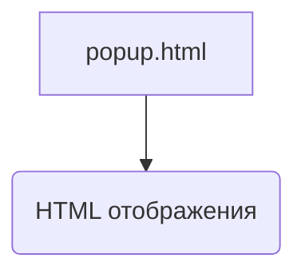

# Анализ кода popup.html

**1. <input code>**

```html
## \file hypotez/src/webdriver/chrome/extentions/test_extention/html/popup.html
# -*- coding: utf-8 -*-\n#! venv/Scripts/python.exe\n\n""" module: src.webdriver.chrome.extentions.test_extention.html """\nMODE = \'debug\'\n<!-- popup.html -->\n\n<!DOCTYPE html>\n<html>\n<head>\n    <title>hypotez</title>\n    <style>\n        body {\n            width: 200px;\n            padding: 10px;\n        }\n    </style>\n</head>\n<body>\n    <h1>hypotez</h1>\n    <p>Click the extension icon to collect data from the current webpage.</p>\n</body>\n</html>
```

**2. <algorithm>**

Этот код представляет собой HTML-документ, который отображает простую страницу с заголовком "hypotez" и абзацем, информирующим пользователя о функциональности расширения.  Поскольку это HTML, алгоритм работы - это просто отображение страницы в браузере.  Нет ни каких вызовов функций или классов.  Данные не перемещаются, так как нет ни обработки данных, ни взаимодействий с другими частями программы.

**3. <mermaid>**



**4. <explanation>**

* **Импорты:** Нет импортов. Это чистый HTML-документ, не связанный с Python-кодом.  Файл `popup.html` является частью расширения Chrome, и его содержание не зависит от других модулей в `src`.
* **Классы:** Нет классов.
* **Функции:** Нет функций.
* **Переменные:**
    * `MODE = 'debug'`:  Переменная, вероятно, определяет режим работы, но поскольку это HTML, никакой обработки данных в этой переменной не происходит. В контексте расширения Chrome, это переменная, относящаяся к Python-коду, лежащему в основе расширения (если есть).
* **Возможные ошибки или улучшения:**
    * Код не содержит ошибок с точки зрения HTML.
    *  Нет логики.  Страница не взаимодействует с другими частями расширения. Для взаимодействия с другими частями расширения (Python скриптами)  в этом HTML нужно добавить JavaScript.
    * Должно быть дополнительное JavaScript для обработки кликов на значке расширения и взаимодействия с backend'ом расширения (если таковой есть).


**Цепочка взаимосвязей:**

Этот HTML-файл является частью расширения Chrome `test_extention`.  Он будет отображаться, когда пользователь щелкнет значок расширения.  Любые действия, которые пользователь выполняет на этой странице (например, клик по кнопке), должны запускать JavaScript, который, в свою очередь, будет взаимодействовать с Python-кодом, расположенным в других частях проекта (`src.webdriver.chrome.extentions.test_extention`).  Без JavaScript код `popup.html` не может взаимодействовать с внешними системами.  Он просто отображает статическую страницу.