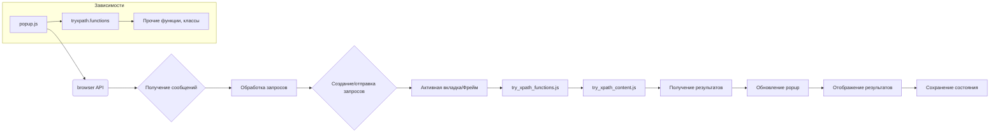

```MD
# Анализ кода popup.js

## <input code>

```javascript
/* This Source Code Form is subject to the terms of the Mozilla Public
 * License, v. 2.0. If a copy of the MPL was not distributed with this
 * file, You can obtain one at http://mozilla.org/MPL/2.0/. */

(function (window) {
    "use strict";

    // alias
    var tx = tryxpath;
    var fu = tryxpath.functions;

    var document = window.document;

    const noneClass = "none";
    const helpClass = "help";
    const invalidTabId = browser.tabs.TAB_ID_NONE;
    const invalidExecutionId = NaN;
    const invalidFrameId = -1;

    // ... (много переменных) ...

    // ... (функции) ...
})(window);
```

## <algorithm>

К сожалению, построить подробную блок-схему для всего кода невозможно из-за его объема.  Код организован как набор функций, обрабатывающих события и взаимодействующих с `browser` API для коммуникации с активной вкладкой и заданными фреймами.

Основные блоки:

1. **Инициализация:**  При загрузке страницы устанавливаются слушатели событий для элементов DOM.
2. **Обработка сообщений:** Функция `genericListener` обрабатывает сообщения, полученные от контекста вкладки. Различные сообщения ведут к выполнению различных действий (например, отображению результатов поиска, focus на элементе).
3. **Создание и отправка сообщений:**  Функции (`sendToActiveTab`, `sendToSpecifiedFrame`) формируют и отправляют сообщения в активную вкладку или в указанный фрейм.  Сообщения содержат запросы, результаты поиска, или команды.
4. **Получение и обработка результатов:**  Функции `showResultsInPopup` получает результаты из активной вкладки, обновляет таблицы с результатами поиска.
5. **Сохранение и восстановление состояния:**  Функции `collectPopupState` и `restorePopupState` сохраняют и восстанавливают состояние поп-апа для сохранения пользовательских настроек между сеансами.
6. **Обработка событий:**  Различные обработчики событий (например, `handleExprEnter`, `changeContextVisible`) реагируют на действия пользователя в поп-апе и обновляют состояние приложения.
7. **Отображение данных:**  Функция `showDetailsPage` отвечает за отображение результатов поиска в виде таблиц.

Данные передаются между функциями и классами в виде объектов JavaScript, которые могут содержать различную информацию, включая результаты поиска, состояния элементов, ID фреймов и т.д.  API `browser` используется для коммуникации с другими частями приложения.


## <mermaid>



## <explanation>

**Импорты:**

В коде нет явных импортов в традиционном смысле, т.к. он использует переменные `tx` и `fu`, которые вероятно указывают на внешний модуль (`tryxpath`). `tryxpath.functions` вероятно является объектом, содержащим вспомогательные функции для работы с данными, вероятно, из модуля `tryxpath`.  `browser`  - это объектная структура, предоставляемая браузерным API, позволяющая взаимодействовать с вкладками.

**Классы:**

Нет явных определений классов.  Код использует функции для выполнения различных задач, например, `sendToActiveTab`, `sendToSpecifiedFrame`,  `showResultsInPopup` и т.д.

**Функции:**

* `sendToActiveTab`: Отправляет сообщение в активную вкладку. Принимает сообщение и опции (включая `frameId`),  возвращает `Promise`.
* `sendToSpecifiedFrame`: Отправляет сообщение в указанный фрейм. Использует `getSpecifiedFrameId` для определения фрейма и выполняет ряд действий, прежде чем послать сообщение. Возвращает `Promise`.
* `collectPopupState`: Считывает состояние поп-апа (нажатые флажки, значения полей ввода). Возвращает объект состояния.
* `genericListener`: Обрабатывает сообщения, посланные из вкладки.  Использует структуру `genericListener.listeners` для выбора функции обработки конкретного типа сообщения.
* `execContentScript`: Выполняет скрипты в контексте вкладки, скорее всего, скрипты для выполнения XPath.
* `makeExecuteMessage`: Формирует сообщение, содержащее данные XPath-запроса. Собирает значения из полей ввода и возвращает объект `msg`.
* `getSpecifiedFrameId`: Возвращает ID фрейма. Может получать ID как из пользовательского ввода, так и из списка выбранных вариантов.
* `showError`: Обрабатывает ошибки и очищает результаты, передавая сообщение и ID фрейма.
* `showDetailsPage`: Отображает данные в таблице, принимает `index` страницы.
* `change*Visible`: Управляет отображением/скрытием различных блоков в поп-апе в зависимости от нажатых флажков.
* `handleExprEnter`: Обрабатывает нажатие клавиши "Enter" в поле ввода выражения, отправляя запрос.


**Переменные:**

Переменные содержат константы (`noneClass`, `helpClass`, `invalidTabId` ), данные, получаемые из DOM (элементы интерфейса), состояние приложения (например, `resultedDetails`).


**Возможные ошибки или области для улучшений:**

* **Обработка ошибок:** Хотя есть `catch` блоки, обработка ошибок в `sendToSpecifiedFrame` могла быть более полной.
* **Проверка на null/undefined:**  Некоторые функции, например `getSpecifiedFrameId`, могли бы проверять на корректность передаваемых значений, таких как `frameIdList.selectedOptions`.
* **Модульность:** Можно разделить код на более мелкие, специализированные функции для лучшей читаемости и поддержания.
* **Ясность кода:** В некоторых местах код может быть более понятным с использованием более описательных имен переменных.

**Взаимосвязи с другими частями проекта:**

Код активно использует API `browser`, что указывает на связь с компонентами, отвечающими за взаимодействие с браузером и вкладками (likely в расширении).  Функции `sendToActiveTab`, `sendToSpecifiedFrame`,  `browser.tabs.executeScript` и другие вызовы указывают на взаимодействие с другим кодом (`try_xpath_functions.js`, `try_xpath_content.js`), который, вероятно, выполняется в контексте вкладки.


**Вывод:**

Код реализует функционал расширения браузера для поиска по XPath.  Он получает данные из интерфейса пользователя, отправляет запросы в активную вкладку, обрабатывает полученные данные и отображает результат в поп-апе расширения.  Для лучшей поддерживаемости стоит улучшить обработку ошибок и структурировать код.