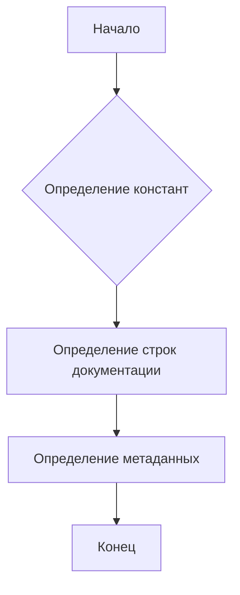

# Анализ кода файла hypotez/src/webdriver/chrome/extentions/version.py

## <input code>

```python
## \file hypotez/src/webdriver/chrome/extentions/version.py
# -*- coding: utf-8 -*-\
#! venv/Scripts/python.exe
#! venv/bin/python/python3.12

"""
.. module: src.webdriver.chrome.extentions 
	:platform: Windows, Unix
	:synopsis:

"""
MODE = 'dev'

"""
	:platform: Windows, Unix
	:synopsis:

"""


"""
	:platform: Windows, Unix
	:synopsis:

"""


"""
  :platform: Windows, Unix

"""
"""
  :platform: Windows, Unix
  :platform: Windows, Unix
  :synopsis:
"""MODE = 'dev'
  
""" module: src.webdriver.chrome.extentions """


"""
- `__version__`: This variable holds the version of the module or package.
- `__name__`: Contains the name of the module. If the script is being run directly, the value will be `"__main__"`.
- `__doc__`: The module's documentation string.
- `__details__`: This variable likely contains additional details about the module, but the exact purpose depends on the specific module or package.
- `__annotations__`: Contains type annotations for variables and functions in the module.
- `__author__`: The name(s) of the author(s) of the module.
"""
__name__:str
__version__="3.12.0.0.0.4"
__doc__:str
__details__:str="Details about version for module or class"
__annotations__

__author__='hypotez '
```

## <algorithm>

Этот код представляет собой конфигурационный файл, скорее всего, для модуля или пакета Python.  Алгоритм - это просто определение констант и строк документации.  Не существует циклов или сложных условных выражений.  Данные не перемещаются между функциями.

**Блок-схема:**




## <mermaid>

```mermaid
graph LR
    subgraph Модуль version.py
        A[MODE = 'dev'] --> B(Константы);
        B --> C(Документация);
        C --> D(__version__ = "3.12.0.0.0.4");
        D --> E(__author__ = 'hypotez ');
        D --> F(__doc__);
        D --> G(__details__);
    end
```

## <explanation>

**Импорты:** В коде отсутствуют импорты.  Это файл, содержащий конфигурацию и метаданные самого себя.

**Классы:** Нет классов в этом файле.

**Функции:** Нет функций в этом файле.

**Переменные:**
* `MODE`: строковая переменная, которая вероятно, определяет режим работы (например, 'dev', 'prod').
* `__version__`: строковая константа, содержащая версию модуля.
* `__author__`: строковая константа, имя автора модуля.
* `__doc__`, `__details__`, `__annotations__`:  Строковые константы, содержащие описание, дополнительные детали и аннотации.


**Комментарии:**
* Код содержит много строк документации (`"""Docstring"""`). Это важная практика, позволяющая другим программистам понимать назначение файла и переменных.
* Присутствуют комментарии с описанием назначения переменных `__version__`, `__name__`, `__details__` и т.д.
* `__annotations__` объявлен, но не используется. Это может быть намеком на будущие типы данных.
* `__name__` объявлен как строка, но его значение в данном коде не присваивается.
* Использование директив `#! venv/Scripts/python.exe` и `#! venv/bin/python/python3.12` в начале файла определяет интерпретатор Python для запуска этого файла. В современных проектах они не рекомендованы, и `shebang` используется чаще для запуска скрипта, а не для определения интерпретатора.

**Возможные ошибки или области для улучшений:**
* Отсутствие `__name__`: В `__name__` переменная должна быть инициализирована с именем файла/модуля, или хотя бы зарезервирована для неё память.
* `MODE = 'dev'` дублируется.
* Неоптимальное использование директив `#!`:  Это потенциально несовместимые директивы.


**Взаимосвязь с другими частями проекта:** Этот файл является частью проекта, и конфигурационные данные (например, версия) вероятно, будут использоваться в других файлах проекта. Для определения точной взаимосвязи необходимо просмотреть другие файлы из проекта.