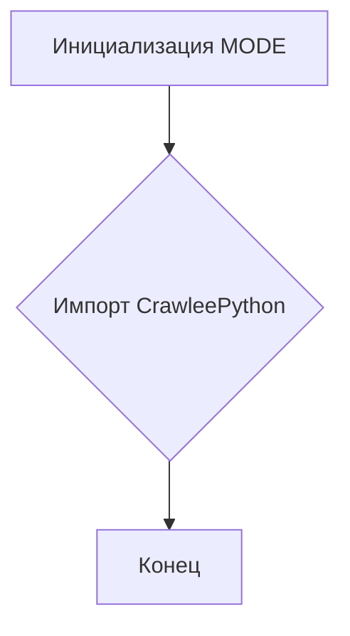
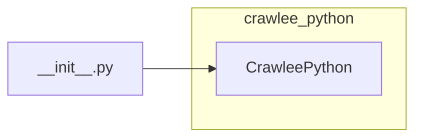

```MD
# Анализ файла hypotez/src/webdriver/crawlee_python/__init__.py

## <input code>

```python
## \file hypotez/src/webdriver/crawlee_python/__init__.py
# -*- coding: utf-8 -*-
#! venv/Scripts/python.exe
#! venv/bin/python/python3.12

"""
.. module: src.webdriver.crawlee_python 
	:platform: Windows, Unix
	:synopsis:

"""
MODE = 'dev'

from .crawlee_python import CrawleePython
```

## <algorithm>

Этот код является файлом инициализации модуля `crawlee_python`.  Он не содержит логики выполнения, а лишь импортирует класс `CrawleePython` из модуля `crawlee_python`.  Алгоритм работы состоит в инициализации константы `MODE` со значением 'dev' и импорте класса. Блок-схема очень простая:



Пример:  При запуске скрипта, использующего этот модуль, будет доступен класс `CrawleePython` для создания и использования экземпляров.


## <mermaid>



**Объяснение диаграммы:**

Диаграмма демонстрирует, что файл `__init__.py` импортирует класс `CrawleePython` из модуля `crawlee_python`.  Никаких зависимостей *вне* модуля `crawlee_python` в данном файле нет.


## <explanation>

**Импорты:**

- `from .crawlee_python import CrawleePython`: Импортирует класс `CrawleePython` из модуля `crawlee_python` внутри текущей директории (`crawlee_python.py`). Символ `.` перед именем модуля указывает на то, что модуль находится в подпапке, имеющейся в том же каталоге, что и текущий файл. Этот импорт делает класс доступным для использования в других частях проекта.  Связь с другими пакетами: этот импорт показывает, что `crawlee_python` вероятно, является основной частью `webdriver` и связан с классом `CrawleePython`.


**Классы:**

- `CrawleePython`:  Этот класс определен в файле `crawlee_python.py` (не в данном `__init__.py`).  Подробности о его функциональности можно найти в `crawlee_python.py`.


**Функции:**

В данном файле нет функций.


**Переменные:**

- `MODE = 'dev'`: Это константа, которая, вероятно, определяет режим работы скрипта (например, 'dev', 'prod').  Значение может использоваться в других частях проекта для адаптации логики.


**Возможные ошибки и улучшения:**

- **Отсутствие документации:** Недостаточно документирован класс `CrawleePython`.  Важно добавить подробные комментарии и docstrings к классу и его методам.
- **Проверка существования файла `crawlee_python.py`:**  Стоит добавить проверку, что файл `crawlee_python.py` существует, прежде чем пытаться импортировать `CrawleePython`, чтобы избежать ошибок при запуске.

**Цепочка взаимосвязей:**

Этот `__init__.py` файл служит связующим звеном между модулем `crawlee_python` и любыми другими частями проекта, которые будут использовать класс `CrawleePython`.  В дальнейшем `CrawleePython` будет  использоваться, например, для запуска веб-драйвера и управления взаимодействием с веб-сайтом.