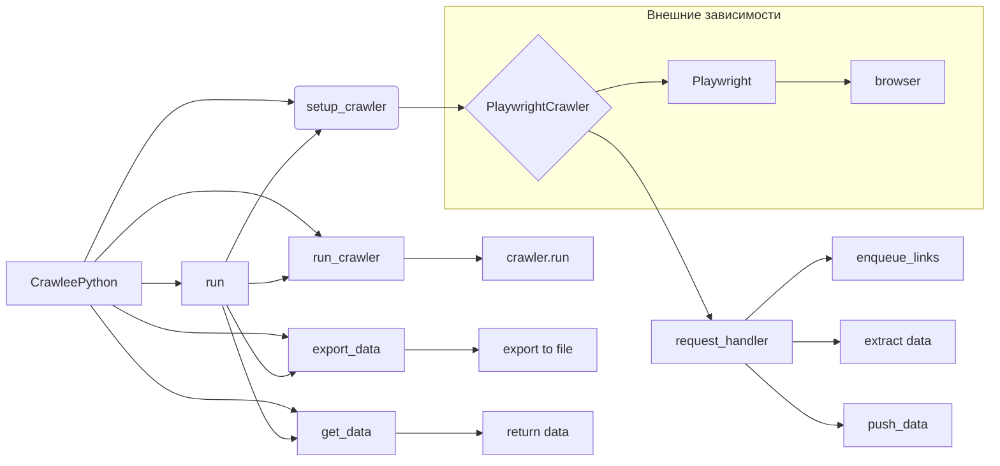

# <input code>

```python
## \file hypotez/src/webdriver/crawlee_python/crawlee_python.py
# -*- coding: utf-8 -*-\n#! venv/Scripts/python.exe
#! venv/bin/python/python3.12

"""
.. module: src.webdriver.crawlee_python 
	:platform: Windows, Unix
	:synopsis:

"""
MODE = 'dev'


from pathlib import Path
from src import gs
import asyncio
from crawlee.playwright_crawler import PlaywrightCrawler, PlaywrightCrawlingContext
from src.logger import logger

class CrawleePython:
    def __init__(self, max_requests: int = 5, headless: bool = False, browser_type: str = 'firefox'):
        """ Initializes the CrawleeExperiment with the specified parameters """
        self.max_requests = max_requests
        self.headless = headless
        self.browser_type = browser_type
        self.crawler = None

    async def setup_crawler(self):
        """ Sets up the PlaywrightCrawler instance """
        self.crawler = PlaywrightCrawler(
            max_requests_per_crawl=self.max_requests,
            headless=self.headless,
            browser_type=self.browser_type,
        )

        @self.crawler.router.default_handler
        async def request_handler(context: PlaywrightCrawlingContext) -> None:
            context.log.info(f'Processing {context.request.url} ...')

            # Enqueue all links found on the page.
            await context.enqueue_links()

            # Extract data from the page using Playwright API.
            data = {
                'url': context.request.url,
                'title': await context.page.title(),
                'content': (await context.page.content())[:100],
            }

            # Push the extracted data to the default dataset.
            await context.push_data(data)

    async def run_crawler(self, urls: list[str]):
        """ Runs the crawler with the initial list of URLs 

        @param urls: List of URLs to start the crawl
        """
        await self.crawler.run(urls)

    async def export_data(self, file_path: str):
        """ Exports the entire dataset to a JSON file 

        @param file_path: Path to save the exported JSON file
        """
        await self.crawler.export_data(file_path)

    async def get_data(self) -> dict:
        """ Retrieves the extracted data 

        @return: Extracted data as a dictionary
        """
        data = await self.crawler.get_data()
        return data

    async def run(self, urls: list[str]):
        """ Main method to set up, run the crawler, and export data 

        @param urls: List of URLs to start the crawl
        """
        await self.setup_crawler()
        await self.run_crawler(urls)
        await self.export_data(str(Path(gs.path.tmp / 'results.json')))
        data = await self.get_data()
        logger.info(f'Extracted data: {data.items}')


# Example usage
if __name__ == '__main__':
    async def main():
        experiment = CrawleeExperiment(max_requests=5, headless=False, browser_type='firefox')
        await experiment.run(['https://ksp.co.il'])

    asyncio.run(main())
```

# <algorithm>

**Шаг 1:** Инициализация `CrawleePython`

- Принимает параметры: `max_requests`, `headless`, `browser_type`.
- Инициализирует `max_requests`, `headless`, `browser_type`, `crawler` = None.
- Создает экземпляр `PlaywrightCrawler` с заданными параметрами, сохраняет его в `self.crawler`.

**Шаг 2:**  `setup_crawler()`

- Устанавливает параметры `PlaywrightCrawler` (например, лимит запросов, headless режим, тип браузера)
- Добавляет `@self.crawler.router.default_handler` обработчик запросов `request_handler`

**Шаг 3:** `request_handler`

- Логирует текущий URL.
- Добавляет ссылки с текущей страницы в очередь.
- Извлекает `title` и `content` страницы.
- Формирует словарь `data` с полученной информацией.
- Отправляет данные в основную базу данных (default dataset).

**Шаг 4:** `run_crawler`

- Запускает `crawler` с переданным списком URL.
- Ожидает завершения процесса сбора данных.

**Шаг 5:** `export_data`

- Экспортирует данные из `crawler` в JSON-файл.

**Шаг 6:** `get_data`

- Возвращает собранные данные в формате словаря.

**Шаг 7:** `run`

- Вызывает `setup_crawler`, `run_crawler` для запуска сбора данных.
- Экспортирует данные в файл `results.json` с помощью `export_data`.
- Выводит полученные данные с помощью `get_data`.


**Пример:** Если в списке `urls` есть `'https://example.com'`, то процесс пойдет по указанным шагам, используя `https://example.com` в качестве начальной точки для сбора данных.


# <mermaid>



**Объяснение диаграммы:**

- `CrawleePython` - главный класс, управляет процессом сбора данных.
- `setup_crawler` настраивает `PlaywrightCrawler`.
- `PlaywrightCrawler` - библиотека для управления браузером.
- `request_handler` обрабатывает каждый URL.
- `enqueue_links` добавляет ссылки в очередь.
- `extract data` извлекает данные с страницы.
- `push_data` отправляет данные в хранилище.
- `run_crawler` запускает весь процесс сбора по списку URL.
- `export_data` сохраняет данные в файл.
- `get_data` получает данные из хранилища.
- `run` - основной метод, запускающий всю цепочку.

- `Playwright` и браузер - внешние зависимости, используемые `PlaywrightCrawler`.
- `src.gs`, `src.logger` - зависят от `src`, это подмодули, вероятно, для работы с файловой системой и логированием.


# <explanation>

**Импорты:**

- `from pathlib import Path`: Импортирует класс `Path` для работы с путями к файлам.
- `from src import gs`: Импортирует модуль `gs`, который, по всей видимости, содержит константы или функции для взаимодействия с файловой системой, возможно, для доступа к временной папке (`gs.path.tmp`).
- `import asyncio`:  Для асинхронного программирования (важно для работы с браузером в Playwright).
- `from crawlee.playwright_crawler import PlaywrightCrawler, PlaywrightCrawlingContext`:  Импортирует классы `PlaywrightCrawler` и `PlaywrightCrawlingContext` из внешней библиотеки `crawlee` для работы с Playwright.  `crawlee` - предположительно, внешняя библиотека, для создания и управления веб-скраперами.
- `from src.logger import logger`: Импортирует объект `logger` из модуля `src.logger`, используемого для логирования.

**Классы:**

- `CrawleePython`:  Класс для управления процессом сбора данных.
    - `__init__`: Инициализирует атрибуты (предел запросов, headless режим, тип браузера).  `self.crawler` инициализируется как `None`, для поздней инициализации `PlaywrightCrawler`.
    - `setup_crawler`: Настраивает `PlaywrightCrawler`.
    - `run_crawler`: Запускает процесс сбора данных.
    - `export_data`: Экспортирует данные в файл.
    - `get_data`: Возвращает собранные данные.
    - `run`: Основной метод, объединяющий все действия сбора, запуска и экспорта.


**Функции:**

- `setup_crawler`:  Настраивает экземпляр `PlaywrightCrawler`.
- `request_handler`: Обработчик запросов для каждого URL. Логирует URL и извлекает базовые данные (URL, title, содержание страницы).
- `run_crawler`: Запускает сбор данных с заданным списком URL.
- `export_data`: Экспортирует собранные данные в JSON-файл.
- `get_data`: Возвращает собранные данные.
- `run`: Объединяет все методы, инициируя запуск веб-скрапера.


**Переменные:**

- `MODE`: Переменная с типом данных `str` и значением `'dev'`. Вероятно, используется для определения режима работы программы.
- `max_requests`, `headless`, `browser_type`: Параметры для настройки процесса сбора.
- `self.crawler`: Экземпляр `PlaywrightCrawler`, управляет асинхронной частью сбора.

**Возможные ошибки и улучшения:**

- **Обработка ошибок:**  Не хватает обработки исключений (например, `asyncio.TimeoutError` при запросе страницы).
- **Обработка неудачных запросов:**  Код не проверяет, были ли успешны запросы к страницам.
- **Управление памятью:**  Если используется много параллельных запросов, может возникнуть потребность в улучшении управления памятью и параллелизмом.
- **Динамическая настройка обработчика запросов:** Обработчик запросов (`request_handler`) является статическим. В реальном случае необходимо подходить к этому более гибко.
- **Журналирование:**  Журналирование (logger) должно быть более детальным (например, лог ошибок).


**Взаимосвязь с другими частями проекта:**

- `gs` (где определены пути, например, к папкам): Используется для определения пути к временной папке.
- `logger`: Подключается для записи сообщений в журнал.
- `PlaywrightCrawler`: Класс используется для работы с браузером, вероятно, в более широкой архитектуре проекта для веб-скрейпинга.