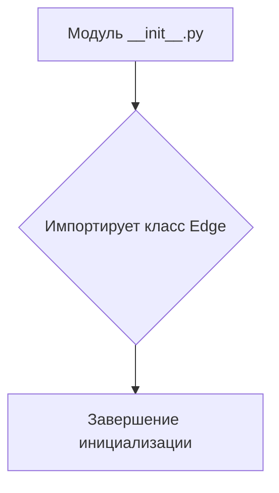
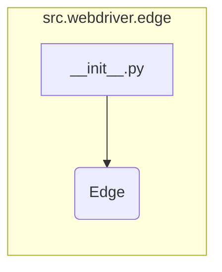

```MD
# Анализ кода hypotez/src/webdriver/edge/__init__.py

## <input code>

```python
## \file hypotez/src/webdriver/edge/__init__.py
# -*- coding: utf-8 -*-\
#! venv/Scripts/python.exe
#! venv/bin/python/python3.12

"""
.. module: src.webdriver.edge 
	:platform: Windows, Unix
	:synopsis:

"""
MODE = 'dev'

from .edge import Edge
```

## <algorithm>

Этот код представляет собой модуль инициализации для пакета `src.webdriver.edge`.  Алгоритм работы прост: он импортирует класс `Edge` из подпапки `edge`.  Никаких вычислений или сложных операций нет.

**Блок-схема:**



**Пример:**

Когда другой модуль (например, `src.main`) импортирует `src.webdriver.edge`, он фактически получает доступ к классу `Edge` через инициализацию этого модуля.

## <mermaid>



В данной диаграмме показано, что `__init__.py` импортирует класс `Edge` из подмодуля `edge` внутри `webdriver`.


## <explanation>

**Импорты:**

- `from .edge import Edge`: Этот импорт подключает класс `Edge` из модуля `hypotez/src/webdriver/edge/edge.py`. Символ `.` в начале пути импорта означает, что импортируемый модуль находится в той же директории, что и `__init__.py` (т.е. `src/webdriver/edge`). Это типичная практика для организации модулей в Python.

**Классы:**

- `Edge`:  Данный класс, вероятно, содержит реализацию веб-драйвера для браузера Edge, предоставляющего методы для взаимодействия с браузером. Подробности о нём можно найти в `hypotez/src/webdriver/edge/edge.py`.


**Функции:**

В данном `__init__.py` нет определенных функций, только импорт. Функциональность сосредоточена внутри класса `Edge`, который определяется в `edge.py`.


**Переменные:**

- `MODE = 'dev'`:  Эта переменная, вероятно, используется для определения режима работы (например, 'dev', 'prod') в модуле webdriver. Она задаёт константу, хранящую режим работы.


**Возможные ошибки/улучшения:**

- Отсутствует документация, описывающая назначение класса `Edge`.  В идеале, в `__init__.py` должна быть документация о роли этого модуля, а в `edge.py` - документация о классе `Edge`.
- Отсутствует проверка наличия/доступности файла `edge.py`. При импорте должна присутствовать проверка, чтобы быть уверенным в наличии требуемого файла.
- Не показано, какие зависимости имеет класс `Edge`.  Оптимально в документации было бы описано, какие библиотеки используются, и какие зависимости у `edge.py` и его классов (например, Selenium).


**Взаимосвязи с другими частями проекта:**

Этот `__init__.py` предоставляет входную точку для взаимодействия с классом `Edge`. Другие части проекта (например, `main.py`) могут импортировать и использовать `Edge` через `src.webdriver.edge`. Это позволяет организовать модульность и разделить логику. Отсутствует конкретная информация о связи с другими частями проекта, но можно предположить, что эта веб-драйверная часть взаимодействует с другими модулями проекта, которые, вероятно, отвечают за создание `webdriver` объектов и их управление, тестирование, запуск тестов и т.д. Необходимо анализировать `edge.py`, чтобы увидеть, какие классы и методы `Edge` использует.