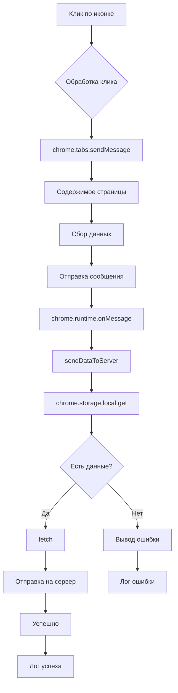

```MD
# Анализ кода расширения Chrome

## <input code>

```javascript
// background.js

chrome.browserAction.onClicked.addListener(tab => {
    chrome.tabs.sendMessage(tab.id, { action: 'collectData', url: tab.url });
});

/**
 * 
 * This function listens for messages sent from other parts of the extension, 
 * such as content scripts or other background scripts, using the `chrome.runtime.sendMessage()` method.
 
Here's a breakdown of what each part does:
 
- `chrome.runtime.onMessage.addListener()`: 
This function sets up a listener for messages sent from other parts of the extension.
 
- `(message, sender, sendResponse) => { ... }`: This is an arrow function that defines what should happen when a message is received. It takes three parameters:
  - `message`: The message object sent from the sender.
  - `sender`: Information about the sender of the message, such as its ID and whether it is a tab or another extension.
  - `sendResponse`: A function that can be used to send a response back to the sender if needed.
 
- `if (message.action === 'collectData') { ... }`: This condition checks if the received message has a property named `action` with a value of `'collectData'`. This is often used to determine the purpose or type of the message.
 
- `sendDataToServer(message.url)`: If the received message has an action of `'collectData'`, this function calls another function named `sendDataToServer()` and passes the URL from the message as an argument. This typically triggers some action or behavior in response to the received message.
 
In summary, this function listens for messages with the action `'collectData'`, and when such a message is received, it triggers the `sendDataToServer()` function, presumably to collect data and send it to a server.
 */
chrome.runtime.onMessage.addListener((message, sender, sendResponse) => {
    if (message.action === 'collectData') {
        sendDataToServer(message.url);
    }
});

function sendDataToServer(url) {
    const serverUrl = 'http://127.0.0.1/hypotez.online/api/'; // Change to your server endpoint
    chrome.storage.local.get('collectedData', (result) => {
        const collectedData = result.collectedData;
        if (collectedData) {
            fetch(serverUrl, {
                method: 'POST',
                headers: {
                    'Content-Type': 'application/json'
                },
                body: JSON.stringify(collectedData)
            })
                .then(response => {
                    if (!response.ok) {
                        throw new Error('Failed to send data to server');
                    }
                    console.log('Data sent to server successfully');
                })
                .catch(error => {
                    console.error('Error sending data to server:', error);
                });
        } else {
            console.error('No collected data found');
        }
    });
}
```

## <algorithm>

**Шаг 1:** Клик по иконке расширения.
* Данный код реагирует на клик по иконке браузерного расширения.

**Шаг 2:** Отправка сообщения содержимому страницы.
* Код отправляет сообщение с действием `collectData` и URL текущей страницы в активную вкладку.

**Шаг 3:** Получение данных о сборе данных.
* Вкладка обрабатывает это сообщение и собирает данные.

**Шаг 4:** Отправка собранных данных на сервер.
* При обработке сообщения `collectData` функция `sendDataToServer` получает URL.
* Функция извлекает сохраненные данные из хранилища chrome.storage.local.
* Она проверяет, присутствуют ли собранные данные.
* Если данные есть, отправляет их на сервер, используя fetch с методом POST, содержащий данные в JSON формате.
* Если данных нет, выводит сообщение об ошибке.


## <mermaid>



## <explanation>

**Импорты:**  В данном коде нет явных импортов, т.к. он использует встроенные API Chrome.

**Классы:**  Нет классов.

**Функции:**

* `chrome.browserAction.onClicked.addListener()`:  Обрабатывает клики по иконке расширения. Принимает объект `tab` с информацией о вкладке. Отправляет сообщение в активную вкладку.
* `chrome.runtime.onMessage.addListener()`:  Слушает сообщения, отправленные из других частей расширения (например, скриптов содержимого).  Принимает сообщение (`message`), данные об отправителе (`sender`), функцию для ответа (`sendResponse`).  Обрабатывает сообщение с действием `collectData`, вызывает `sendDataToServer`.
* `sendDataToServer(url)`: Отправляет собранные данные на сервер. Принимает URL. Использует `chrome.storage.local` для получения данных. Использует `fetch` для отправки POST запроса на сервер с данными. Обрабатывает успешную и неуспешную отправку.

**Переменные:**

* `serverUrl`:  Строковая переменная, хранящая адрес сервера. Важно, чтобы этот адрес был корректным.
* `collectedData`:  Переменная, хранящая собранные данные. Тип данных зависит от того, как они собираются в других частях расширения.

**Возможные ошибки и улучшения:**

* **Ошибка 1:** Неясно, откуда берутся `collectedData`.  В коде нет кода сбора данных.  Нужно добавить в `content.js` или другой скрипт логику сбора данных.
* **Ошибка 2:** Отсутствие обработки ошибок `fetch`.  Кода ошибки, если `fetch` не выполнится или не получит `200`, нет.  Нужно добавить обработку ошибок.
* **Улучшение 1:** Добавить `try...catch` вокруг `fetch`, чтобы перехватывать ошибки сетевого запроса.
* **Улучшение 2:** В функции `sendDataToServer` использовать асинхронный `await`.
* **Улучшение 3:** Разделение логики сбора данных и отправки на сервер.
* **Улучшение 4:** Проверка на пустоту  `collectedData`.  Добавление обработки случаев, когда `collectedData` undefined или null.
* **Улучшение 5:**  Использование более понятных имен переменных.


**Взаимосвязи с другими частями проекта:**

Расширение должно иметь скрипты содержимого (content scripts), которые собирают данные с текущей страницы (например, `content.js`).  Эти скрипты общаются с фоновым скриптом (`background.js`) с помощью `chrome.runtime.sendMessage`.


**В итоге:** Код реализует базовую отправку данных на сервер после клика по иконке расширения, но нуждается в дополнении кодом сбора данных и более надежной обработке ошибок.