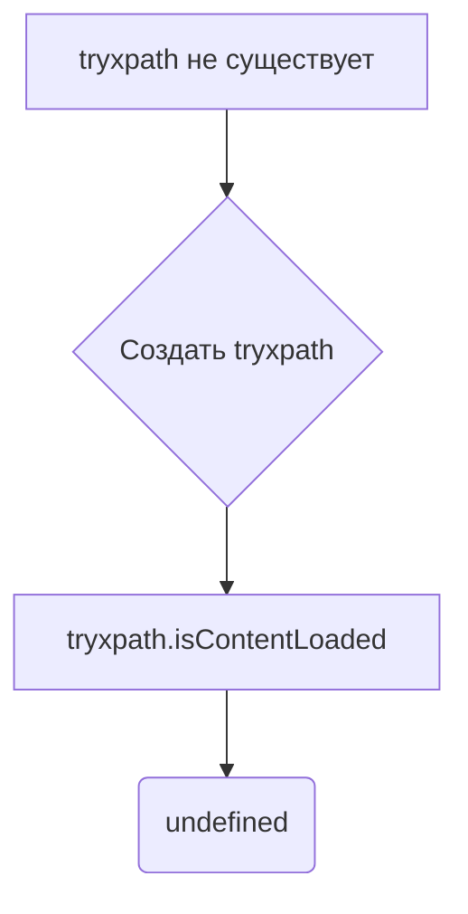

# Анализ кода try_xpath_check_frame.js

**<input code>**

```javascript
/* This Source Code Form is subject to the terms of the Mozilla Public
 * License, v. 2.0. If a copy of the MPL was not distributed with this
 * file, You can obtain one at http://mozilla.org/MPL/2.0/. */

// namespace
if (!tryxpath) {
    var tryxpath = {};
}

tryxpath.isContentLoaded;
```

**<algorithm>**

Код представляет собой очень простой фрагмент, который создает или проверяет существование объекта `tryxpath` в глобальном пространстве имен.

**Шаг 1:** Проверка существования объекта `tryxpath`.
```
if (!tryxpath) {
    var tryxpath = {};
}
```
Если объект `tryxpath` не существует в текущем контексте (например, глобальном объекте), то создается пустой объект с тем же именем.

**Пример:**

Если `tryxpath` не определен, выполнение приведет к созданию пустого объекта `tryxpath`.

**Шаг 2:** Доступ к свойству `isContentLoaded`.
```javascript
tryxpath.isContentLoaded;
```
Эта строка пытается получить доступ к свойству `isContentLoaded` объекта `tryxpath`.  В данном случае, оно не инициализировано, и никакого действия не происходит.  Возвращаемое значение в этом случае не определено.


**<mermaid>**



**<explanation>**

* **Импорты:** Нет импортов.  Код работает в контексте, где все переменные и объекты уже доступны.
* **Классы:** Нет классов.  Код работает на уровне глобальных переменных и свойств.
* **Функции:** Нет функций.  Код содержит только оператор `if` и обращение к свойству объекта.
* **Переменные:**  `tryxpath` - переменная, которая либо существует в глобальном контексте, либо создается.  Она типа `object`.
* **Возможные ошибки или улучшения:**

    * Код не выполняет никакой полезной работы.  Строка `tryxpath.isContentLoaded` просто пытается получить доступ к свойству, но не использует его значение.  Возможно, это фрагмент кода, который предназначался для дальнейшей разработки, но был оставлен в таком состоянии.
    * Если `isContentLoaded`  будет использоваться в дальнейшем, следует добавить инициализацию этой переменной.  Например, `tryxpath.isContentLoaded = true;` после её объявления.
    * Отсутствие комментариев затрудняет понимание цели кода.


**Взаимосвязи с другими частями проекта:**

Код `try_xpath_check_frame.js` скорее всего является частью расширения для браузера (Edge), связанного с автоматизацией или работой с веб-страницами.  Связь с другими частями проекта неясна без дополнительных контекстов.  Возможно, `isContentLoaded` используется в других частях кода для проверки состояния загрузки страницы, а `tryxpath` является частью пространства имен, используемого для хранения данных о контексте выполнения.   Без доступа к остальным файлам невозможно проследить полную цепочку взаимосвязей.