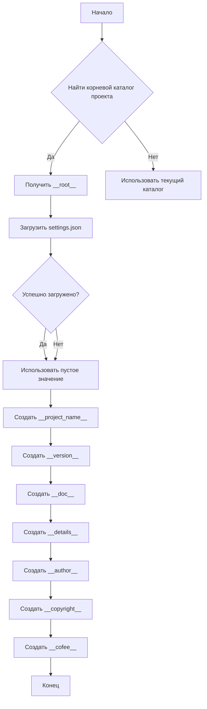

```MD
# Анализ кода hypotez/src/webdriver/edge/header.py

## <input code>

```python
## \file hypotez/src/webdriver/edge/header.py
# -*- coding: utf-8 -*-\
#! venv/Scripts/python.exe
#! venv/bin/python/python3.12

"""
.. module: src.webdriver.edge 
	:platform: Windows, Unix
	:synopsis:

"""
MODE = 'dev'


import sys
import json
from packaging.version import Version

from pathlib import Path
def set_project_root(marker_files=('pyproject.toml', 'requirements.txt', '.git')) -> Path:
    """
    Finds the root directory of the project starting from the current file's directory,
    searching upwards and stopping at the first directory containing any of the marker files.

    Args:
        marker_files (tuple): Filenames or directory names to identify the project root.
    
    Returns:
        Path: Path to the root directory if found, otherwise the directory where the script is located.
    """
    __root__:Path
    current_path:Path = Path(__file__).resolve().parent
    __root__ = current_path
    for parent in [current_path] + list(current_path.parents):
        if any((parent / marker).exists() for marker in marker_files):
            __root__ = parent
            break
    if __root__ not in sys.path:
        sys.path.insert(0, str(__root__))
    return __root__


# Get the root directory of the project
__root__ = set_project_root()
"""__root__ (Path): Path to the root directory of the project"""


from src import gs

settings:dict = None
try:
    with open(gs.path.root / 'src' /  'settings.json', 'r') as settings_file:
        settings = json.load(settings_file)
except (FileNotFoundError, json.JSONDecodeError):
    ...

doc_str:str = None
try:
    with open(gs.path.root / 'src' /  'README.MD', 'r') as settings_file:
        doc_str = settings_file.read()
except (FileNotFoundError, json.JSONDecodeError):
    ...


__project_name__ = settings.get("project_name", 'hypotez') if settings  else 'hypotez'
__version__: str = settings.get("version", '')  if settings  else ''
__doc__: str = doc_str if doc_str else ''
__details__: str = ''
__author__: str = settings.get("author", '')  if settings  else ''
__copyright__: str = settings.get("copyrihgnt", '')  if settings  else ''
__cofee__: str = settings.get("cofee", "Treat the developer to a cup of coffee for boosting enthusiasm in development: https://boosty.to/hypo69")  if settings  else "Treat the developer to a cup of coffee for boosting enthusiasm in development: https://boosty.to/hypo69"
```

## <algorithm>

**Блок-схема:**



**Пример:**

Если `pyproject.toml`, `requirements.txt` или `.git` находятся в каталоге выше текущего, `__root__` будет установлен на этот каталог. В противном случае `__root__` будет текущим каталогом.  Далее происходит чтение `settings.json` и `README.MD`, если файлы существуют. Результат записывается в переменные, если они не найдены, значения по умолчанию.

## <mermaid>

```mermaid
graph LR
    subgraph Project Root
        A[set_project_root] --> B(Path(__file__).resolve().parent);
        B --> C[parents];
        C --> D{any(marker in marker_files)};
        D -- true --> E[__root__ = parent];
        D -- false --> F[__root__ = current_path];
        E --> G[sys.path.insert(0, str(__root__))];
        B --> H[__root__];
        H --> I[return __root__];
    end

    subgraph Settings Loading
        J[__root__] --> K[gs.path.root / 'src' / 'settings.json'];
        K --> L{exists};
        L -- true --> M[json.load];
        L -- false --> N[settings = None];
        M --> O[settings];
    end

    subgraph README Loading
        O --> P[__root__] --> Q[gs.path.root / 'src' / 'README.MD'];
        Q --> R{exists};
        R -- true --> S[settings.read()];
        R -- false --> T[doc_str = None];
        S --> U[doc_str];
    end

    subgraph Variable Initialization
        O --> V[__project_name__ = settings.get("project_name", 'hypotez')];
        U --> W[__doc__ = doc_str];
        O --> X[__version__ = settings.get("version", '')];
        O --> Y[__author__ = settings.get("author", '')];
        O --> Z[__copyright__ = settings.get("copyright", '')];
        O --> AA[__cofee__ = settings.get("cofee", "...")];
    end

    subgraph Project Information
    V --> BB;
    W --> CC;
    X --> DD;
    Y --> EE;
    Z --> FF;
    AA --> GG;
    end
    
    subgraph External Dependencies
    A --> AA(pathlib);
    A --> BB(sys);
    A --> CC(json);
    A --> DD(packaging.version);
    K --> EE(gs);
    end
```

## <explanation>

**Импорты:**

- `sys`: Предоставляет доступ к системным переменным и функциям.
- `json`: Используется для работы с JSON-файлами.
- `packaging.version`: Используется для работы с версиями пакетов.
- `pathlib`: Для работы с путями к файлам, значительно упрощая и делая более безопасным работу с файлами.
- `src.gs`: Возможно, внутренний модуль проекта, используемый для доступа к основным папкам проекта.

**Классы:**

Нет определённых классов.


**Функции:**

- `set_project_root(marker_files)`: Находит корневой каталог проекта, начиная с текущего файла и идя вверх по директориям. Возвращает объект Path, представляющий этот каталог.  Аргумент `marker_files` позволяет указывать файлы/директории, наличие которых указывает на корень проекта.  Обратите внимание на использование `any` для проверки наличия любого из файлов.  Возвращает объект `Path`, указывающий на корневой каталог, или текущий, если корень не найден.

**Переменные:**

- `MODE`: Переменная, вероятно, определяющая режим работы (например, 'dev', 'prod').
- `__root__`: Путь к корневому каталогу проекта.
- `settings`: Словарь, загруженный из `settings.json`.
- `doc_str`: Строка, содержащая содержимое файла `README.MD`.
- `__project_name__`, `__version__`, `__doc__`, `__details__`, `__author__`, `__copyright__`, `__cofee__`: Переменные, получающие значения из словаря `settings` или по умолчанию.

**Возможные ошибки и улучшения:**

- **Обработка ошибок:** Используются блоки `try...except`, но обработка ошибок могла бы быть более подробной, особенно для вывода информации об ошибках. Например, выводить сообщение об ошибке, что `settings.json` не найден.
- **Проверка типов:** Проверка типов данных в функции `set_project_root` и других местах, где загружаются переменные, могла бы предотвратить некоторые ошибки.
- **Использование `typing`:** Введение типов данных через `typing` сделало бы код более читаемым и позволило бы статическому анализатору обнаруживать потенциальные ошибки.

**Взаимосвязи с другими частями проекта:**

- Файл напрямую зависит от `gs.path.root`, что предполагает наличие модуля `gs` в `src` для получения корневого пути проекта.
- Зависимость от `settings.json` и `README.MD` предполагает, что эти файлы содержат конфигурационную информацию о проекте.
- Использование `MODE` предполагает, что это часть более широкой системы настройки и управления режимами работы.

**Общая оценка:**

Код написан аккуратно и функционально.  Достаточно хорошая обработка ошибок при чтении конфигурационных файлов, что повышает надёжность.  Добавление типов данных через `typing` и использование `Path` для работы с путями значительно улучшают код.