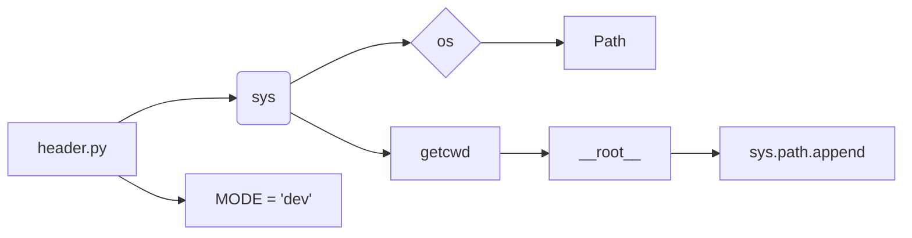

```MD
# Анализ кода header.py

1. **<input code>**

```python
## \file hypotez/src/webdriver/firefox/_examples/header.py
# -*- coding: utf-8 -*-\
#! venv/Scripts/python.exe
#! venv/bin/python/python3.12

"""
.. module: src.webdriver.firefox._examples 
	:platform: Windows, Unix
	:synopsis:

"""
MODE = 'dev'

"""
	:platform: Windows, Unix
	:synopsis:

"""


"""
	:platform: Windows, Unix
	:synopsis:

"""


"""
  :platform: Windows, Unix

"""
"""
  :platform: Windows, Unix
  :platform: Windows, Unix
  :synopsis:
"""MODE = 'dev'
  
""" module: src.webdriver.firefox._examples """


""" Установкя кораня проекта в системный путь """

import sys,os
from pathlib import Path
__root__ : Path = os.getcwd() [:os.getcwd().rfind(r'hypotez')+7]
sys.path.append (__root__)   
```

2. **<algorithm>**

Код не содержит сложного алгоритма. Он выполняет следующие действия:

* **Установка кодировки:** `# -*- coding: utf-8 -*-\` - Устанавливает кодировку UTF-8 для файла.
* **Установка интерпретатора Python:** `#! venv/Scripts/python.exe`, `#! venv/bin/python/python3.12` -  Указывает интерпретатор Python, используемый для запуска скрипта.
* **Документирование:** Многострочные строки документации (`"""..."""`) предоставляют информацию о модуле.
* **Константа MODE:** `MODE = 'dev'` - Определяет константу, вероятно, для режима работы (разработка, например).
* **Установка пути к корню проекта:** `__root__` = Путь к корню проекта `hypotez`.
* **Добавление пути к корню проекта в `sys.path`:** Это позволяет Python импортировать модули из подпапок проекта, которые находятся вне текущей рабочей директории.


**Пример:**  Если скрипт находится в `hypotez/src/webdriver/firefox/_examples/`, а модуль, который нужно импортировать находится в `hypotez/src/utils/`, то добавление пути к `sys.path` позволит импортировать его.

**Блок-схема (в виде текста):**

```
Начало
|
V
Установка кодировки UTF-8
|
V
Установка интерпретатора Python
|
V
Документирование (многострочные строки)
|
V
Определение константы MODE
|
V
Определение пути к корню проекта (__root__)
|
V
Добавление пути к корню проекта в sys.path
|
V
Конец
```


3. **<mermaid>**



**Объяснение диаграммы:**

Диаграмма показывает, что `header.py` использует модули `sys`, `os` и `pathlib.Path`. Модуль `os` используется для получения текущей рабочей директории с помощью `getcwd()`, а `pathlib.Path` используется для работы с путями.  Переменная `__root__` хранит путь к корню проекта.  `sys.path.append` добавляет этот путь в список путей поиска модулей Python.

4. **<explanation>**

* **Импорты:**
    * `sys`: Модуль `sys` предоставляет доступ к интерпретатору Python и системе. В данном случае используется для управления списком модулей (`sys.path`).
    * `os`: Модуль `os` предоставляет функции для взаимодействия с операционной системой, например, получение текущей рабочей директории (`os.getcwd()`).
    * `pathlib`: Модуль `pathlib` предоставляет высокоуровневый способ работы с файловыми путями. `Path` позволяет создавать и манипулировать объектами путей, что делает код более читаемым и устойчивым к изменениям в операционной системе.

* **Классы:** Нет классов в данном коде.

* **Функции:** Нет функций в данном коде.

* **Переменные:**
    * `__root__`: Переменная типа `Path`, хранящая путь к корню проекта.
    * `MODE`: Строковая константа, вероятно, для установки режима работы программы.

* **Возможные ошибки/улучшения:**
    * **Жестко заданный путь к интерпретатору:** `#! venv/Scripts/python.exe` и `#! venv/bin/python/python3.12` указывает на конкретный интерпретатор. Это не гибко, если скрипт используется в других окружениях. Лучше использовать относительный путь или переменную среды.
    * **Усложнённое получение пути к корню:**  `os.getcwd() [:os.getcwd().rfind(r'hypotez')+7]` -  можно написать проще, используя `Path(__file__).parent.parent.parent`, чтобы найти корень без поиска подстроки.
    * **Неопределенное поведение:**  Если `hypotez` не находится в директории с файлом `header.py`,  код может сгенерировать исключение.
    * **Отсутствие проверок:**  Не проверяется существование директории `hypotez`.
    * **Избыточное документация:** Несколько `"""..."""`-строк с одинаковой информацией.


**Цепочка взаимосвязей:**

Этот код, вероятно, является частью более крупного проекта (вероятно, проекта с использованием веб-драйвера для тестирования).  Добавление текущей директории в `sys.path` позволяет импортировать модули из других папок проекта, делая проект более организованным и модульным.  Следующие части проекта могут полагаться на этот скрипт для установки правильного пути к корню проекта.


```