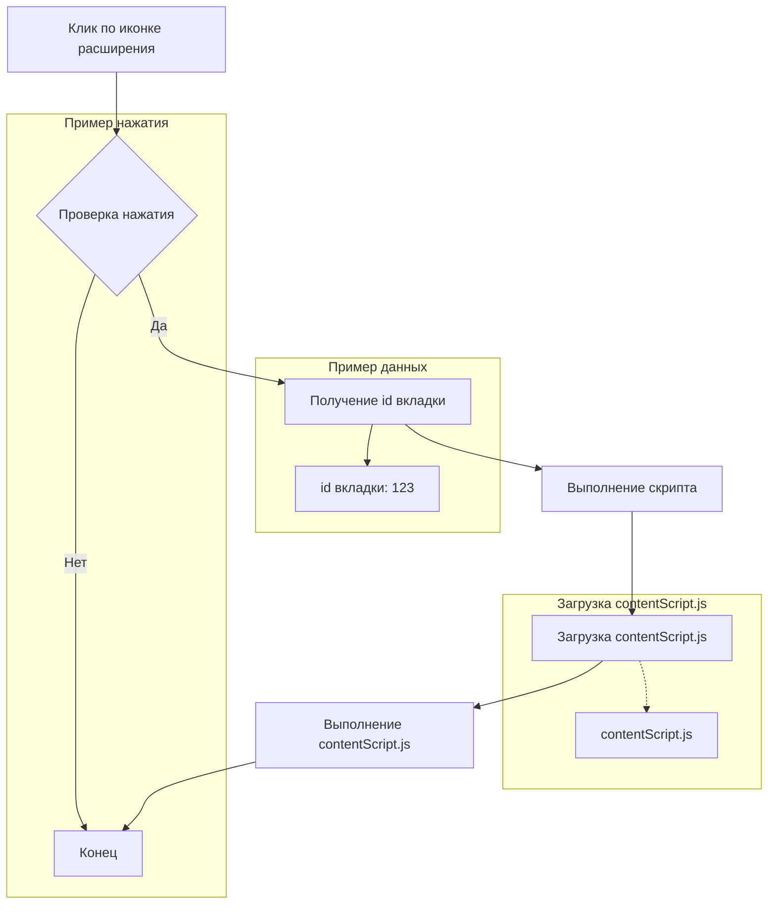

# Анализ кода background.js

**1. <input code>**

```javascript
// background.js
browser.browserAction.onClicked.addListener((tab) => {
    browser.scripting.executeScript({
        target: { tabId: tab.id },
        files: ["contentScript.js"],
    });
});
```

**2. <algorithm>**



**Пошаговый алгоритм:**

1. Пользователь нажимает на иконку расширения в браузере.
2. Событие `browser.browserAction.onClicked` срабатывает.
3. В качестве аргумента функции передается объект `tab`, содержащий данные о текущей вкладке, включая ее ID (`tab.id`).
4. Функция `browser.scripting.executeScript` получает `tab.id` и инициализируется для выполнения `contentScript.js` в этой вкладке.
5. `contentScript.js` загружается и выполняется в контексте текущей вкладки.
6. После выполнения скрипта процесс завершается.


**3. <mermaid>**

```mermaid
graph LR
    subgraph Background Script
        A[browser.browserAction.onClicked.addListener] --> B(tab);
        B --> C[browser.scripting.executeScript];
        C --> D{target: {tabId: tab.id}};
        D --> E[files: ["contentScript.js"]];
        E --> F[Выполнение contentScript.js];
    end
    subgraph Content Script
        F -.-> contentScript.js;
    end

```

**4. <explanation>**

* **Импорты:** В данном коде нет явных импортов, но используется `browser`, что подразумевает использование API расширений браузера. Это API предоставляет функции для взаимодействия с браузером, такими как `browser.browserAction.onClicked` и `browser.scripting.executeScript`.  API доступно через  `browser`  объект из текущей среды расширения.
* **Классы:** Нет классов. Код использует функции.
* **Функции:**
    * `browser.browserAction.onClicked.addListener`: Эта функция регистрирует обработчик события клика по иконке расширения. Она принимает один аргумент:
        * `tab`: Объект, содержащий информацию о вкладке, на которой был нажат клик.
    * `browser.scripting.executeScript`:  Эта функция выполняет скрипт в заданной вкладке.  Она принимает один аргумент:
        * `options`: Объект с параметрами выполнения скрипта.  В данном случае:
            * `target`: Объект, определяющий контекст выполнения (`tabId`).
            * `files`: Массив с путями к файлам, которые должны быть загружены и выполнены.
* **Переменные:**
    * `tab`: Переменная, содержащая данные о текущей вкладке.  Тип - объект.


**Возможные ошибки и улучшения:**

* **Отсутствие обработки ошибок:** Если `browser.scripting.executeScript` не удастся выполнить скрипт (например, вкладка закрыта), то код не будет обрабатывать эту ситуацию.  Следует добавить обработчики ошибок.
* **Динамический путь к `contentScript.js`:** В этом примере путь `"contentScript.js"` является хардкодированным. Для улучшения структуры лучше сделать константу или переменную для хранения пути к файлу.
* **Логирование:** Добавление логирования в случае успешного/неудачного выполнения скрипта позволит отслеживать ошибки и отлаживать код.


**Цепочка взаимосвязей с другими частями проекта:**

`background.js` взаимодействует с `contentScript.js`, который, вероятно, находится в папке `extentions/test_extention - Copy`.  `contentScript.js` отвечает за выполнение логики в контексте страницы сайта, а `background.js` отвечает за инициацию этого выполнения. Эта цепочка образует взаимодействие между контекстами расширения и страницы.


```