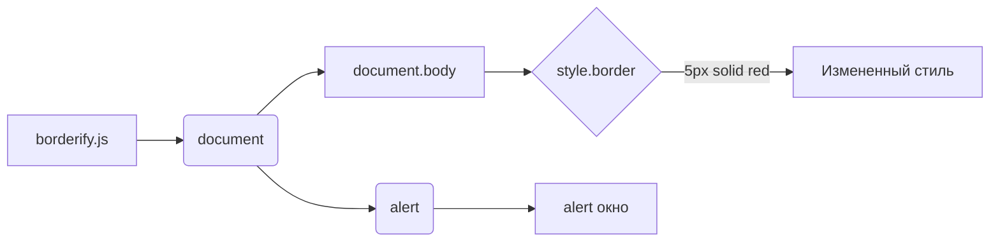

# Анализ кода borderify.js

## <input code>

```javascript
document.body.style.border = "5px solid red";
alert();
```

## <algorithm>

Этот код очень прост.  Он выполняет две операции:

1. **Установка границы:**  `document.body.style.border = "5px solid red";`  меняет стиль отображения элемента `body` на странице. Он устанавливает границу шириной 5 пикселей, состоящую из красной сплошной линии.

2. **Вызов alert():** `alert();` отображает диалоговое окно с сообщением "alert".

**Пример:** Если вы запустите этот скрипт на веб-странице, тело страницы (`body`) мгновенно изменит свой стиль, получив красную границу. После этого отобразится всплывающее окно с текстом "alert".

**Пошаговая блок-схема:**

```mermaid
graph TD
    A[Начало] --> B{Установка границы};
    B -- Да -- C[Изменение стиля body];
    C --> D[Вызов alert];
    D --> E[Отображение alert окна];
    E --> F[Конец];
```

## <mermaid>



## <explanation>

**Импорты:** В данном коде нет импортов. Все операции выполняются с помощью встроенных объектов JavaScript, доступных в браузере.

**Классы:** Нет классов.

**Функции:** Нет функций в собственном смысле.  Есть только две инструкции: установка стилей и вызов функции alert().

**Переменные:** Нет переменных.

**Возможные ошибки/улучшения:**

* **Отсутствие проверки:** Код не проверяет, существует ли элемент `body`.  Если страница не имеет элемента `body`, установка границы приведет к ошибке.
* **Неудобство использования:**  Этот код предназначен для мгновенного изменения стиля в JavaScript и не подходит для сложных динамических изменений на странице. Для более сложной логики и работы с пользователем, желательно использовать структуры данных и функции.
* **Неиспользование событий:** Код выполняется сразу при запуске. Отсутствие обработки событий (например, `addEventListener`) делает его неадаптивным к динамическим изменениям.


**Цепочка взаимосвязей:**

Код `borderify.js` напрямую взаимодействует с объектами браузера: `document` и `body`.  Он не зависит от других файлов или классов в проекте,  кроме  встроенных функций JavaScript, необходимых для работы с DOM.  Это локальная и независимая  функция.