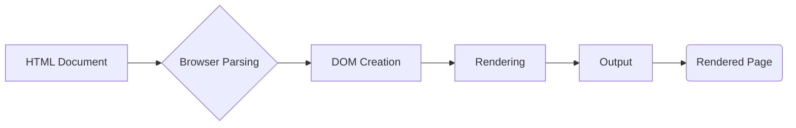

# Анализ кода popup.html

## <input code>

```html
## \file hypotez/src/webdriver/firefox/extentions/test_extention - Copy/html/popup.html
# -*- coding: utf-8 -*-
#! venv/Scripts/python.exe

""" module: src.webdriver.firefox.extentions.test_extention - Copy.html """
MODE = 'debug'
<!DOCTYPE html>
<html lang="en">
<head>
    <meta charset="UTF-8">
    <meta name="viewport" content="width=device-width, initial-scale=1.0">
    <title>Hypotez</title>
</head>
<body>
    <h1>Hypotez</h1>
    <p>Привет, Это Давидка. Я обучаю модель</p>
</body>
</html>
```

## <algorithm>

Этот код представляет собой HTML-документ, который отображает простую веб-страницу.  Алгоритм его работы - это простая последовательность:

1. **Парсинг HTML**: Браузер парсит HTML-код и интерпретирует его, создавая DOM (Document Object Model).
2. **Отрисовка**: Браузер использует DOM для создания визуального представления страницы. В этом случае он отображает заголовок "Hypotez", а также абзац с текстом.
3. **Загрузка ресурсов**: Поскольку в коде нет ссылок на внешние ресурсы (CSS, JavaScript), этот шаг отсутствует.
4. **Вывод**: Отображенная страница содержит текст "Hypotez" и сообщение.


## <mermaid>




## <explanation>

Этот файл `popup.html` — это обычный HTML-документ, предназначенный для отображения в браузере. Он не содержит JavaScript и, следовательно, не имеет динамического поведения.

* **Импорты:** В этом файле нет импортов, так как он сам является HTML-файлом. Он скорее всего используется для отображения информации в контексте расширения Firefox.

* **Классы:** В этом файле нет классов JavaScript.

* **Функции:** Нет функций.

* **Переменные:** Переменная `MODE` определена, но ее значение не используется в HTML. По всей видимости, она предназначена для возможного использования в связанном JavaScript-коде.  В контексте файла `popup.html` она просто константа.  Значение `debug`  предполагает, что это переменная для настройки режима работы расширения, возможно, связанного с логированием или отладкой.

* **Возможные ошибки или области для улучшений:**
    * Отсутствует JavaScript:  Если нужно динамическое поведение, например, взаимодействие с пользователем, необходимо добавить JavaScript.
    * Нет проверки на валидность HTML: В случае сложных HTML-структур желательно использовать валидаторы.
    * Неясно назначение `MODE`: Без контекста JavaScript, переменная `MODE` бесполезна.  Если в будущем она будет использоваться, нужно прояснить ее назначение и область видимости.
    * Отсутствует описание файла.  Не понятно, что представляет собой эта страница и её цель.

**Цепочка взаимосвязей с другими частями проекта:**

Этот файл `popup.html` является частью расширения Firefox. Он, вероятно, вызывается через некоторую пользовательскую точку входа, организованную в расширении.  Он предполагает наличие кода на JavaScript, который обрабатывает логику и взаимодействие с расширением.  Этот JavaScript, скорее всего, находится в другом файле  с расширением `.js` и подключен к HTML.  Также нужно обратить внимание на то, как это расширение работает с `webdriver` (если это действительно автотестирующее расширение), и каким образом этот HTML-код связан с другими частями проекта по обработке данных и управлению тестированием.

**Вывод:** Код представляет собой статическую HTML-страницу, которая скорее всего служит частью пользовательского интерфейса расширения Firefox.  Для полноценного функционирования требуется JavaScript.