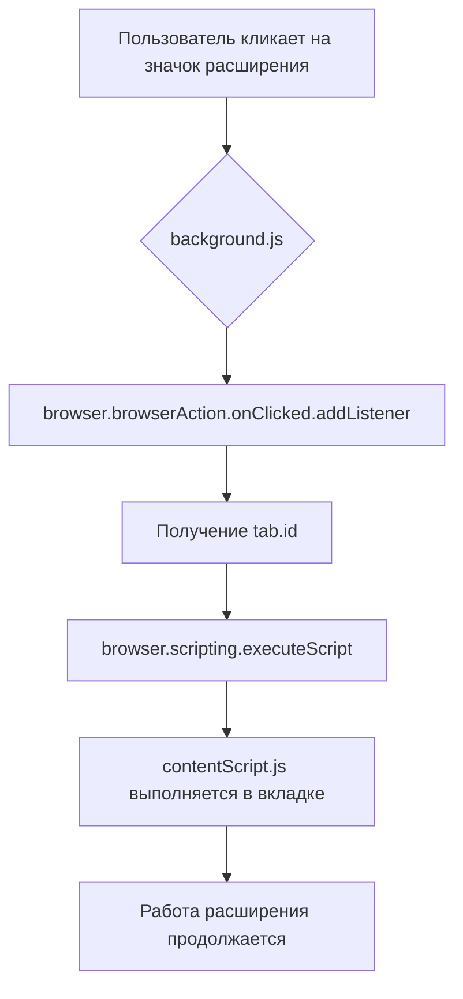

```MD
# Анализ кода background.js

## <input code>

```javascript
// background.js
\
browser.browserAction.onClicked.addListener((tab) => {
    browser.scripting.executeScript({
        target: { tabId: tab.id },
        files: ["contentScript.js"],
    });
});
```

## <algorithm>

**Шаг 1:**  Слушатель `browser.browserAction.onClicked.addListener` регистрируется.  Он ожидает события клика на значок расширения в адресной строке браузера.

**Пример:** Пользователь кликает на значок расширения в открытой вкладке.

**Шаг 2:** При клике вызывается функция, переданная в `addListener`. Эта функция принимает объект `tab`, содержащий информацию о текущей вкладке, включая ее идентификатор (`tab.id`).

**Пример:**  `tab` содержит данные о текущей вкладке, например: `{id: 123, url: 'https://example.com'}`

**Шаг 3:** `browser.scripting.executeScript` выполняет скрипт `contentScript.js` в контексте данной вкладки.

**Пример:** `browser.scripting.executeScript` с помощью `target: { tabId: tab.id }` и `files: ["contentScript.js"]` инициирует загрузку и выполнение `contentScript.js` во вкладке с идентификатором `tab.id` (123 в примере).

**Шаг 4:** После выполнения `contentScript.js`, расширение продолжает работу, ожидая следующего клика на значок.

**Последовательность данных:**

1. Пользовательский клик передается в `addListener`.
2. `tab.id` передается в `executeScript`.
3. Скрипт `contentScript.js` получает контекст и выполняется в целевой вкладке.


## <mermaid>



## <explanation>

**Импорты:** Нет импортов в представленном коде, т.к. он использует API браузера.

**Классы:** Нет определений классов.

**Функции:**

* **`browser.browserAction.onClicked.addListener((tab) => { ... })`**:  Эта функция-обработчик регистрируется для прослушивания событий клика на значок браузерного расширения.
    * Аргумент `tab`: Объект, содержащий информацию о вкладке, где произошел клик.  Содержит, например, `tab.id`, который необходим для таргетирования выполнения скрипта в конкретной вкладке.
    * Возвращаемого значения нет.

* **`browser.scripting.executeScript({...})`**: Эта функция выполняет указанный скрипт в контексте указанной вкладки.
    * Аргумент `target`: Объект, определяющий целевую вкладку (`tabId`).
    * Аргумент `files`: Массив путей к файлам скриптов, которые нужно выполнить.
    * Возвращаемого значения нет.

**Переменные:** Нет объявленных переменных, все операции происходят с помощью API браузера.

**Возможные ошибки и улучшения:**

* **Отсутствие обработки ошибок:** Код не содержит проверок на то, что таб существует или  `contentScript.js` найден. Необходимо добавить обработку случаев, когда таб закрыт или `contentScript.js` не существует.
* **Логирование:** Включите логирование для отладки и выявления ошибок при работе.
* **Указание относительных путей:** Если `contentScript.js` находится в другой папке, следует использовать относительные пути к нему.

**Взаимосвязи с другими частями проекта:**

`background.js` служит центральным компонентом для взаимодействия с браузерным расширением.  Он слушает события и передает информацию (инициативны) компонентам `contentScript.js` для выполнения скриптов в контентной области вкладки браузера.  Связь  осуществляется через API браузера и  `contentScript.js`. `contentScript.js` (вероятно, часть расширения), отвечает за выполнение заданной логики в целевом документе.