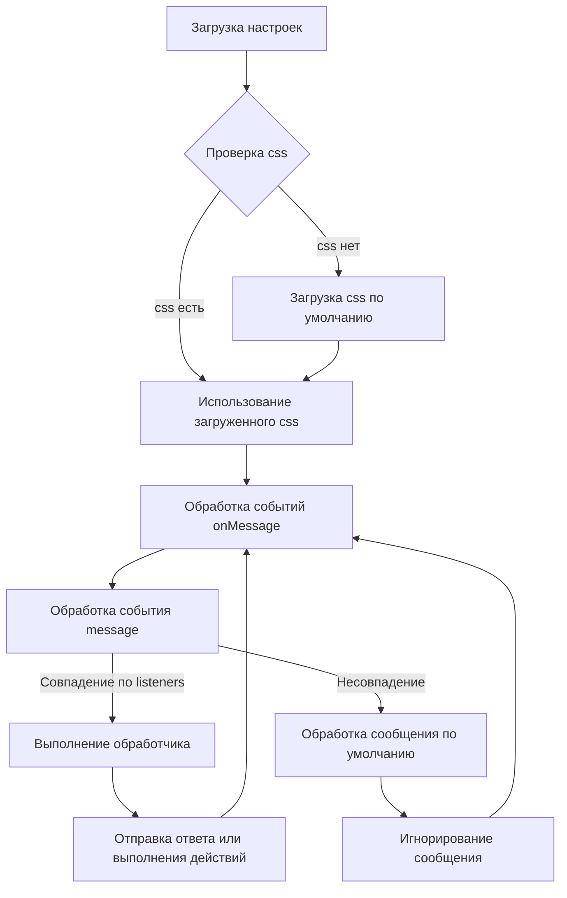

# Анализ кода try_xpath_background.js

## <input code>

```javascript
/* This Source Code Form is subject to the terms of the Mozilla Public
 * License, v. 2.0. If a copy of the MPL was not distributed with this
 * file, You can obtain one at http://mozilla.org/MPL/2.0/. */

(function (window, undefined) {
    "use strict";

    // alias
    var tx = tryxpath;
    var fu = tryxpath.functions;

    var popupState = null;
    var popupCss = "body{width:367px;height:auto;}";
    var results = {};
    var css = "";
    var attributes = {
        "element": "data-tryxpath-element",
        "context": "data-tryxpath-context",
        "focused": "data-tryxpath-focused",
        "focusedAncestor": "data-tryxpath-focused-ancestor",
        "frame": "data-tryxpath-frame",
        "frameAncestor": "data-tryxpath-frame-ancestor"
    };

    function loadDefaultCss() {
        return new Promise((resolve, reject) => {
            var req = new XMLHttpRequest();
            req.open("GET",
                     browser.runtime.getURL("/css/try_xpath_insert.css"));
            req.responseType = "text";
            req.onreadystatechange = function () {
                if (req.readyState === XMLHttpRequest.DONE) {
                    resolve(req.responseText);
                }
            };
            req.send();
        });
    }

    // ... (rest of the code)
```

## <algorithm>

**Блок-схема:**



**Пример:**

Если приходит сообщение `showAllResults`, то выполняется обработчик `genericListener.listeners.showAllResults`.  В нём обновляются данные в `results`, добавляются `tabId` и `frameId`, и открывается новая вкладка для отображения результатов.

## <mermaid>

```mermaid
graph LR
    subgraph Background Script
        A[browser.runtime.onMessage.addListener] --> B(genericListener);
        B --> C{message.event};
        C -- "storePopupState" --> D[storePopupState];
        C -- "requestRestorePopupState" --> E[requestRestorePopupState];
        C -- "requestInsertStyleToPopup" --> F[requestInsertStyleToPopup];
        C -- "showAllResults" --> G[showAllResults];
        C -- "loadResults" --> H[loadResults];
        C -- "updateCss" --> I[updateCss];
        C -- "loadOptions" --> J[loadOptions];
        C -- "requestSetContentInfo" --> K[requestSetContentInfo];
        
        D --> L[popupState = message.state];
        E --> M[browser.runtime.sendMessage];
        F --> N[browser.runtime.sendMessage];
        G --> O[results = message, open new tab];
        H --> P[sendResponse(results)];
        I --> Q[browser.tabs.removeCSS, browser.tabs.insertCSS, browser.tabs.sendMessage];
        J --> R[sendResponse];
        K --> S[browser.tabs.sendMessage];
    end
    subgraph Browser Storage
        T[browser.storage.onChanged.addListener] --> U[Update attributes/css/popupCss];
    end
    subgraph External Resources
        V[tryxpath.functions] -- fu --> B;
    end
```

## <explanation>

**Импорты:**

* `tryxpath`, `tryxpath.functions`:  Вероятно, эти импорты представляют собой модули, содержащие функции или классы, которые используются в скрипте. Необходимые для работы с зависимостями.

**Классы:**

* Нет явных пользовательских классов.

**Функции:**

* `loadDefaultCss()`: Асинхронно загружает CSS из файла `/css/try_xpath_insert.css` с использованием `XMLHttpRequest`. Возвращает `Promise`, содержащий текст CSS.
* `genericListener()`:  Обработчик сообщений `browser.runtime.onMessage`.  Динамически определяет и выполняет обработчики для разных событий (событий внутри).
* ... (Другие функции): Каждая функция обрабатывает определенное событие, отправленное из расширения или страницы.  Используют `browser.runtime.sendMessage` для коммуникации с другими частями приложения.

**Переменные:**

* `popupState`, `popupCss`, `results`, `css`, `attributes`: Хранят состояние, стили, результаты и атрибуты соответственно. Важные для сохранения и работы расширения.


**Возможные ошибки/улучшения:**

* **Обработка ошибок:** В функциях, которые используют `Promise` (например, `loadDefaultCss`), нет явной обработки ошибок `reject`. При серьезных ошибках загрузки CSS приложение может не выдать сообщение об ошибке. Нужно использовать `catch` для обработки ошибок.
* **Запись логов:** Включить логирование для отладки, особенно при работе с `browser.tabs.sendMessage` и других асинхронных операциях.
* **Структура кода:**  Модульная структура облегчит масштабирование.


**Взаимосвязи с другими частями проекта:**

* Код взаимодействует с расширением (вероятно, с другой частью кода) через `browser.runtime.sendMessage` и `browser.runtime.onMessage`.
* Использование  `browser.tabs.sendMessage`, `browser.tabs.removeCSS` и `browser.tabs.insertCSS` показывают связь с вставкой CSS в открытые вкладки браузера.
* Используется переменная `results`, которая, вероятно, передает данные результата поиска.
* Взаимодействует со `storage` для хранения и загрузки настроек (атрибуты, стили).


**Заключение:**

Код реализует обработчик сообщений для расширения Chrome, позволяющий обновлять стили, атрибуты и выполнять действия в ответ на события, полученные от других компонентов расширения.   Важно уделить внимание обработке ошибок и логированию для отладки.  Добавление модульной структуры позволит сделать код более организованным и масштабируемым.