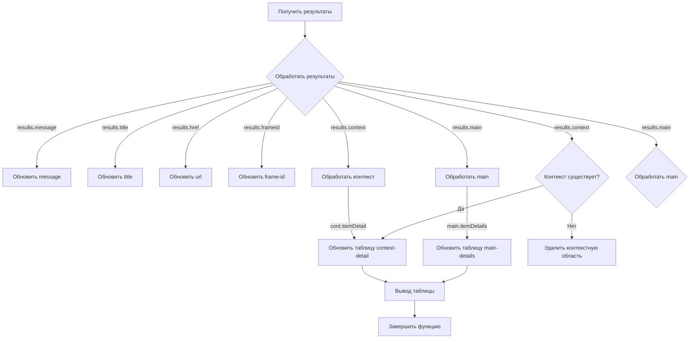

# Анализ кода show_all_results.js

## <input code>

```javascript
/* This Source Code Form is subject to the terms of the Mozilla Public
 * License, v. 2.0. If a copy of the MPL was not distributed with this
 * file, You can obtain one at http://mozilla.org/MPL/2.0/. */

(function (window, undefined) {
    "use strict";

    // alias
    var tx = tryxpath;
    var fu = tryxpath.functions;

    var document = window.document;

    var detailKeys = ["type", "name", "value", "textContent"];
    var headerValues = ["Type", "Name", "Value", "textContent"];
    var relatedTabId;
    var relatedFrameId;
    var executionId;

    function showAllResults(results) {
        // ... (остальной код функции)
    };

    // ... (остальные функции)
})(window);
```

## <algorithm>

Функция `showAllResults` принимает объект `results` и обновляет содержимое HTML-страницы, отображая результаты XPath-запроса.  Блок-схема:



**Пример:**

Если `results.context` содержит данные, функция обновит таблицу с контекстными данными. Если `results.context` отсутствует, функция удалит элемент `context-area` из документа.

## <mermaid>

```mermaid
graph LR
    subgraph tryxpath
        A[tryxpath] --> B(functions);
        B --> C{showAllResults};
    end
    C --> D[document.getElementById("message")];
    C --> E[document.getElementById("title")];
    C --> F[document.getElementById("url")];
    C --> G[document.getElementById("frame-id")];
    C --> H[fu.updateDetailsTable(context-detail)];
    C --> I[fu.updateDetailsTable(main-details)];

    subgraph Browser API
        J[browser.runtime] --> K[sendMessage];
        K --> C;

        L[browser.tabs] --> M[sendMessage];
    end
    subgraph Custom functions
      O[makeTextDownloadUrl] --> P[URL.createObjectURL];
      Q[makeInfoText] --> R(функции обработки текста);
      R --> P;
      S[makeConvertedInfoText] --> T(функции обработки текста);
      T --> P;

      U[fu.makeDetailText] --> V[обработка детализированных данных];
    end

```


## <explanation>

**Импорты:**

Код использует алиасы `tx` и `fu` для `tryxpath` и `tryxpath.functions` соответственно. Это, скорее всего, внутренние переменные или модули из проекта, которые предоставляют функции для работы с результатами XPath.

**Классы:**

Нет явных классов, только функции.

**Функции:**

* **`showAllResults(results)`:**
    * Принимает объект `results` с данными XPath-запроса.
    * Обновляет элементы HTML (`message`, `title`, `url`, `frame-id`, `context-area`, `main-area`) с соответствующими значениями из объекта `results`.
    * Использует `fu.updateDetailsTable` для обновления таблиц с деталями результатов.
    * Обрабатывает наличие/отсутствие контекста.
    * Возвращаемого значения нет.


* **`makeTextDownloadUrl(text)`:** Создает URL для скачивания текста. Принимает строку `text`, возвращает строку URL.

* **`makeInfoText(results)`:** Создает строку текста для скачивания, содержащую информацию о результатах. Принимает объект `results`, возвращает строку.

* **`makeConvertedInfoText(results)`:**  Аналогично `makeInfoText`, но преобразует некоторые поля в JSON.

**Переменные:**

* `detailKeys`, `headerValues`: Массивы строк, используемые для заголовков таблиц.
* `relatedTabId`, `relatedFrameId`, `executionId`: Переменные, хранящие данные для взаимодействия с браузерным API.


**Возможные ошибки/улучшения:**

* **Обработка ошибок:** В коде присутствует `.catch(fu.onError)`, но сама функция `fu.onError` не определена в предоставленном фрагменте.  Необходимо добавить обработку ошибок, чтобы предотвратить аварийное завершение при возникновении проблем.
* **Оптимизация:**  Функции `makeInfoText` и `makeConvertedInfoText` можно оптимизировать, чтобы не создавать полную строку в памяти сразу, а строить ее постепенно,  что может быть полезно для очень больших наборов данных.
* **Доступность данных:** Доступ к значениям контекста в `results` осуществляется через `results.context`. Нужно убедиться, что это свойство всегда определено.

**Взаимосвязи с другими частями проекта:**

Функции используют функции из `tryxpath.functions`, указывая на зависимость от этого модуля.  Использование `browser.runtime.sendMessage` и `browser.tabs.sendMessage` демонстрирует взаимодействие с браузерным расширением. Это указывает на то, что код является частью расширения для браузера, и взаимодействует с другими частями расширения через сообщения.