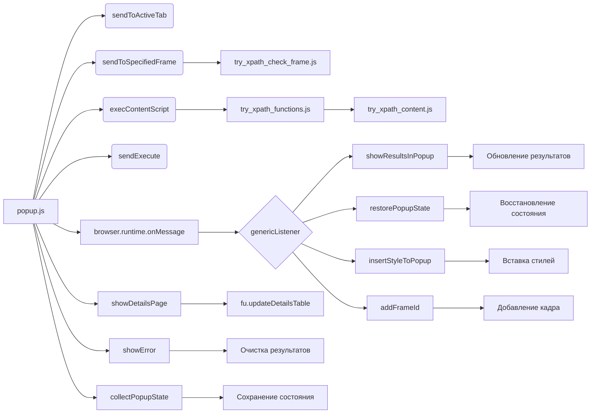

# Анализ кода popup.js

## <input code>

```javascript
/* ... (Лицензионное соглашение) ... */

(function (window) {
    "use strict";

    // alias
    var tx = tryxpath;
    var fu = tryxpath.functions;

    // ... (Определения констант) ...

    // ... (Объявление переменных) ...

    // ... (Функция sendToActiveTab) ...
    // ... (Функция sendToSpecifiedFrame) ...
    // ... (Функция collectPopupState) ...
    // ... (Функции changeVisible) ...
    // ... (Функция makeExecuteMessage) ...
    // ... (Функция getSpecifiedFrameId) ...
    // ... (Функция execContentScript) ...
    // ... (Функция sendExecute) ...
    // ... (Функция handleExprEnter) ...
    // ... (Функция showDetailsPage) ...
    // ... (Функция showError) ...
    // ... (Функция genericListener) ...
    // ... (Обработчики событий в genericListener) ...

    // ... (Инициализация элементов страницы) ...

})(window);
```

## <algorithm>

Код представляет собой обработчик событий для всплывающего окна расширения браузера, взаимодействующего с активной вкладкой.

**Блок 1: Инициализация:**

- При загрузке страницы выполняются операции по получению ссылок на элементы DOM.
- Устанавливаются слушатели событий на кнопки, текстовые поля и др. элементы.
- Отправляется сообщение в контекст страницы, содержащее запрос на стили.
- Отправляется сообщение в контекст страницы, содержащее запрос на сохраненное состояние.

**Блок 2: Обработка событий:**

- `genericListener`: служит для обработки сообщений, отправленных из контекста страницы.
- Возможные сообщения: `showResultsInPopup`, `restorePopupState`, `insertStyleToPopup`, `addFrameId` (для динамического добавления элементов в список кадровых идентификаторов).
- Каждое сообщение обрабатывается соответствующим обработчиком (`listeners`), который выполняет действия в соответствии с типом сообщения.
    - `showResultsInPopup`: обновляет данные в popup, отображает результаты запроса XPath.
    - `restorePopupState`: восстанавливает сохраненное состояние popup.
    - `insertStyleToPopup`: вставляет в popup css-стили, полученные из контекста страницы.
    - `addFrameId`: добавляет новый элемент в список кадровых идентификаторов.

**Блок 3: Отправка сообщений:**

- `sendToActiveTab`: отправляет сообщение активной вкладке.
- `sendToSpecifiedFrame`: отправляет сообщение в указанный кадр активной вкладки, вызывая скрипты в `/scripts/`.
- `sendExecute`: собирает и отправляет запросы XPath в активную вкладку.
- `showDetailsPage`: обновляет таблицу результатов, с возможностью постраничного отображения.


**Блок 4: Управление отображением:**

- Различные функции (changeVisible) скрывают/отображают части popup в зависимости от состояния checkboxes.
- `showError`: отображает сообщение об ошибке, очищая предыдущие результаты.

**Блок 5: Сохранение состояния:**

- При закрытии popup-окна информация о текущем состоянии собирается (например, выбранные опции, значения текстовых полей) и сохраняется (в браузере).


## <mermaid>



## <explanation>

**Импорты:**

- `tryxpath` и `tryxpath.functions`: скорее всего, это внутренние модули расширения браузера, предоставляющие функции и методы для работы с XPath, и их вызовом из всплывающего окна.  `tx` и `fu` — алиасы для более краткой записи.


**Классы:**

Нет явных пользовательских классов.  Код использует объекты (например, `msg`, `opts`), но не объявляет свои классы.


**Функции:**

- `sendToActiveTab`: отправляет сообщение активной вкладке браузера. Аргументы: `msg` (сообщение), `opts` (опции). Возвращает промис.
- `sendToSpecifiedFrame`: отправляет сообщение в указанный кадр активной вкладки. Аргументы: `msg` (сообщение). Возвращает промис.
- `collectPopupState`: собирает состояние элементов в всплывающем окне в объект.
- `changeVisible`: изменяет видимость элементов.
- `makeExecuteMessage`: создает сообщение для выполнения XPath запроса на странице.
- `getSpecifiedFrameId`: возвращает идентификатор кадра.
- `execContentScript`: выполняет скрипты, необходимые для работы XPath-функций, в контексте страницы.
- `sendExecute`: отправляет сообщение для выполнения XPath запроса.
- `showDetailsPage`: отображает результаты запроса на странице.
- `showError`: отображает сообщения об ошибках и очищает данные.
- `genericListener`: обработчик сообщений от контекстной страницы. Принимает сообщения и выполняет соответствующие функции.


**Переменные:**

- `relatedTabId`, `relatedFrameId`, `executionId`: хранят информацию о текущей вкладке и кадре для связи с контекстом страницы.
- `resultedDetails`, `detailsPageSize`: данные, полученные из контекста и их количество на странице.
- `detailsPageIndex`: номер текущей страницы результатов.


**Возможные ошибки и улучшения:**

- Недостаточно информации о типе данных, возвращаемых функциями (например, типы промисов).
- Недостаточно ясна логика `sendToSpecifiedFrame`.
- Отсутствие проверки ввода на корректность (например, в `getSpecifiedFrameId` при парсинге `frameIdExpression.value`).
- Необходимо описать функции из tryxpath.functions.
- Необходимо добавить обработку ошибок для `parseInt`.
- Отсутствие валидации параметров, передаваемых в `fu.updateDetailsTable`.


**Взаимосвязи с другими частями проекта:**

Код тесно связан с скриптами `/scripts/try_xpath_check_frame.js`, `/scripts/try_xpath_functions.js`, `/scripts/try_xpath_content.js`. Эти скрипты, очевидно, содержат функции, используемые для обработки запросов XPath в контексте страницы.  Связь осуществляется через механизм `browser.tabs.executeScript` и отправку сообщений.


**Заключение:**

Код реализует всплывающее окно для взаимодействия с активной вкладкой браузера и отображения результатов запросов XPath. Он демонстрирует использование `browser.tabs`, `Promise`, обработку ошибок и взаимодействие с другими скриптами в расширении.  Для более глубокого понимания необходимы скрипты `/scripts/`, которые не предоставлены.