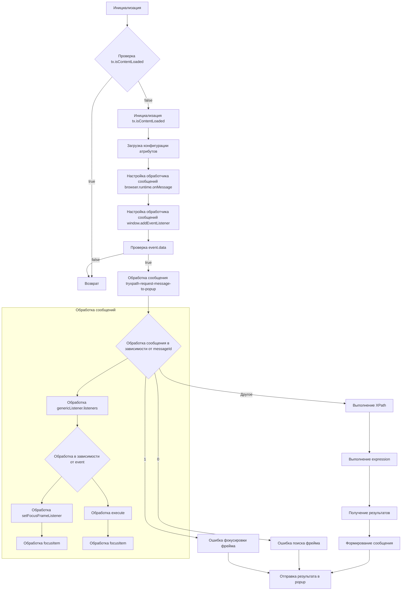

# Анализ кода try_xpath_content.js

## <input code>

```javascript
/* ... (Комментарии) */

(function (window, undefined) {
    "use strict";

    // alias
    var tx = tryxpath;
    var fu = tryxpath.functions;

    // prevent multiple execution
    if (tx.isContentLoaded) {
        return;
    }
    tx.isContentLoaded = true;

    // ... (Определения констант и переменных)

    // ... (Функции setAttr, setIndex, isFocusable, focusItem)

    // ... (Функции setMainAttrs, restoreAttrs, resetPrev, makeTypeStr)

    // ... (Функции updateCss, getFrames, parseFrameDesignation)

    // ... (Функция traceBlankWindows)

    // ... (Функция handleCssChange)

    // ... (Функция findFrameByMessage)

    // ... (Функция setFocusFrameListener)

    // ... (Функции initBlankWindow, findStyleParent, updateStyleElement)

    // ... (Функции updateAllStyleElements, removeStyleElement)

    // ... (Функция removeAllStyleElements)

    // ... (Функция createResultMessage)

    // ... (Функция genericListener)

    // ... (Обработчики событий onMessage и onChanged)

    // ... (Обработчик события message)


    prevMsg = createResultMessage();
    setFocusFrameListener(window, false);

    browser.runtime.sendMessage({ "event": "requestSetContentInfo" });

})(window);
```

## <algorithm>

Этот код реализует механизм для обработки запросов XPath в расширении для браузера Firefox.  Алгоритм можно представить в виде следующей блок-схемы:


Примеры:
* **A**: Инициализация переменных, констант, и настройка обработчиков сообщений.
* **M**:  Получение данных по XPath запросу
* **N**: Выполнение XPath запроса на получение узлов в указанном контексте.
* **O**: Формирование результата в виде списка узлов с дополнительной информацией.
* **P**: Создание и заполнение объекта `sendMsg` для отправки в popup.
* **Q**: Отправка `sendMsg` с результатом в `browser.runtime.sendMessage`.
* **J**: Обработка разных типов сообщений, пришедших из popup, либо из вложенных фреймов.
* **K, L**: Обработка сообщений об ошибках.


## <mermaid>

```mermaid
graph LR
    subgraph Расширение
        A[try_xpath_content.js] --> B(browser.runtime.onMessage);
        B --> C(genericListener);
        C --> D{Обработка сообщений};
        D --> E[execute];
        D --> F[focusItem];
        D --> G[focusContextItem];
        D --> H[focusFrame];
        D --> I[requestShowResultsInPopup];
        D --> J[resetStyle];
        D --> K[setStyle];
    end
    subgraph Браузер
        A --> L(window);
        L --> M(addEventListener("message"));
        M --> C;
    end
    subgraph Popup
        E --> N[Отправка XPath запроса]
        F --> O[Получение результата XPath]
        I --> P[Отображение результата]
    end
    subgraph Вложенные фреймы
        L --> Q(addEventListener("message"))
        Q --> C
    end
    subgraph Storage
        A --> R(browser.storage.onChanged)
    end


    E --> S[Обработка XPath];
    S --> T[Получение результатов];
    T --> U[Отправка результатов в Popup]


```

## <explanation>

**Импорты:**  Код использует `tryxpath` и `tryxpath.functions` (алиасы `tx` и `fu`).  Предполагается, что эти переменные и функции определены в других частях проекта (например, `src.webdriver.firefox.extentions.try_path_1.3.5.common.js`) и обеспечивают функции для работы с XPath, сохранения атрибутов, и получения элементов.

**Классы:**  Нет явных классов, но существуют объекты (например, `attributes`, `originalAttributes`, `insertedStyleElements`, `expiredCssSet`), которые представляют собой структуры данных, используемые для хранения различных настроек, данных и результатов.

**Функции:**
* `setAttr`, `setIndex`: Устанавливают атрибуты элементов или индексы для множества элементов, сохраняя при этом оригинальные значения.
* `isFocusable`, `focusItem`: Проверяют, может ли элемент быть фокусирован, и фокусируют элемент в соответствии с запросом.
* `setMainAttrs`, `restoreAttrs`, `resetPrev`: Настраивают главные атрибуты, восстанавливают атрибуты и сбрасывают предыдущие значения для следующей операции.
* `makeTypeStr`: Преобразует тип результата XPath в строку.
* `updateCss`, `getFrames`, `parseFrameDesignation`, `traceBlankWindows`, `handleCssChange`: Обработка CSS, получение фреймов, проверка на наличие пустых окон.
* `findFrameByMessage`, `setFocusFrameListener`: Обработка сообщений о фокусировке фреймов.
* `initBlankWindow`, `findStyleParent`, `updateStyleElement`: Инициализация пустого окна, поиск родителя для добавления стилей, обновление CSS стилей.
* `updateAllStyleElements`, `removeStyleElement`, `removeAllStyleElements`: Обновляет все элементы стилей, удаляет элемент стиля, удаляет все элементы стиля.
* `createResultMessage`: Создаёт стандартный объект результата, в случае отсутствия данных.
* `genericListener`: Центральный обработчик сообщений, который вызывает специализированные обработчики в зависимости от типа события.  Здесь же определены все функции-обработчики (`genericListener.listeners`).
* **Обработка событий `onMessage` и `onChanged`:**
   * `browser.runtime.onMessage.addListener(genericListener)`: Обработчик сообщений, переданных расширению.
   * `browser.storage.onChanged.addListener(changes)`: Обработчик изменений в хранилище браузера, например, настроек атрибутов.
* **Обработчик события `message`:** Обрабатывает сообщения из фреймов браузера.


**Переменные:**
* `tx`, `fu`: алиасы, ссылаются на переменные в другом месте кода.
* `attributes`: Объект, содержащий имена атрибутов, используемых для идентификации и управления элементами.
* `originalAttributes`: Map, содержащая оригинальные значения атрибутов элементов.
* `currentCss`: Текущий CSS стили.
* `expiredCssSet`: Набор устаревших CSS стилей.
* `contextItem`, `currentItems`, `focusedItem`: Переменные, используемые для хранения контекста и фокусируемых элементов во время обработки XPath.
* `inBlankWindow`: Флаг, указывающий, выполняется ли операция в отдельном окне.
* `currentDocument`: Текущий документ.
* `prevMsg`, `executionCount`: Предварительное сообщение и счётчик операций.


**Возможные ошибки и улучшения:**

* **Обработка ошибок:**  Код включает обработку ошибок `try...catch` в нескольких местах, что хорошо.  Однако, обработка ошибок могла бы быть более централизованной и логичной.
* **Документация:** Добавление комментариев с более подробным описанием функциональности функций и переменных.
* **Читабельность:** Некоторый код мог бы быть более организованным с использованием более понятных имён переменных.
* **Использование дополнительных инструментов:**  Для большей читаемости и удобства разработки можно использовать средства для форматирования кода, linting, и IDE с поддержкой JavaScript.
* **Переменные-константы**:  Использование констант (например, `NaN`) вместо магических чисел повышает читаемость.

**Взаимосвязь с другими частями проекта:**

Функции `tx` и `fu` предполагают существование других модулей, отвечающих за функции работы с XPath и элементами документа. Код взаимодействует с функциями из `tryxpath` и `tryxpath.functions`. Есть взаимодействие через события (`browser.runtime.sendMessage`) с другим компонентом (вероятно, расширения или popup). Есть взаимодействие со `browser.storage` для хранения и получения данных.  Отсутствие полной структуры проекта усложняет более глубокий анализ.