# <input code>

```python
## \file hypotez/src/webdriver/firefox/firefox.py
# -*- coding: utf-8 -*-\
#! venv/Scripts/python.exe
#! venv/bin/python/python3.12

"""
.. module:: src.webdriver.firefox
   :platform: Windows, Unix
   :synopsis: Firefox WebDriver

This code defines a subclass of `webdriver.Firefox` called `Firefox`. 
It provides additional functionality such as the ability to launch Firefox 
in kiosk mode and the ability to set up a Firefox profile for the WebDriver.

```python
# Example usage
if __name__ == "__main__":
    profile_name = "custom_profile"
    geckodriver_version = "v0.29.0"
    firefox_version = "78.0"
    
    browser = Firefox(profile_name=profile_name, geckodriver_version=geckodriver_version, firefox_version=firefox_version)
    browser.get("https://www.example.com")
    browser.quit()
```
@image html class_firefox.png

"""

MODE = 'dev'

import os
from pathlib import Path
from typing import Optional
from selenium.webdriver import Firefox as WebDriver
from selenium.webdriver.firefox.options import Options
from selenium.webdriver.firefox.service import Service
from selenium.webdriver.firefox.firefox_profile import FirefoxProfile
from selenium.common.exceptions import WebDriverException
from src.webdriver.executor import ExecuteLocator
from src.webdriver.js import JavaScript
from fake_useragent import UserAgent
from src import gs
from src.utils import j_loads_ns
from src.logger import logger

class Firefox(WebDriver):
    """
    Subclass of `webdriver.Firefox` that provides additional functionality.

    Attributes:
        driver_name (str): Name of the WebDriver used, defaults to 'firefox'.
    """
    driver_name: str = 'firefox'

    def __init__(self, profile_name: Optional[str] = None, 
                 geckodriver_version: Optional[str] = None,
                 firefox_version: Optional[str] = None, 
                 user_agent: Optional[dict] = None, 
                 *args, **kwargs) -> None:
        """
        Initializes the Firefox WebDriver with the specified launch options, profile, geckodriver version, and Firefox version.

        :param profile_name: Name of the Firefox profile to use.
        :param geckodriver_version: Version of the geckodriver to use.
        :param firefox_version: Version of Firefox to use.
        :param user_agent: A dictionary containing user agent settings.
        """
        # ... (rest of the code)
```

# <algorithm>

**(Блок-схема не приводится из-за объема кода.  Вместо этого дается описание алгоритма)**

1. **Инициализация:**  
   - Читает настройки из `firefox.json` используя `j_loads_ns`.
   - Определяет пути к `geckodriver` и `firefox` исполняемым файлам, используя `gs.path.root` и данные из `settings`.
   - Создает экземпляр `Service` для управления `geckodriver`.
   - Создает экземпляр `Options` для управления параметрами запуска браузера. Дополнительно задает опции из `firefox.json`, включая заголовки (headers).
   - Устанавливает случайный User-Agent.
   - Создает экземпляр `FirefoxProfile`, используя настройки профиля (включая `profile_name`). Обрабатывает специфику пути к профилю (определяет локальный или внутренний профиль).

2. **Запуск Firefox:**
   - Создает драйвер `WebDriver` с заданными `service` и `options`.
   - Вызывает `_payload` для инициализации дополнительных функций.

3. **Обработка ошибок:**
   - Обрабатывает исключение `WebDriverException` при проблемах с запуском драйвера.
   - Обрабатывает все остальные исключения.

4. **`_payload`:**
   - Инициализирует и связывает `JavaScript` и `ExecuteLocator` с драйвером, предоставляя доступ к их методам (get_page_lang, execute_locator, etc.).

```mermaid
graph TD
    subgraph "src.webdriver.firefox"
        A[Firefox] --> B(init);
        B --> C{Load settings};
        C --> D[Get geckodriver path];
        C --> E[Get firefox binary path];
        D --> F[Create Service];
        E --> G[Create Options];
        G --> H[Add arguments from settings];
        G --> I[Set User Agent];
        C --> J[Create FirefoxProfile];
        J --> K[Set profile directory];
        F --> B1(Create WebDriver);
        G --> B1;
        J --> B1;
        B1 --> L[Start Firefox];
        L --> M[_payload];
        M --> N[Create JavaScript];
        M --> O[Create ExecuteLocator];
        N --> P[Assign JavaScript methods];
        O --> Q[Assign ExecuteLocator methods];
    end
    subgraph "src"
        C -- settings --> gs;
        C -- utils --> j_loads_ns;
    end
    subgraph "selenium"
        B1 --> R[WebDriver];
        R --> P;
        R --> Q;
    end

    style B fill:#ccf,stroke:#333,stroke-width:2px
```

# <mermaid>



# <explanation>

**Импорты:**

- `os`, `pathlib`, `typing`: Стандартные библиотеки Python для работы с операционной системой, путями к файлам и типизацией.
- `selenium.webdriver.*`:  Пакет Selenium для управления веб-драйверами.  `Firefox`, `Options`, `Service`, `FirefoxProfile` — классы для работы с Firefox. `WebDriverException` — для обработки ошибок.
- `src.webdriver.executor`, `src.webdriver.js`:  Внутренние модули проекта (вероятно, для управления выполнением JavaScript-кода и работы с локаторами элементов).
- `fake_useragent`:  Библиотека для генерации случайных User-Agent строк.
- `src`:  Корневой пакет проекта, который содержит подпакеты (включая `webdriver`).
- `gs`:  Вероятно, внутренний модуль проекта для работы с конфигурацией и путями.
- `j_loads_ns`, `logger`:  Внутренние модули для работы с JSON-данными и логированием соответственно.

**Классы:**

- `Firefox`: Наследуется от `selenium.webdriver.Firefox`.  Расширяет функциональность стандартного драйвера Firefox, добавляя:
    - Инициализацию профилей.
    - Установку параметров запуска Firefox.
    - Возможность настройки User-Agent.
    - Наличие дополнительных методов (`_payload`) для расширения функциональности браузера.

**Функции:**

- `__init__`: Конструктор класса `Firefox`. Принимает параметры для настройки профиля, геокдрайвера и браузера. Устанавливает пути, параметры, профили и запускает браузер.
- `_payload`:  Внутренняя функция, выполняющая инициализацию дополнительных методов, связанных с JavaScript и локаторами.

**Переменные:**

- `MODE`: Переменная, хранящая режим работы.
- `geckodriver_path`, `firefox_binary_path`:  Пути к исполняемым файлам.
- `settings`:  Данные из файла `firefox.json` для настройки драйвера.
- `profile_directory`: Путь к директории профиля Firefox.
- `options`: Объект настроек Selenium для Firefox.
- `service`: Объект `Service` для управления geckodriver.
- `profile`: Объект `FirefoxProfile`.

**Возможные ошибки и улучшения:**

- **Обработка исключений:** Хорошая практика, но можно добавить более подробную информацию об ошибках (например, выводить лог с traceback).
- **Документация:** Можно добавить более подробную документацию к методам, классам и параметрам.
- **Управление ресурсами:**  Класс `Firefox` должен содержать метод `quit()` для закрытия браузера и освобождения ресурсов.  В примере `if __name__ == "__main__":` это правильно.
- **Проверка на существование файлов:** Проверять существование `geckodriver` и `firefox` исполняемых файлов.
- **Типизация:** Все аргументы конструктора `__init__` являются `Optional`. Возможно, стоит сделать некоторые аргументы обязательными или проверить их корректность.
- **Модульность:**  Функции  `_payload` можно разбить на более мелкие функции для лучшей читаемости и модульности.

**Связь с другими частями проекта:**

- `gs.path`:  Модуль для работы с путями к файлам, используемый для определения путей к `geckodriver` и `firefox`.
- `src.utils.j_loads_ns`:  Модуль для разбора настроек из JSON-файла.
- `src.logger`:  Модуль для логирования, используемый для вывода сообщений об ошибках и успешном запуске Firefox.
- `src.webdriver.js`:  Модуль для выполнения JavaScript-кода в контексте драйвера.
- `src.webdriver.executor`:  Модуль для работы с локаторами элементов.

В целом код хорошо структурирован и читаем, но есть моменты, которые можно улучшить для большей надежности и модульности.