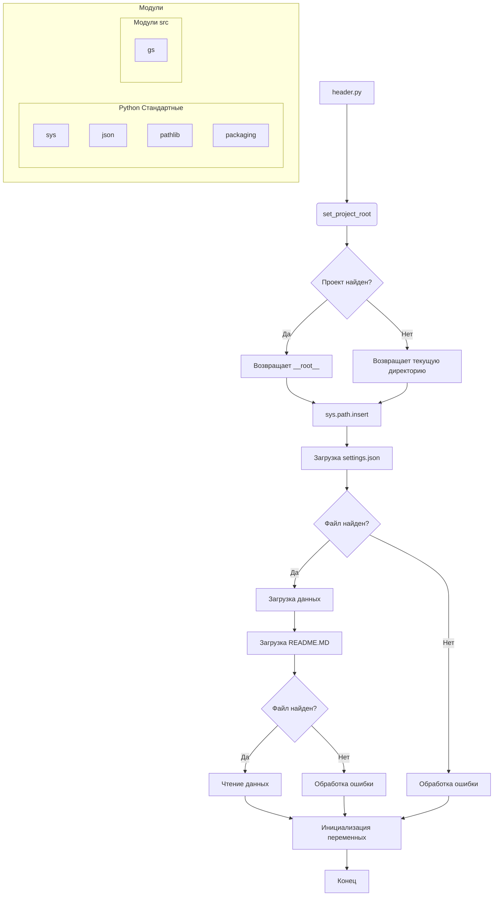

# <input code>

```python
## \file hypotez/src/webdriver/firefox/header.py
# -*- coding: utf-8 -*-\
#! venv/Scripts/python.exe
#! venv/bin/python/python3.12

"""
.. module: src.webdriver.firefox 
	:platform: Windows, Unix
	:synopsis:

"""
MODE = 'dev'

import sys
import json
from packaging.version import Version

from pathlib import Path
def set_project_root(marker_files=('pyproject.toml', 'requirements.txt', '.git')) -> Path:
    """
    Finds the root directory of the project starting from the current file's directory,
    searching upwards and stopping at the first directory containing any of the marker files.

    Args:
        marker_files (tuple): Filenames or directory names to identify the project root.
    
    Returns:
        Path: Path to the root directory if found, otherwise the directory where the script is located.
    """
    __root__:Path
    current_path:Path = Path(__file__).resolve().parent
    __root__ = current_path
    for parent in [current_path] + list(current_path.parents):
        if any((parent / marker).exists() for marker in marker_files):
            __root__ = parent
            break
    if __root__ not in sys.path:
        sys.path.insert(0, str(__root__))
    return __root__


# Get the root directory of the project
__root__ = set_project_root()
"""__root__ (Path): Path to the root directory of the project"""

from src import gs

settings:dict = None
try:
    with open(gs.path.root / 'src' / 'settings.json', 'r') as settings_file:
        settings = json.load(settings_file)
except (FileNotFoundError, json.JSONDecodeError):
    ...

doc_str:str = None
try:
    with open(gs.path.root / 'src' / 'README.MD', 'r') as settings_file:
        doc_str = settings_file.read()
except (FileNotFoundError, json.JSONDecodeError):
    ...


__project_name__ = settings.get("project_name", 'hypotez') if settings  else 'hypotez'
__version__: str = settings.get("version", '')  if settings  else ''
__doc__: str = doc_str if doc_str else ''
__details__: str = ''
__author__: str = settings.get("author", '')  if settings  else ''
__copyright__: str = settings.get("copyrihgnt", '')  if settings  else ''
__cofee__: str = settings.get("cofee", "Treat the developer to a cup of coffee for boosting enthusiasm in development: https://boosty.to/hypo69")  if settings  else "Treat the developer to a cup of coffee for boosting enthusiasm in development: https://boosty.to/hypo69"
```

# <algorithm>

**Алгоритм работы:**

1. **`set_project_root`:**
   - Принимает кортеж `marker_files` с именами файлов/папок, по которым определяется корень проекта.
   - Начинает поиск с текущей директории файла.
   - Перебирает родительские директории до тех пор, пока не найдёт директорию, содержащую хотя бы один из файлов/папок из `marker_files`.
   - Если найдена, то возвращает её путь, иначе возвращает путь текущей директории.
   - Дополнительно добавляет путь к корню проекта в `sys.path` для импорта модулей из родительских каталогов.
   * **Пример:** Если `__file__` находится в `hypotez/src/webdriver/firefox/header.py`, а `pyproject.toml` находится в `hypotez`, то функция вернет `hypotez`.


2. **Получение данных из `settings.json`:**
   - Находит файл `settings.json` в директории `src` относительно корня проекта (`__root__`).
   - Загружает данные из файла в переменную `settings` с помощью `json.load`.
   - Обрабатывает исключения `FileNotFoundError` и `json.JSONDecodeError`, если файл не найден или поврежден.


3. **Получение данных из `README.MD`:**
    - Аналогично считывает содержимое `README.MD` в переменную `doc_str`.
    - Обрабатывает исключения, если файл не найден или поврежден.


4. **Инициализация констант:**
   - Инициализирует переменные `__project_name__`, `__version__`, `__doc__`, `__details__`, `__author__`, `__copyright__`, `__cofee__`, используя данные из `settings` (если доступны), иначе с умолчанием.


**Пример данных:**

`settings.json`:
```json
{
  "project_name": "MyProject",
  "version": "1.0.0",
  "author": "John Doe"
}
```

В результате выполнения будут инициализированы соответствующие переменные.

# <mermaid>



**Объяснение диаграммы:**

- `header.py` — стартовая точка.
- `set_project_root()` ищет корень проекта.
- `gs` — это, вероятно, модуль из пакета `src`, который используется для получения пути к корню проекта.
- `json` используется для загрузки настроек.
- `pathlib` используется для работы с путями.
- `packaging` — для работы с версиями пакетов.
- Код обрабатывает возможные ошибки (например, `FileNotFoundError`, `json.JSONDecodeError`) при работе с файлами.


# <explanation>

**Импорты:**

- `sys`: Предоставляет доступ к системным переменным, в том числе `sys.path`. Используется для добавления пути к корню проекта в `sys.path`, чтобы Python мог импортировать модули из родительских каталогов.
- `json`: Для работы с файлами JSON.
- `packaging.version`: Для работы с версиями пакетов.
- `pathlib`: Для работы с путями. `Path` — ключевой класс для работы с путями.
- `src.gs`: Вероятно, модуль из пакета `src`, предоставляющий функциональность для работы с путями.
   - Это крайне важная зависимость, так как определяет путь к корню проекта.

**Классы:**

- В коде нет явных пользовательских классов. Используются встроенные классы, такие как `Path` из `pathlib`.

**Функции:**

- `set_project_root(marker_files)`: Ищет корень проекта, начиная с текущего файла. Это ключевая функция, которая определяет правильный путь к корню проекта.  Аргументы, возвращаемые значения, обработка ошибок - подробно рассмотрены в разделе "Алгоритм".

**Переменные:**

- `__root__`: Путь к корню проекта.
- `settings`: Словарь с настройками проекта из `settings.json`.
- `doc_str`: Содержимое файла `README.MD`.
- `__project_name__`, `__version__`, `__doc__`, `__details__`, `__author__`, `__copyright__`, `__cofee__`:  Константы, полученные из `settings` или со значениями по умолчанию. Эти переменные используются для хранения важных метаданных проекта.

**Возможные ошибки и улучшения:**

- **Обработка ошибок:** Хорошая практика, но можно добавить более подробную информацию об ошибках в логах для лучшей отладки.
- **Документация:** Добавлены строки документации к функциям и переменным, что улучшает читаемость кода.
- **Логирование:** Добавление логирования может помочь отслеживать процесс поиска корня проекта и обработки ошибок.

**Взаимосвязи с другими частями проекта:**

Функция `set_project_root()`  и последующая загрузка настроек и документации (`settings.json`, `README.MD`)  явно демонстрирует зависимость от этих файлов, а также от модуля `gs` из пакета `src` для работы с путями.  Это указывает на то, что этот модуль (`header.py`) является частью более крупного проекта и выполняет начальные инициализирующие действия.  Загрузка `settings` и `README` используется для различных целей (например, для инициализации переменных, используемых во всем проекте).