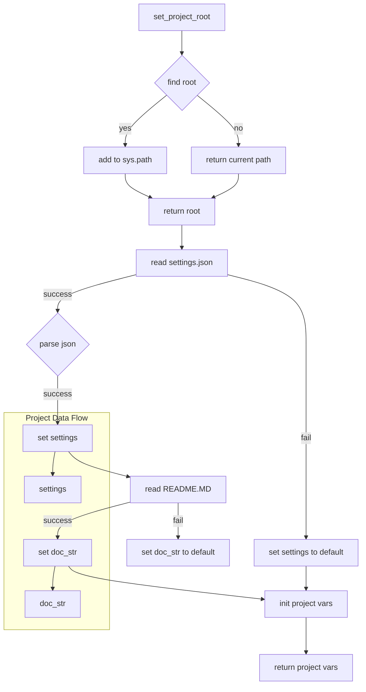

# <input code>

```python
## \file hypotez/src/webdriver/header.py
# -*- coding: utf-8 -*-
#! venv/Scripts/python.exe
#! venv/bin/python/python3.12

"""
.. module: src.webdriver 
	:platform: Windows, Unix
	:synopsis:

"""
MODE = 'dev'

import sys
import json
from packaging.version import Version

from pathlib import Path
def set_project_root(marker_files=('pyproject.toml', 'requirements.txt', '.git')) -> Path:
    """ Finds the root directory of the project starting from the current file's directory,
    searching upwards and stopping at the first directory containing any of the marker files.

    Args:
        marker_files (tuple): Filenames or directory names to identify the project root.
    
    Returns:
        Path: Path to the root directory if found, otherwise the directory where the script is located.
    """
    __root__:Path
    current_path:Path = Path(__file__).resolve().parent
    __root__ = current_path
    for parent in [current_path] + list(current_path.parents):
        if any((parent / marker).exists() for marker in marker_files):
            __root__ = parent
            break
    if __root__ not in sys.path:
        sys.path.insert(0, str(__root__))
    return __root__


# Get the root directory of the project
__root__ = set_project_root()
"""__root__ (Path): Path to the root directory of the project"""

from src import gs

settings:dict = None
try:
    with open(gs.path.root / 'src' / 'settings.json', 'r') as settings_file:
        settings = json.load(settings_file)
except (FileNotFoundError, json.JSONDecodeError):
    ...

doc_str:str = None
try:
    with open(gs.path.root / 'src' / 'README.MD', 'r') as settings_file:
        doc_str = settings_file.read()
except (FileNotFoundError, json.JSONDecodeError):
    ...


__project_name__ = settings.get("project_name", 'hypotez') if settings  else 'hypotez'
__version__: str = settings.get("version", '')  if settings  else ''
__doc__: str = doc_str if doc_str else ''
__details__: str = ''
__author__: str = settings.get("author", '')  if settings  else ''
__copyright__: str = settings.get("copyrihgnt", '')  if settings  else ''
__cofee__: str = settings.get("cofee", "Treat the developer to a cup of coffee for boosting enthusiasm in development: https://boosty.to/hypo69")  if settings else "Treat the developer to a cup of coffee for boosting enthusiasm in development: https://boosty.to/hypo69"
```

# <algorithm>

**Алгоритм работы:**

1. **Нахождение корневой директории проекта (`set_project_root`)**:
    * Получает текущую директорию файла (`__file__`).
    * Итерируется по родительским директориям, начиная с текущей, до тех пор, пока не найдёт директорию, содержащую файлы `pyproject.toml`, `requirements.txt` или `.git` (маркеры проекта).
    * Если корневая директория найдена, добавляет её в `sys.path` для импорта модулей из проекта.
    * Возвращает найденную корневую директорию.

2. **Чтение настроек проекта (`settings`)**:
    * Используя найденную корневую директорию, читает файл `settings.json` из поддиректории `src`.
    * Обрабатывает ошибки `FileNotFoundError` и `json.JSONDecodeError`, если файл не найден или имеет некорректный формат JSON.

3. **Чтение документации проекта (`doc_str`)**:
    * Аналогично чтению настроек, но читает файл `README.MD`.

4. **Инициализация переменных проекта**:
    * Получает значения из `settings` для `__project_name__`, `__version__`, `__author__`, `__copyright__`, `__cofee__`, используя метод `get()` для безопасного обращения к словарю.
    * Устанавливает значения для других переменных `__doc__`, `__details__`. Если значения не найдены, используются значения по умолчанию.


**Пример данных:**

Пусть `__file__` находится в `/home/user/project/webdriver/header.py`.
`set_project_root()` будет искать корневую директорию, содержащую `pyproject.toml`, `requirements.txt` или `.git` в `/home/user/project/`, `/home/user/`.  Если `pyproject.toml` найден в `/home/user/project/`, то `__root__` будет иметь это значение. Затем это значение будет добавлено в `sys.path`.


# <mermaid>



# <explanation>

**Импорты:**

* `sys`:  Предоставляет доступ к системным переменным, включая `sys.path`, необходимый для импорта модулей из разных директорий.
* `json`: Используется для работы с файлами в формате JSON, необходимым для обработки настроек проекта.
* `packaging.version`: Позволяет работать с версиями пакетов. В данном случае импорт не используется напрямую.
* `pathlib`: Предоставляет класс `Path` для работы с файлами и директориями, что делает код более читаемым и безопасным в плане обработки путей.
* `gs`:  Предполагается, что `gs` – это модуль из пакета `src`, вероятно, содержащий вспомогательные функции или классы для работы с путями к ресурсам проекта.  Это внешняя зависимость.


**Классы:**

Нет явных классов в данном коде.  Используется класс `Path` из `pathlib`.


**Функции:**

* `set_project_root(marker_files)`: Находит корневую директорию проекта.  Принимает кортеж `marker_files`, содержащий имена файлов (или директорий), которые позволяют определить корень проекта. Возвращает объект `Path` с путем к корневой директории или путь к текущей директории, если корень не найден.  Функция важна для правильной работы импорта модулей.


**Переменные:**

* `MODE`: Строковая переменная, вероятно, определяющая режим работы приложения (например, `dev`, `prod`).
* `__root__`: Объект `Path`, хранящий путь к корневой директории проекта.
* `settings`: Словарь, хранящий настройки проекта, полученные из файла `settings.json`.
* `doc_str`: Строка, содержащая текст документации, прочитанная из файла `README.MD`.
* `__project_name__`, `__version__`, `__author__`, `__copyright__`, `__cofee__`, `__doc__`, `__details__`:  Строковые переменные, содержащие информацию о проекте, полученные из настроек. Использование префикса `__` предполагает, что это внутренние константы или атрибуты.


**Возможные ошибки и улучшения:**

* **Обработка ошибок:**  Обработка `FileNotFoundError` и `json.JSONDecodeError` важна, но проверка на корректность данных в файле `settings.json` (например, наличие нужных ключей) могла бы быть дополнена.
* **Типизация:**  Использование аннотаций типов (`-> Path`) улучшает читаемость и позволяет статическим анализаторам выявлять ошибки.
* **Логирование:**  Добавление логирования может помочь в отладке.
* **`gs.path.root`:**  Необходимо понимать, как `gs` взаимодействует с корневой директории.  Это важная зависимость и следует определить, как она строится.  (Например, `gs` может использовать `__root__` или другой способ определения пути.)


**Взаимосвязь с другими частями проекта:**

Код в `header.py` является вспомогательным и предоставляет данные для других частей проекта (например, для инициализации параметров запуска).  Он, скорее всего, используется другими модулями (в `src`) для получения информации о проекте.  Взаимосвязь напрямую зависит от того, как используется `__root__` в других модулях.