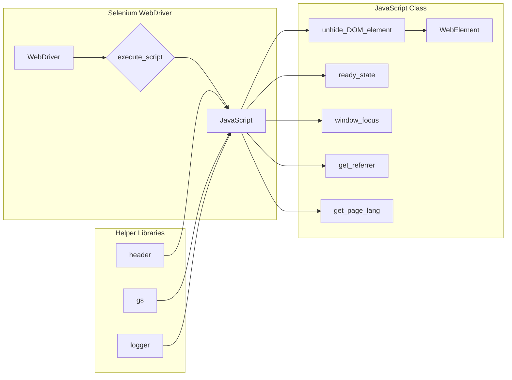

# <input code>

```python
## \file hypotez/src/webdriver/js.py
# -*- coding: utf-8 -*-\
#! venv/Scripts/python.exe
#! venv/bin/python/python3.12

"""
.. module:: src.webdriver.js
    :platform: Windows, Unix
    :synopsis: Provides JavaScript utility functions for interacting with a web page.

This module is designed to extend the capabilities of Selenium WebDriver by adding common JavaScript-based
functions for interacting with web pages, including visibility manipulations, retrieving page information,
and managing browser focus.

Key Features:
    1. Make invisible DOM elements visible for interaction.
    2. Retrieve metadata like document ready state, referrer, or page language.
    3. Manage browser window focus programmatically.
"""
MODE = 'dev'

import header
from src import gs
from src.logger import logger
from selenium.webdriver.remote.webdriver import WebDriver
from selenium.webdriver.remote.webelement import WebElement


class JavaScript:
    """Provides JavaScript utility functions for interacting with a web page."""

    def __init__(self, driver: WebDriver):
        """Initializes the JavaScript helper with a Selenium WebDriver instance.

        Args:
            driver (WebDriver): Selenium WebDriver instance to execute JavaScript.
        """
        self.driver = driver

    def unhide_DOM_element(self, element: WebElement) -> bool:
        """Makes an invisible DOM element visible by modifying its style properties.

        Args:
            element (WebElement): The WebElement object to make visible.

        Returns:
            bool: True if the script executes successfully, False otherwise.
        """
        script = """
        arguments[0].style.opacity = 1;
        arguments[0].style.transform = 'translate(0px, 0px) scale(1)';
        arguments[0].style.MozTransform = 'translate(0px, 0px) scale(1)';
        arguments[0].style.WebkitTransform = 'translate(0px, 0px) scale(1)';
        arguments[0].style.msTransform = 'translate(0px, 0px) scale(1)';
        arguments[0].style.OTransform = 'translate(0px, 0px) scale(1)';
        arguments[0].scrollIntoView(true);
        return true;
        """
        try:
            self.driver.execute_script(script, element)
            return True
        except Exception as ex:
            logger.error('Error in unhide_DOM_element: %s', ex)
            return False

    @property
    def ready_state(self) -> str:
        """Retrieves the document loading status.

        Returns:
            str: 'loading' if the document is still loading, 'complete' if loading is finished.
        """
        try:
            return self.driver.execute_script('return document.readyState;')
        except Exception as ex:
            logger.error('Error retrieving document.readyState: %s', ex)
            return ''

    def window_focus(self) -> None:
        """Sets focus to the browser window using JavaScript.

        Attempts to bring the browser window to the foreground.
        """
        try:
            self.driver.execute_script('window.focus();')
        except Exception as ex:
            logger.error('Error executing window.focus(): %s', ex)

    def get_referrer(self) -> str:
        """Retrieves the referrer URL of the current document.

        Returns:
            str: The referrer URL, or an empty string if unavailable.
        """
        try:
            return self.driver.execute_script('return document.referrer;') or ''
        except Exception as ex:
            logger.error('Error retrieving document.referrer: %s', ex)
            return ''

    def get_page_lang(self) -> str:
        """Retrieves the language of the current page.

        Returns:
            str: The language code of the page, or an empty string if unavailable.
        """
        try:
            return self.driver.execute_script('return document.documentElement.lang;') or ''
        except Exception as ex:
            logger.error('Error retrieving document.documentElement.lang: %s', ex)
            return ''
```

# <algorithm>

**Алгоритм работы класса JavaScript:**

1. **Инициализация (__init__):**
   - Принимает экземпляр WebDriver.
   - Сохраняет WebDriver в свойстве `self.driver`.
   - *Пример:* `driver = webdriver.Chrome()`, `js_helper = JavaScript(driver)`.

2. **Скрытие элемента (unhide_DOM_element):**
   - Принимает WebElement.
   - Создает JavaScript-код для изменения свойств стиля элемента (opacity, transform).
   - Использует `execute_script` для выполнения кода в браузере.
   - Возвращает True при успешном выполнении, False при ошибке.
   - *Пример:* `element = driver.find_element(...)`, `result = js_helper.unhide_DOM_element(element)`.

3. **Получение состояния загрузки (ready_state):**
   - Возвращает состояние загрузки страницы (loading/complete).
   - Использует `execute_script` для получения значения `document.readyState`.
   - *Пример:* `state = js_helper.ready_state`.

4. **Установка фокуса на окно (window_focus):**
   - Использует `execute_script` для вызова `window.focus()`.
   - *Пример:* `js_helper.window_focus()`.

5. **Получение referrer (get_referrer):**
   - Возвращает ссылку referrer.
   - Использует `execute_script` для получения значения `document.referrer`.
   - *Пример:* `referrer = js_helper.get_referrer()`.

6. **Получение языка страницы (get_page_lang):**
   - Возвращает язык страницы.
   - Использует `execute_script` для получения значения `document.documentElement.lang`.
   - *Пример:* `lang = js_helper.get_page_lang()`.

Взаимодействие между функциями и классами осуществляется через передачу параметров (WebElement в unhide_DOM_element) и вызов методов экземпляра JavaScript.  Результат работы, такой как True/False в unhide_DOM_element, возвращается вызывающей стороне.

# <mermaid>



**Объяснение диаграммы:**

Диаграмма иллюстрирует, как класс JavaScript использует Selenium WebDriver для выполнения JavaScript-кода на странице.  WebDriver выступает в качестве посредника для взаимодействия с браузером.  Зависимости от других частей проекта (header, gs, logger) также отображены.

# <explanation>

**Импорты:**

- `header`: Вероятно, содержит вспомогательные функции или константы, специфичные для проекта.
- `gs`: Вероятно, содержит вспомогательные функции или классы для работы с данными.
- `src.logger`: Модуль для логирования, используемый для записи сообщений об ошибках.
- `selenium.webdriver.remote.webdriver`: Основной класс WebDriver из Selenium, позволяющий управлять браузером.
- `selenium.webdriver.remote.webelement`: Класс WebElement, представляющий элемент на веб-странице.

**Классы:**

- `JavaScript`:  Помощник для выполнения JavaScript-кода внутри Selenium WebDriver.  Атрибут `driver` хранит экземпляр WebDriver для взаимодействия.  Методы (unhide_DOM_element, ready_state, window_focus, get_referrer, get_page_lang) реализуют необходимые функции.


**Функции:**

- `__init__(self, driver)`: Инициализирует объект JavaScript, сохраняя экземпляр WebDriver.
- `unhide_DOM_element(self, element)`: Делает видимым элемент на странице.  Критически важно обрабатывать возможные исключения (`try...except`).
- `ready_state(self)`: Возвращает текущее состояние загрузки документа.
- `window_focus(self)`: Ставит фокус на окно браузера.
- `get_referrer(self)`: Возвращает URL referrer.
- `get_page_lang(self)`: Возвращает язык страницы.

**Переменные:**

- `MODE`: Контейнер константы, вероятно, для управления режимами работы.
- `script`: Содержит JavaScript-код для выполнения на странице.

**Возможные ошибки и улучшения:**

- **Обработка исключений:** Обработка исключений (try...except) в методах очень важна, так как `execute_script` может вызвать ошибки.
- **Явное указание типов:**  Хорошая практика для ясности кода.
- **Улучшение документации:** Добавьте более подробные комментарии к параметрам, возвращаемым значениям и возможным исключениям.
- **Логирование:** Логирование должно быть более подробным (например, уровень детализации логирования).

**Взаимосвязи с другими частями проекта:**

- Этот модуль (js.py) использует модуль `logger` для записи ошибок и `gs` для взаимодействия с данными, вероятно. 
- `header` может содержать дополнительные импорты или настройки.
- Модуль зависит от Selenium WebDriver для взаимодействия с браузером.


Этот код представляет собой хороший пример взаимодействия с браузером с помощью JavaScript.  Обработка ошибок делает его более устойчивым к проблемам.