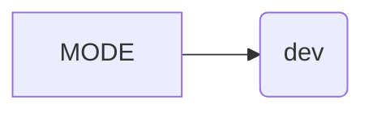

```MD
# <input code>

```python
## \file hypotez/src/webdriver/playwright/pw_executor.py
# -*- coding: utf-8 -*-
#! venv/Scripts/python.exe
#! venv/bin/python/python3.12

"""
.. module: src.webdriver.playwright 
	:platform: Windows, Unix
	:synopsis:

"""
MODE = 'dev'
```

# <algorithm>

Этот код представляет собой фрагмент, содержащий только одну глобальную переменную.  Блок-схема в данном случае не применима.  Данные не передаются между функциями или классами.

# <mermaid>



# <explanation>

Этот код представляет собой очень небольшой фрагмент Python-файла, содержащий лишь одну строку с определением глобальной константы. 

* **`MODE = 'dev'`**: Это строковая константа, которая вероятно используется для определения режима работы программы. Значение `'dev'` указывает на "разработку". В более полном контексте кода эта переменная могла бы использоваться для выбора различных конфигураций, например, для переключения между режимами разработки, тестирования или производства.  Без контекста дальнейшего кода сложно сказать о ее точном применении.

* **Импорты**: В данном примере импортов нет.  Этот фрагмент не взаимодействует с другими модулями.

* **Классы**: Нет классов.

* **Функции**: Нет функций.

* **Переменные**: Единственная переменная - `MODE` - имеет тип `str` и хранит строковое значение 'dev'.

* **Возможные ошибки или области для улучшений**:
    * Отсутствие документации (документирующих строк) о назначении переменной.  В идеале, в строке документации ("""...""") нужно было бы дать описание цели этой константы.
    * Непонятно, где и как используется эта константа. Без контекста дальнейшего кода сложно оценить ее важность.


**Цепочка взаимосвязей**:  Без дальнейшего кода сложно определить взаимосвязи с другими частями проекта.  По всей видимости, это константа, используемая в другом файле (модуле).  Возможно, этот код используется для настройки параметров, которые будут использованы в других функциях.