## ИНСТРУКЦИЯ:

Анализируй предоставленный код подробно и объясни его функциональность. Ответ должен включать три раздела:  

1. **<алгоритм>**: Опиши рабочий процесс в виде пошаговой блок-схемы, включая примеры для каждого логического блока, и проиллюстрируй поток данных между функциями, классами или методами.  
2. **<mermaid>**: Напиши код для диаграммы в формате `mermaid`, проанализируй и объясни все зависимости, 
    которые импортируются при создании диаграммы. 
    **ВАЖНО!** Убедитесь, что все имена переменных, используемые в диаграмме `mermaid`, 
    имеют осмысленные и описательные имена. Имена переменных вроде `A`, `B`, `C`, и т.д., не допускаются!  
    
    **Дополнительно**: Если в коде есть импорт `import header`, добавьте блок `mermaid` flowchart, объясняющий `header.py`:\
    ```mermaid\
    flowchart TD\
        Start --> Header[<code>header.py</code><br> Determine Project Root]\
    \
        Header --> import[Import Global Settings: <br><code>from src import gs</code>] \
    ```

3. **<объяснение>**: Предоставьте подробные объяснения:  
   - **Импорты**: Их назначение и взаимосвязь с другими пакетами `src.`.  
   - **Классы**: Их роль, атрибуты, методы и взаимодействие с другими компонентами проекта.  
   - **Функции**: Их аргументы, возвращаемые значения, назначение и примеры.  
   - **Переменные**: Их типы и использование.  
   - Выделите потенциальные ошибки или области для улучшения.  

Дополнительно, постройте цепочку взаимосвязей с другими частями проекта (если применимо).  

Это обеспечивает всесторонний и структурированный анализ кода.
## Формат ответа: `.md` (markdown)
**КОНЕЦ ИНСТРУКЦИИ**

## <алгоритм>

Этот документ README.MD описывает структуру модулей проекта `hypo`. Он не содержит исполняемого кода, а представляет собой текстовое описание.  Алгоритмически, его можно представить как последовательность шагов:
   
1. **Начало**: Документ начинается с общей информации о проекте и ссылок на главную страницу и русскоязычную версию документа.
2. **Обзор модулей**:
   -  Для каждого модуля (assistant, bot, scenario, suppliers, templates, translators, utils, webdriver) предоставляется:
     - Описание функциональности модуля.
     - Ссылка на исходный код модуля.
     - Ссылка на документацию модуля.
     - Ссылка на тесты модуля.
     - Ссылка на примеры использования модуля.
3. **Глоссарий**:
   - Описываются основные понятия и термины проекта, сгруппированные по областям (webdriver, Supplier, Product, ai).

Пример логического блока:
   
   - **Модуль**: `assistant`
       - **Описание**: "Module for interacting with the `CodeAssistant` class, which helps with processing code tasks."
       - **Ссылки**:
          - [Module code](https://github.com/hypo69/hypo/blob/master/src/assistant/readme.en.md)
          - [Documentation](https://github.com/hypo69/hypo/blob/master/docs/gemini/en/doc/src/assistant/readme.en.md)
          - [Tests](https://github.com/hypo69/hypo/blob/master/pytest/gemini/src/assistant)
          - [Examples](https://github.com/hypo69/hypo/blob/master/docs/examples/assistant)
       - **Поток данных**: Читается как текст, не подразумевает выполнения, а является указателем на другие части проекта.

```mermaid
graph LR
    Start[Начало] --> Modules[Обзор модулей];
    Modules --> Assistant[Модуль assistant];
    Modules --> Bot[Модуль bot];
    Modules --> Scenario[Модуль scenario];
    Modules --> Suppliers[Модуль suppliers];
    Modules --> Templates[Модуль templates];
    Modules --> Translators[Модуль translators];
    Modules --> Utils[Модуль utils];
    Modules --> Webdriver[Модуль webdriver];
    Modules --> Glossary[Глоссарий];
    
    Assistant --> Assistant_code[Ссылка на код модуля];
    Assistant --> Assistant_doc[Ссылка на документацию];
    Assistant --> Assistant_tests[Ссылка на тесты];
    Assistant --> Assistant_examples[Ссылка на примеры];
    
    Bot --> Bot_code[Ссылка на код модуля];
    Bot --> Bot_doc[Ссылка на документацию];
    Bot --> Bot_tests[Ссылка на тесты];
    Bot --> Bot_examples[Ссылка на примеры];

    Scenario --> Scenario_code[Ссылка на код модуля];
    Scenario --> Scenario_doc[Ссылка на документацию];
    Scenario --> Scenario_tests[Ссылка на тесты];
    Scenario --> Scenario_examples[Ссылка на примеры];
    
    Suppliers --> Suppliers_code[Ссылка на код модуля];
    Suppliers --> Suppliers_doc[Ссылка на документацию];
    Suppliers --> Suppliers_tests[Ссылка на тесты];
    Suppliers --> Suppliers_examples[Ссылка на примеры];

    Templates --> Templates_code[Ссылка на код модуля];
    Templates --> Templates_doc[Ссылка на документацию];
    Templates --> Templates_tests[Ссылка на тесты];
    Templates --> Templates_examples[Ссылка на примеры];

    Translators --> Translators_code[Ссылка на код модуля];
    Translators --> Translators_doc[Ссылка на документацию];
    Translators --> Translators_tests[Ссылка на тесты];
    Translators --> Translators_examples[Ссылка на примеры];
    
    Utils --> Utils_code[Ссылка на код модуля];
    Utils --> Utils_doc[Ссылка на документацию];
    Utils --> Utils_tests[Ссылка на тесты];
    Utils --> Utils_examples[Ссылка на примеры];

    Webdriver --> Webdriver_code[Ссылка на код модуля];
    Webdriver --> Webdriver_doc[Ссылка на документацию];
    Webdriver --> Webdriver_tests[Ссылка на тесты];
    Webdriver --> Webdriver_examples[Ссылка на примеры];

    Glossary --> Webdriver_terms[Термины Webdriver];
    Glossary --> Supplier_terms[Термины Supplier];
    Glossary --> Product_terms[Термины Product];
    Glossary --> AI_terms[Термины AI];
    
    
    classDef module fill:#f9f,stroke:#333,stroke-width:2px
    class Assistant,Bot,Scenario,Suppliers,Templates,Translators,Utils,Webdriver module
```

## <mermaid>



**Анализ `mermaid`:**
- Диаграмма представляет собой граф, где узлы – это разделы README.MD, а стрелки показывают их взаимосвязь.
- `Start` - начало документа.
- `Modules` - общий раздел, объединяющий все модули проекта.
- Каждый модуль (например, `Assistant`, `Bot`) имеет свои узлы для исходного кода, документации, тестов и примеров.
- `Glossary` содержит термины по `webdriver`, `Supplier`, `Product`, и `ai`
- `classDef` задает стиль для блоков, представляющих модули
- Диаграмма наглядно демонстрирует структуру документа и его организацию.
- Нет импорта сторонних зависимостей, так как это описание, а не исполняемый код.

## <объяснение>

**Общее:**

- Этот документ (README.MD) является точкой входа для понимания структуры проекта `hypo`. Он предоставляет общую картину всех основных модулей, включая ссылки на их код, документацию, тесты и примеры использования.
- Он не выполняет никаких действий, а лишь служит ориентиром для разработчиков и пользователей проекта.
- Он написан на языке разметки reStructuredText, что позволяет его преобразовать в различные форматы (например, HTML).

**Разделы:**

1.  **Модули**:
    -   Каждый модуль представляет собой отдельную функциональную область проекта.
    -   `assistant`:  Управляет обработкой задач с кодом. Использует класс `CodeAssistant`.
    -   `bot`:  Содержит логику работы бота, включая обработку сообщений и команд.
    -   `scenario`:  Отвечает за создание и выполнение сценариев.
    -   `suppliers`:  Управляет данными и отношениями с поставщиками.
    -   `templates`:  Работает с шаблонами для различных целей.
    -   `translators`:  Занимается переводом текста.
    -   `utils`:  Содержит вспомогательные функции и утилиты.
    -   `webdriver`:  Управляет веб-браузерами и элементами на веб-страницах.
    -   Для каждого модуля указаны пути к файлам (код, документация, тесты, примеры).
    -   **Цепочка взаимосвязей**: Каждый модуль может зависеть от других модулей, но  в этом документе связи явно не описаны, только пути к файлам. Связи выстраиваются внутри самих модулей (например, `bot` может использовать `assistant` для обработки задач).

2.  **Глоссарий**:
    -   Определяет основные термины и понятия, используемые в проекте.
    -   **`webdriver`**:
        -  `Driver`:  Интерфейс для управления браузером.
        -  `Executor`:  Выполняет команды в контексте драйвера.
        -  `Chrome`, `Firefox` и др.:  Конкретные браузеры, управляемые через `webdriver`.
        -  `locator`:  Механизм поиска элементов на веб-странице.
    -   **`Supplier`**:
        -   Список поставщиков (например, `Amazon`, `Aliexpress`):  Компании, предоставляющие товары и услуги.
        -   `Graber`: Инструмент для автоматического сбора данных с сайтов поставщиков.
    -   **`Product`**:
        -   `Product`:  Объект, представляющий товар или услугу.
        -   `ProductFields`:  Атрибуты, описывающие продукт (название, цена, описание, изображения).
    -   **`ai`**:
        -   `Model Prompt`: Устанавливает, как модель должна обрабатывать и отвечать на запросы.
        -   `Command Instruction`:  Небольшие инструкции, отправляемые вместе с запросами.

**Улучшения и потенциальные ошибки:**

-   **Отсутствие явных зависимостей**: Документ не описывает явные зависимости между модулями. Было бы полезно добавить раздел о том, как модули взаимодействуют друг с другом, например, с помощью диаграммы.
-   **Подробное описание модулей**: Описания модулей довольно кратки. Было бы хорошо расширить их, добавив больше деталей о их функциональности и возможностях.
-   **Актуальность ссылок**: Необходимо следить за актуальностью ссылок на другие файлы.

В целом, данный документ является важным элементом проекта, который помогает пользователям и разработчикам ориентироваться в его структуре и функциональности.