## Анализ структуры проекта Hypo

### 1. <алгоритм>

Этот документ `README.MD` описывает структуру модулей проекта `Hypo`, представляя каждый модуль как отдельную сущность со своей функциональностью. Вот пошаговая блок-схема описания проекта:

1.  **Начало**: Пользователь открывает `README.MD` в `src`.
2.  **Обзор**: Пользователю предоставляется общее описание проекта и ссылка на корень проекта (`[Root ↑]`).
3.  **Переключение языков**: Предоставляется ссылка на русскоязычную версию `readme.ru.md`.
4.  **Описание модулей**:  Документ содержит разделы для каждого модуля. Процесс повторяется для каждого из них:
    *   **Имя модуля**: `assistant`, `bot`, `scenario`, `suppliers`, `templates`, `translators`, `utils`, `webdriver`.
    *   **Описание модуля**: Краткое описание функциональности модуля.
    *   **Ссылки**: Ссылки на ресурсы, связанные с модулем:
        *   `Module code` - ссылка на исходный код модуля.
        *   `Documentation` - ссылка на документацию модуля.
        *   `Tests` - ссылка на тесты модуля.
        *   `Examples` - ссылка на примеры использования модуля.
5.  **Глоссарий**: Описание ключевых понятий проекта, сгруппированных по разделам:
    *   **`webdriver`**: `Driver`, `Executor`, `Chrome`, `Firefox`, `locator`.
    *   **`Supplier`**: `Amazon`, `Aliexpress`, `Morlevi`, `Graber`.
    *   **`Product`**: `Product`, `ProductFields`.
    *   **`ai`**: `Model Prompt`, `Command Instruction`.
6.  **Переход к следующему этапу**: Ссылка на файл `credentials.md` для инициализации и настройки проекта.
7.  **Конец**: Конец документа `README.MD`.

**Пример работы для модуля `assistant`:**

1.  Пользователь читает заголовок "## assistant".
2.  Пользователь читает описание "Module for interacting with the `CodeAssistant` class, which helps with processing code tasks."
3.  Пользователь видит ссылки на ресурсы для модуля `assistant`.
4.  Пользователь может перейти по ссылкам `Module code`, `Documentation`, `Tests`, `Examples` чтобы изучить модуль подробнее.

```mermaid
graph LR
    subgraph ProjectStructure
    A[README.MD] --> B(Overview);
    B --> C{Language Switch};
    C -- "Русский" --> D[readme.ru.md];
    C --> E[Module Descriptions];

    subgraph Modules
        E --> F(assistant);
        E --> G(bot);
        E --> H(scenario);
        E --> I(suppliers);
        E --> J(templates);
        E --> K(translators);
        E --> L(utils);
        E --> M(webdriver);

        F --> F1[Module Code: assistant];
        F --> F2[Documentation: assistant];
        F --> F3[Tests: assistant];
        F --> F4[Examples: assistant];

        G --> G1[Module Code: bot];
        G --> G2[Documentation: bot];
        G --> G3[Tests: bot];
        G --> G4[Examples: bot];
        H --> H1[Module Code: scenario];
        H --> H2[Documentation: scenario];
        H --> H3[Tests: scenario];
        H --> H4[Examples: scenario];
        I --> I1[Module Code: suppliers];
        I --> I2[Documentation: suppliers];
        I --> I3[Tests: suppliers];
        I --> I4[Examples: suppliers];
        J --> J1[Module Code: templates];
        J --> J2[Documentation: templates];
        J --> J3[Tests: templates];
        J --> J4[Examples: templates];
        K --> K1[Module Code: translators];
        K --> K2[Documentation: translators];
        K --> K3[Tests: translators];
        K --> K4[Examples: translators];
        L --> L1[Module Code: utils];
        L --> L2[Documentation: utils];
        L --> L3[Tests: utils];
        L --> L4[Examples: utils];
        M --> M1[Module Code: webdriver];
        M --> M2[Documentation: webdriver];
        M --> M3[Tests: webdriver];
        M --> M4[Examples: webdriver];
    end
     E --> N[Glossary];
    
    N --> O[webdriver];
        O --> O1[Driver];
        O --> O2[Executor];
        O --> O3[Chrome];
        O --> O4[Firefox];
        O --> O5[locator];
    N --> P[Supplier];
        P --> P1[Amazon];
        P --> P2[Aliexpress];
        P --> P3[Morlevi];
        P --> P4[Graber];
    N --> Q[Product];
        Q --> Q1[Product];
        Q --> Q2[ProductFields];
    N --> R[ai];
        R --> R1[ModelPrompt];
        R --> R2[CommandInstruction];

    E --> S[Next Step];
    S --> T[Project Initialization and Setup: credentials.md]
     end
```

### 2. <mermaid>

**Объяснение `mermaid` диаграммы:**

*   `graph LR`: Определяет тип диаграммы как направленный граф, где поток идет слева направо.
*   `subgraph`:  Создает логические группы для более четкого разделения частей диаграммы.
*   `A[README.MD]`:  Обозначает начальный узел - файл `README.MD`.
*   `B(Overview)`: Указывает на раздел обзора в `README.MD`.
*   `C{Language Switch}`: Обозначает блок переключения языков.
*   `D[readme.ru.md]`: Указывает на русскоязычную версию `readme.ru.md`.
*   `E[Module Descriptions]`:  Обозначает раздел с описанием модулей.
*   `F(assistant)`, `G(bot)`... `M(webdriver)`: Обозначают модули проекта.
*   `F1[Module Code: assistant]`, `F2[Documentation: assistant]` и т.д.: Указывают на ссылки на исходный код, документацию, тесты и примеры для каждого модуля.
*   `N[Glossary]`:  Указывает на раздел глоссария.
*   `O[webdriver]`, `P[Supplier]`, `Q[Product]`, `R[ai]`: Разделы глоссария, описывающие ключевые понятия проекта.
*   `O1[Driver]`, `O2[Executor]`...  `R2[CommandInstruction]`: Конкретные термины, описанные в глоссарии.
*   `S[Next Step]`: Указывает на следующий этап в настройке проекта.
*   `T[Project Initialization and Setup: credentials.md]`:  Обозначает ссылку на файл `credentials.md` для инициализации и настройки проекта.
*   `-->`:  Обозначает направленную связь между узлами.

### 3. <объяснение>

**Импорты:**

*   В данном файле `README.MD` нет импортов в смысле кода Python. Вместо этого, используются ссылки на другие файлы и ресурсы проекта. Эти ссылки работают как импорты, позволяя пользователям перейти к более подробной информации о модулях проекта.

**Классы:**

*   Файл `README.MD` не содержит определений классов. Он является описательным документом, представляющим модули и их назначение.
*   Однако, в описаниях модулей упоминаются классы, например, `CodeAssistant` в модуле `assistant`, `Driver` и `Executor` в разделе `webdriver`. Эти классы определены в соответствующих модулях (в их исходных файлах, указанных в ссылках).

**Функции:**

*   Этот файл не содержит определений функций. Его основная цель – предоставлять общую информацию о структуре проекта и ссылки на ресурсы.
*   Функциональность описана на уровне модулей, а не конкретных функций. Фактическая реализация функций находится в исходном коде модулей, на которые есть ссылки.

**Переменные:**

*   Файл `README.MD` не содержит определений переменных в контексте программирования. Он использует текстовые строки, заголовки и гиперссылки.
*   В глоссарии встречаются "переменные", например `Amazon`, `Aliexpress` (как примеры списка поставщиков) или `Driver` (как пример объекта вебдрайвера).

**Подробные объяснения:**

*   **Общее:**
    *   `README.MD` является отправной точкой для понимания структуры проекта.
    *   Документ организован по модульному принципу, что упрощает навигацию и понимание.
    *   Использование ссылок позволяет пользователям быстро переходить к исходному коду, документации, тестам и примерам использования каждого модуля.
*   **Модули:**
    *   Каждый модуль (например, `assistant`, `bot`, `scenario` и т.д.) представляет собой отдельную функциональную область проекта.
    *   Ссылки на исходный код, документацию, тесты и примеры предоставляют полную информацию для разработчиков.
*   **Глоссарий:**
    *   Раздел глоссария помогает пользователям понять ключевые понятия и термины, используемые в проекте.
    *   Глоссарий разбит на подразделы (например, `webdriver`, `Supplier`, `Product`, `ai`), чтобы облегчить поиск нужной информации.
*   **Цепочка взаимосвязей:**
    *   Этот документ является отправной точкой для понимания общей архитектуры проекта.
    *   Он указывает на различные модули проекта и их взаимосвязь через описания и ссылки.
    *   Также, он ссылается на файл `credentials.md` для дальнейшей настройки, что подразумевает, что `README.MD` - это начальный этап в понимании проекта, за которым следует его настройка и запуск.

**Потенциальные ошибки или области для улучшения:**

*   **Актуальность ссылок**: Важно следить за тем, чтобы все ссылки были актуальными и вели на нужные ресурсы.
*   **Обновление описаний**: Описания модулей и терминов в глоссарии могут требовать обновления по мере развития проекта.
*   **Более подробные описания**:  Возможно, для некоторых модулей можно добавить более подробные описания или указать их зависимости.
*   **Динамическое обновление**:  В идеале, было бы хорошо, если бы этот документ обновлялся автоматически на основе структуры кода, но это сложнее реализовать.

В целом, `README.MD` представляет собой хорошо структурированный документ, который дает четкое представление о структуре проекта `Hypo` и его модулях.