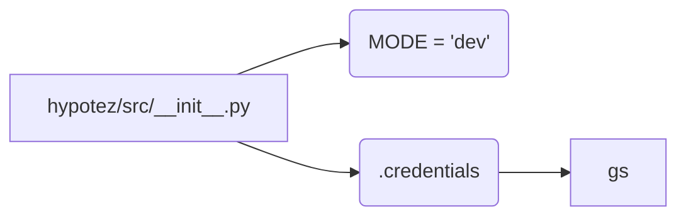

```MD
# <input code>

```python
## \file hypotez/src/__init__.py
# -*- coding: utf-8 -*-
#! venv/Scripts/python.exe
#! venv/bin/python/python3.12

"""
.. module: src 
	:platform: Windows, Unix
	:synopsis:

Root of the project.
========================================================================================

This module provides a structured overview of various modules within the project,
detailing their primary functionalities and roles.

Usage Example
--------------------

.. code-block:: python

    # No usage example available for this module.
"""
MODE = 'dev'

from .credentials import gs
```

# <algorithm>

Данный код представляет собой инициализационный файл для пакета `src`.  Он не содержит алгоритма в привычном смысле, а скорее определяет константу `MODE` и импортирует модуль `credentials`.  Пошаговая блок-схема в данном случае не применима.


# <mermaid>



# <explanation>

**Импорты:**

- `from .credentials import gs`:  Этот импорт подключает переменную `gs` из модуля `credentials`, который находится в той же директории (`./credentials.py`).  Это предполагает, что в файле `hypotez/src/credentials.py` определена переменная `gs` и она доступна в текущем модуле.  Это типичная практика организации импорта в Python, где `.` указывает на поиск в текущем пакете (`src`).

**Переменные:**

- `MODE = 'dev'`:  Определяет константу, вероятно, хранящую режим работы приложения ('dev' - вероятно, режим разработки). Это глобальная переменная, доступная в модулях, которые импортируют `src/__init__.py`.

**Классы:**

- Нет классов в этом модуле.

**Функции:**

- Нет функций в этом модуле.


**Цепочка взаимосвязей:**

Модуль `hypotez/src/__init__.py` является точкой входа и инициализацией для пакета `src`. Он, в свою очередь, зависит от модуля `hypotez/src/credentials.py` для доступа к переменной `gs`.  Предполагается, что `gs` содержит настройки, связанные с Google Cloud Storage,  и используется в других частях проекта, например, при взаимодействии с хранилищем.

**Возможные ошибки или области для улучшений:**

- Отсутствие примеров использования. Это затрудняет понимание, как использовать `gs` и переменную `MODE`. Добавление примера использования, как минимум, в документацию (`__init__.py`), крайне полезно.
-  Добавление типов данных к `MODE` (например, `MODE: str = 'dev'`) улучшит читаемость и поддерживаемость кода.
-  Если `gs` - сложный объект, может потребоваться более четкая документация об ожидаемой структуре или назначении.
- Не определено назначение переменной `MODE`.


В целом, код выполняет минимальную инициализацию для пакета `src`, импортируя необходимые компоненты.  Для более подробного понимания необходимо рассмотреть модуль `hypotez/src/credentials.py`.