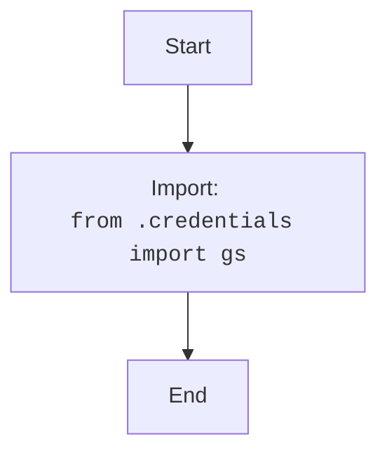

## Анализ кода `hypotez/src/__init__.py`

### <алгоритм>

1. **Импорт:**
   - Импортируется модуль `gs` из пакета `src.credentials`.
   - `src.credentials` - файл или пакет, содержащий настройки и параметры доступа к каким-либо данным.
   - `gs` - переменная или объект, содержащий общие настройки, скорее всего, является экземпляром класса.

### <mermaid>

### <объяснение>

**Импорты:**
- `from .credentials import gs`:
    - Импортирует переменную `gs` из модуля `credentials`, находящегося в том же пакете (`src`).
    - `gs` -  Предположительно, это объект, содержащий глобальные настройки, учетные данные или другие параметры конфигурации, необходимые для работы приложения.
    - `.credentials` - Это указывает на то, что модуль `credentials` находится в том же каталоге, что и `__init__.py`.

**Общее:**

-   Файл `__init__.py` в Python пакете `src` обычно используется для инициализации пакета и определения пространства имен. В данном случае он импортирует `gs` из модуля `credentials`.
-   Импорт `gs` делает этот объект доступным в пакете `src`  в виде `src.gs`. Это позволяет другим модулям внутри `src` использовать глобальные настройки, хранящиеся в `gs`, без прямого импорта из `credentials`.
-   Отсутствие других классов, функций или переменных в `__init__.py` указывает на то, что файл используется для начальной настройки.
-   В данном коде нет явных ошибок. Однако отсутствие примеров и комментариев в docstring может затруднить понимание назначения модуля для новых разработчиков.
-   Возможные улучшения:
    - Добавление подробных комментариев, объясняющих назначение `gs`.
    - Добавление docstring с примером использования пакета `src`.
    - Рекомендовать явное импортирование `credentials` модулям, которым он необходим, а не использовать `src.gs`.

**Цепочка взаимосвязей:**

- `src/__init__.py` - Точка входа в пакет `src`.
- `src/credentials.py` - (предположительно) Модуль, содержащий настройки и параметры.

Этот файл является важной частью общей структуры проекта, поскольку он обеспечивает доступ к глобальным настройкам `gs` для других модулей пакета `src`.