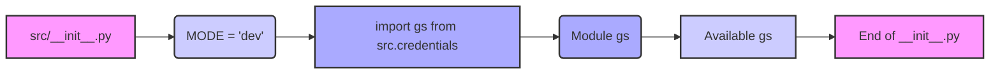

## Анализ кода `hypotez/src/__init__.py`

### <алгоритм>

1. **Инициализация:**
   - Начинается выполнение файла `__init__.py`.
   - Устанавливается глобальная переменная `MODE` в значение `'dev'`.
   - Импортируется модуль `gs` из пакета `src.credentials`.
2. **Импорт модуля `gs`:**
   -  Модуль `gs` из `src.credentials` импортируется и становится доступным для использования в текущем файле и в пакете `src`.
3. **Завершение:**
   - Завершается выполнение файла.

**Пример:**
```python
# src/__init__.py
MODE = 'dev'
from .credentials import gs
# Теперь gs доступен для использования внутри пакета src
```
Поток данных:

`__init__.py` -> `src.credentials.gs`

### <mermaid>


**Объяснение зависимостей:**

*   `A[src/__init__.py]` представляет главный файл инициализации пакета `src`.
*   `B(MODE = 'dev')` показывает установку переменной `MODE` в значение `'dev'`.
*  `C[import gs from src.credentials]` обозначает импорт модуля `gs` из пакета `src.credentials`. Это означает, что в текущем файле становятся доступны объекты и функции из модуля `gs`.
*   `D(Module gs)` показывает модуль, который был импортирован.
*   `E[Available gs]` показывает, что модуль `gs` теперь доступен в `src/__init__.py`.
*   `F[End of __init__.py]` показывает конец выполнения скрипта.

### <объяснение>

**Импорты:**

*   `from .credentials import gs`: Импортирует модуль `gs` из подпакета `credentials`, находящегося в текущем пакете `src`. Модуль `gs` предположительно содержит учетные данные или настройки, связанные с Google Services.  Импорт выполняется для того, чтобы сделать функциональность `gs` доступной в рамках пакета `src`.

**Классы:**

*   В данном файле классы не определены.

**Функции:**
*   В данном файле функции не определены.

**Переменные:**

*   `MODE = 'dev'`:  Глобальная переменная, определяющая режим работы приложения. В данном случае установлено значение `'dev'`, что может указывать на режим разработки.

**Потенциальные ошибки или области для улучшения:**

*   **Отсутствие комментариев:** Отсутствие подробных комментариев внутри кода может затруднить понимание его функциональности в дальнейшем.
*   **Зависимость от `gs`:**  Необходимо убедиться, что модуль `gs` из `src.credentials` корректно настроен и доступен.
*   **Магические строки:** Использование `'dev'` как магической строки для режима работы не является лучшей практикой. Желательно использовать константы (например, `MODE_DEV = 'dev'`).

**Цепочка взаимосвязей с другими частями проекта:**

1.  `src/__init__.py`  является точкой входа для пакета `src`.
2.  Импорт `gs` из `src.credentials` делает функциональность модуля `gs` доступной внутри пакета `src`.
3.  Глобальная переменная `MODE` может влиять на поведение других модулей в пакете `src`.

**Дополнительно:**
`__init__.py` является файлом инициализации пакета `src`. Он отвечает за настройку среды, импорт необходимых модулей и определение общих переменных для всего пакета.
В данном случае, файл устанавливает режим `dev` и импортирует модуль, предположительно связанный с Google Services. Это позволяет другим модулям в пакете `src` использовать функциональность, предоставленную `gs`, и работать в режиме разработки.