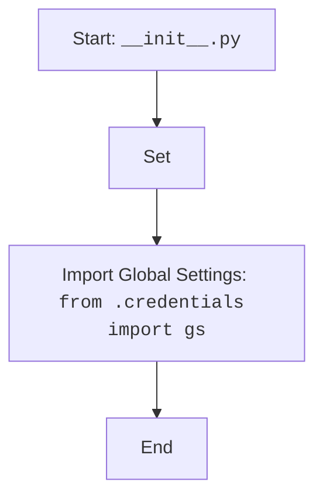

## Анализ кода `hypotez/src/__init__.py`

### <алгоритм>

1. **Начало**: Инициализация модуля `__init__.py`.
2. **Установка режима**: Присваивание переменной `MODE` значения `'dev'`. Эта переменная может использоваться для определения режима работы приложения (например, разработка, тестирование, продакшн).
3. **Импорт глобальных настроек**: Импорт объекта `gs` из модуля `src.credentials`. Этот объект предположительно содержит глобальные настройки проекта, такие как учетные данные, пути и другие параметры.

**Примеры:**

- **Шаг 2**: `` - устанавливает режим разработки.
- **Шаг 3**: `from .credentials import gs` - импортирует объект `gs` (например, словарь с ключами и значениями) из файла `credentials.py`, находящегося в той же директории.

### <mermaid>

**Объяснение зависимостей:**

- `Start`: Начальная точка выполнения модуля `__init__.py`.
- `ModeSetting`: Установка переменной `MODE` в значение `'dev'`. Эта переменная используется для определения текущего режима работы приложения (например, разработка, тестирование, продакшн).
- `ImportSettings`:  Импорт глобальных настроек `gs` из модуля `credentials`, который находится в той же директории, что и `__init__.py`.

### <объяснение>

#### Импорты:

- `from .credentials import gs`:
    - **Назначение**: Импортирует объект `gs` из модуля `credentials.py`, который находится в той же директории, что и текущий модуль `__init__.py`. 
    - **Взаимосвязь с другими пакетами `src.***: Модуль `credentials.py` является частью пакета `src`, и `gs` предположительно содержит глобальные настройки, используемые в различных частях проекта. Этот импорт позволяет использовать глобальные настройки в любом модуле, импортирующем `src`.
    - **Пример**: Если `credentials.py` содержит `gs = {'api_key': 'my_api_key', 'database_url': 'localhost:5432'}`, то после импорта `gs` в `__init__.py`, переменная `gs` будет доступна и содержать этот словарь.

#### Переменные:

- `MODE`:
    - **Тип**: Строка (`str`).
    - **Использование**: Определяет режим работы приложения. В данном случае установлено значение `'dev'`, что указывает на режим разработки. Это позволяет условно выполнять код в зависимости от текущего режима, например, использовать разные настройки для разных окружений.

#### Потенциальные ошибки или области для улучшения:

1. **Отсутствие обработки ошибок:** Код не содержит явной обработки исключений при импорте `gs`. Если файл `credentials.py` не существует или содержит ошибку, это вызовет ошибку импорта, и программа завершится аварийно.
2. **Отсутствие описания `gs`**: В коде нет явного описания структуры и содержимого объекта `gs`, что может затруднить понимание и использование глобальных настроек.
3. **Жестко закодированный режим:** Установка `` делает режим работы статичным. Для переключения между режимами (например, для тестирования или продакшна) потребуется изменять код вручную. Лучше использовать переменные окружения или конфигурационные файлы.

#### Цепочка взаимосвязей:
`__init__.py` является входной точкой пакета `src`.  Импорт `gs` связывает этот модуль с `credentials.py`, который, вероятно, содержит конфигурационные данные.  Другие модули внутри `src` могут импортировать переменные и объекты из `__init__.py`  через `from src import MODE` или `from src import gs`. Таким образом `__init__.py` формирует центральную точку,  где задаются основные параметры и  глобальные переменные для работы всего проекта.