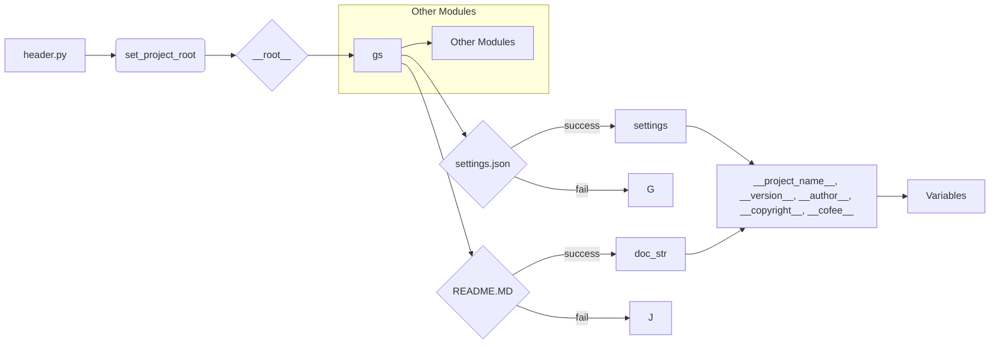

```MD
# <input code>

```python
## \file hypotez/src/utils/_examples/header.py
# -*- coding: utf-8 -*-
#! venv/Scripts/python.exe
#! venv/bin/python/python3.12

"""
.. module: src.utils._examples 
	:platform: Windows, Unix
	:synopsis:

"""
MODE = 'dev'

import sys
import json
from packaging.version import Version

from pathlib import Path
def set_project_root(marker_files=('pyproject.toml', 'requirements.txt', '.git')) -> Path:
    """
    Finds the root directory of the project starting from the current file's directory,
    searching upwards and stopping at the first directory containing any of the marker files.

    Args:
        marker_files (tuple): Filenames or directory names to identify the project root.
    
    Returns:
        Path: Path to the root directory if found, otherwise the directory where the script is located.
    """
    __root__:Path
    current_path:Path = Path(__file__).resolve().parent
    __root__ = current_path
    for parent in [current_path] + list(current_path.parents):
        if any((parent / marker).exists() for marker in marker_files):
            __root__ = parent
            break
    if __root__ not in sys.path:
        sys.path.insert(0, str(__root__))
    return __root__


# Get the root directory of the project
__root__ = set_project_root()
"""__root__ (Path): Path to the root directory of the project"""

from src import gs

settings:dict = None
try:
    with open(gs.path.root / 'src' / 'settings.json', 'r') as settings_file:
        settings = json.load(settings_file)
except (FileNotFoundError, json.JSONDecodeError):
    ...

doc_str:str = None
try:
    with open(gs.path.root / 'src' / 'README.MD', 'r') as settings_file:
        doc_str = settings_file.read()
except (FileNotFoundError, json.JSONDecodeError):
    ...


__project_name__ = settings.get("project_name", 'hypotez') if settings  else 'hypotez'
__version__: str = settings.get("version", '')  if settings  else ''
__doc__: str = doc_str if doc_str else ''
__details__: str = ''
__author__: str = settings.get("author", '')  if settings  else ''
__copyright__: str = settings.get("copyrihgnt", '')  if settings  else ''
__cofee__: str = settings.get("cofee", "Treat the developer to a cup of coffee for boosting enthusiasm in development: https://boosty.to/hypo69")  if settings  else "Treat the developer to a cup of coffee for boosting enthusiasm in development: https://boosty.to/hypo69"
```

# <algorithm>

**Шаг 1:** Функция `set_project_root` принимает кортеж `marker_files`.
- Находит текущий путь к файлу `header.py`.
- Итерируется по родительским каталогам, начиная с текущего, вверх по иерархии.
- Проверяет, существует ли какой-либо файл или каталог из `marker_files` в текущем родительском каталоге.
- Если такой файл или каталог найден, `__root__` устанавливается в родительский каталог, и цикл прерывается.
- Если корневой каталог не найден в `sys.path`, добавляет его в начало `sys.path`.
- Возвращает найденный корневой каталог `__root__`.

**Пример:**

Если `header.py` находится в `/home/user/project/hypotez/src/utils/_examples`, а `pyproject.toml` находится в `/home/user/project/hypotez`, то функция `set_project_root` вернет `/home/user/project/hypotez`.


**Шаг 2:** Вызов функции `set_project_root` для определения корневого каталога проекта и сохранение результата в переменной `__root__`.

**Шаг 3:** Импортирование модуля `gs` из пакета `src`.

**Шаг 4:** Попытка открыть файл `settings.json` в корневом каталоге проекта.
- Если файл найден и успешно обработан, данные из файла загружаются в переменную `settings`.
- В противном случае, переменная `settings` остается `None`.

**Шаг 5:** Попытка открыть файл `README.MD` в корневом каталоге проекта.
- Если файл найден и успешно обработан, содержимое файла читается в переменную `doc_str`.
- В противном случае, переменная `doc_str` остается `None`.

**Шаг 6:** Извлечение значений из словаря `settings`, если он существует.
- Значения по умолчанию устанавливаются, если соответствующий ключ не найден в `settings`.

**Данные передаются между функциями и переменными:**

- Функция `set_project_root` возвращает Path к корневому каталогу, который используется в других частях скрипта для доступа к файлам настроек и документации.
- Переменные `settings` и `doc_str` содержат данные из файлов настроек и README, которые затем используются для формирования других переменных.


# <mermaid>



**Описание диаграммы:**

- `header.py` вызывает функцию `set_project_root` для определения корневого каталога проекта.
- Полученный корневой каталог используется для доступа к `gs`, `settings.json` и `README.MD`.
- Данные из `settings.json` и `README.MD` используются для формирования других переменных.
- Модуль `gs`  вероятно предоставляет функции для взаимодействия с файловой системой проекта.  Другой возможные зависимости.
- Зависимости других модулей `Other Modules` не явно указаны в данном фрагменте кода, но предположительно существуют.

# <explanation>

**Импорты:**

- `sys`: Предоставляет доступ к системным переменным, в частности `sys.path`, для добавления пути к корневому каталогу проекта в список путей поиска модулей.
- `json`: Используется для работы с файлами JSON, в частности для загрузки настроек из файла `settings.json`.
- `packaging.version`: Вероятно, используется для работы с версиями пакетов.
- `pathlib`: Предоставляет удобный способ работы с путями к файлам, что делает код более читабельным и поддерживаемым.


**Классы:**

В коде нет явных классов.

**Функции:**

- `set_project_root`: Находит корневой каталог проекта.
  - Аргументы: `marker_files` (кортеж строк, по умолчанию `('pyproject.toml', 'requirements.txt', '.git')`).
  - Возвращаемое значение: `Path` к корневому каталогу.

**Переменные:**

- `MODE`: Строковая переменная, хранящая режим работы (вероятно, `dev`, `prod`).
- `__root__`: `Path` объект, содержащий путь к корневому каталогу проекта.
- `settings`: Словарь, содержащий данные из `settings.json`.
- `doc_str`: Строка, содержащая содержимое файла `README.MD`.
- `__project_name__`, `__version__`, `__author__`, `__copyright__`, `__cofee__`: Строковые переменные, содержащие данные о проекте, извлеченные из `settings`.


**Возможные ошибки и улучшения:**

- **Обработка ошибок:** Обработка `FileNotFoundError` и `json.JSONDecodeError` является хорошей практикой, но может быть еще более универсальной. Например, можно использовать более обширный обработчик исключений.
- **Проверка типов:** Используя типизацию, можно повысить надежность кода.

**Взаимосвязи с другими частями проекта:**

- Модуль `gs` (вероятно, `global settings`) играет ключевую роль в нахождении корневого каталога и доступа к файлам настроек и документации, указывая на то, что код интегрирован в более сложную систему. Необходимы дополнительные сведения о `gs` для более полной оценки.

В целом, код хорошо написан,  используя лучшие практики Python и предоставляет необходимые функции для работы со справочной информацией о проекте.