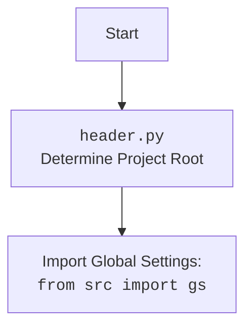

## <алгоритм>

1. **`set_project_root(marker_files)`**:
    *   Начало: Определяется текущий путь к файлу.
        *   Пример: `__file__` может быть `/path/to/hypotez/src/utils/_examples/header.py`, тогда `current_path` будет `/path/to/hypotez/src/utils/_examples`.
    *   Инициализируется переменная `__root__` текущим путем.
        *   Пример: `__root__` = `/path/to/hypotez/src/utils/_examples`.
    *   Перебираются родительские директории, начиная с текущей.
        *   Пример: Проверяется `/path/to/hypotez/src/utils/_examples`, затем `/path/to/hypotez/src/utils`, затем `/path/to/hypotez/src`, `/path/to/hypotez`, и т.д.
    *   Для каждой родительской директории проверяется наличие хотя бы одного из файлов-маркеров.
        *   Пример:  Проверяется существует ли  `/path/to/hypotez/src/utils/_examples/__root__`, если нет, то проверяется `/path/to/hypotez/src/utils/__root__` и так далее.
    *   Если маркер найден, `__root__` обновляется, и цикл завершается.
        *   Пример: Если `/path/to/hypotez/__root__` существует, то `__root__` = `/path/to/hypotez`.
    *   Если `__root__` нет в `sys.path`, он добавляется.
    *   Функция возвращает `__root__`.
        *   Пример: Функция возвращает `/path/to/hypotez`.

2.  **Инициализация `__root__`**:
    *   Вызывается `set_project_root()`, результат присваивается глобальной переменной `__root__`.
        *   Пример: `__root__` = `/path/to/hypotez`.

3.  **Загрузка `settings.json`**:
    *   Пытается открыть и прочитать `settings.json` из `src/settings.json` относительно `__root__`.
        *   Пример: Файл расположен по пути `/path/to/hypotez/src/settings.json`.
    *   Если файл успешно прочитан, его содержимое загружается в словарь `settings`.
    *   Если возникает ошибка `FileNotFoundError` или `json.JSONDecodeError`, то `settings` остается `None`.

4.  **Загрузка `README.MD`**:
    *   Пытается открыть и прочитать `README.MD` из `src/README.MD` относительно `__root__`.
        *   Пример: Файл расположен по пути `/path/to/hypotez/src/README.MD`.
    *   Если файл успешно прочитан, его содержимое сохраняется в строку `doc_str`.
    *   Если возникает ошибка `FileNotFoundError` или `json.JSONDecodeError`, то `doc_str` остается `None`.

5. **Инициализация глобальных переменных**:
    *   `__project_name__` устанавливается из `settings["project_name"]` или `"hypotez"`, если `settings` не найден.
    *   `__version__` устанавливается из `settings["version"]` или `""`, если `settings` не найден.
    *   `__doc__` устанавливается из `doc_str` или `""`, если `doc_str` не найден.
    *   `__details__` устанавливается в `''`.
    *   `__author__` устанавливается из `settings["author"]` или `""`, если `settings` не найден.
    *   `__copyright__` устанавливается из `settings["copyrihgnt"]` или `""`, если `settings` не найден.
    *   `__cofee__` устанавливается из `settings["cofee"]` или "Treat the developer to a cup of coffee for boosting enthusiasm in development: https://boosty.to/hypo69", если `settings` не найден.

## <mermaid>

```mermaid
flowchart TD
    Start[Начало] --> FindRoot[<code>set_project_root()</code><br>Определение корня проекта]
    FindRoot --> CheckMarkers[Проверка наличия маркеров в текущей и родительских директориях]
    CheckMarkers -- Маркер найден --> UpdateRoot[Обновление корня проекта]
    CheckMarkers -- Маркер не найден --> NextParent[Переход к следующей родительской директории]
    NextParent -- Есть еще директории --> CheckMarkers
    NextParent -- Нет директорий --> AddToSysPath[Добавление корня в sys.path]
    UpdateRoot --> AddToSysPath
    AddToSysPath --> ReturnRoot[Возврат корня проекта]
    ReturnRoot --> LoadSettings[Загрузка <code>settings.json</code>]
    LoadSettings -- Файл найден --> ProcessSettings[Обработка <code>settings.json</code>]
    LoadSettings -- Файл не найден --> SkipSettings[Пропуск загрузки <code>settings.json</code>]
    SkipSettings --> LoadReadme[Загрузка <code>README.MD</code>]
    ProcessSettings --> LoadReadme
    LoadReadme -- Файл найден --> ProcessReadme[Обработка <code>README.MD</code>]
    LoadReadme -- Файл не найден --> SkipReadme[Пропуск загрузки <code>README.MD</code>]
    SkipReadme --> SetVariables[Установка глобальных переменных]
    ProcessReadme --> SetVariables
    SetVariables --> End[Конец]

    classDef file fill:#f9f,stroke:#333,stroke-width:2px;
    class FindRoot, LoadSettings, LoadReadme file
```



**Анализ зависимостей:**

*   **`pathlib`**: Используется для работы с путями к файлам и директориям. Позволяет создавать, проверять и манипулировать путями.
*   **`sys`**: Используется для доступа к параметрам среды выполнения, включая список путей поиска модулей (`sys.path`). Добавляет корень проекта в `sys.path`, что позволяет импортировать модули из этого проекта, если `header.py` вызывается откуда-то извне проекта.
*   **`json`**: Используется для чтения данных из файла `settings.json`.
*   **`packaging.version`**: Импортируется, но не используется. Скорее всего, заготовка для будущей работы с версиями.
*  **`src`**: Из пакета `src` импортируется `gs`. Скорее всего, `gs` это объект с глобальными настройками проекта. `gs.path.root` содержит путь к корню проекта.

## <объяснение>

**Импорты:**

*   `sys`:  Модуль `sys` обеспечивает доступ к переменным и функциям, связанным с интерпретатором Python. В данном контексте используется `sys.path` для добавления корня проекта в список путей поиска модулей. Это позволяет импортировать модули из проекта, даже если скрипт запускается извне его структуры.
*   `json`: Модуль используется для работы с файлами в формате JSON. В данном случае, для загрузки настроек проекта из файла `settings.json`.
*   `packaging.version`: Хотя модуль импортируется, он не используется в текущем коде. Это может быть заготовкой для будущей работы с версиями проекта.
*    `pathlib.Path`: используется для работы с путями к файлам и директориям. Он предоставляет более объектно-ориентированный способ работы с файлами по сравнению со встроенными строковыми операциями.
*   `src`: Импортируется подмодуль `gs`. Скорее всего,  `gs` - это объект, содержащий общие настройки проекта, включая путь к его корневой директории `gs.path.root`.

**Функции:**

*   **`set_project_root(marker_files: tuple = ('__root__')) -> Path`**:
    *   **Аргументы**:
        *   `marker_files`: кортеж строк, представляющих имена файлов или директорий, которые используются для определения корня проекта. По умолчанию используется `__root__`.
    *   **Возвращаемое значение**:
        *   `Path`: объект `Path`, представляющий путь к корневой директории проекта, либо путь к текущей директории, если маркеры не найдены.
    *   **Назначение**:
        *   Функция рекурсивно просматривает родительские директории, начиная с директории, где находится скрипт. Она ищет директорию, содержащую хотя бы один из файлов/директорий-маркеров. Когда маркер найден, директория считается корнем проекта, и ее путь возвращается. Если маркеры не найдены, возвращается путь к директории, где расположен файл. Затем, если путь не содержится в `sys.path`, то он добавляется в начало `sys.path`.
    *   **Примеры:**
        *   Если `header.py` находится в `/path/to/project/src/utils/_examples`, а маркер `__root__` находится в `/path/to/project`, то функция вернет `Path("/path/to/project")`.
        *   Если маркер не найден, то функция вернет `Path("/path/to/project/src/utils/_examples")`.

**Переменные:**

*   `MODE`: Глобальная переменная, определяющая режим работы (в данном случае, `'dev'`).
*   `__root__`: Глобальная переменная, которая хранит путь к корню проекта. Инициализируется результатом вызова `set_project_root()`.
*   `settings`: Словарь, который хранит данные из `settings.json`. Если файл не найден или произошла ошибка, переменная остается `None`.
*   `doc_str`: Строка, которая хранит содержимое файла `README.MD`. Если файл не найден или произошла ошибка, переменная остается `None`.
*   `__project_name__`: Глобальная переменная, хранит название проекта. Значение загружается из `settings.json`, или по умолчанию `'hypotez'`.
*   `__version__`: Глобальная переменная, хранит версию проекта. Значение загружается из `settings.json`, или по умолчанию `''`.
*   `__doc__`: Глобальная переменная, хранит документацию из файла `README.MD`. Значение загружается из `doc_str`, или по умолчанию `''`.
*  `__details__`: Глобальная переменная, хранит детали проекта. По умолчанию `''`.
*  `__author__`: Глобальная переменная, хранит автора проекта. Значение загружается из `settings.json`, или по умолчанию `''`.
*  `__copyright__`: Глобальная переменная, хранит авторские права проекта. Значение загружается из `settings.json`, или по умолчанию `''`.
*  `__cofee__`: Глобальная переменная, хранит сообщение о спонсировании проекта. Значение загружается из `settings.json`, или по умолчанию "Treat the developer to a cup of coffee for boosting enthusiasm in development: https://boosty.to/hypo69".

**Взаимосвязи:**

*   `set_project_root()`: Функция устанавливает корень проекта и добавляет его в `sys.path`. Это позволяет импортировать другие модули проекта.
*   `gs.path.root`:  Путь к корню проекта, полученный из  `set_project_root()`, используется для загрузки `settings.json` и `README.MD`.
*   `settings.json`: Файл с настройками проекта, откуда загружаются имя, версия, автор, копирайт и пр.
*   `README.MD`: Файл с документацией проекта, откуда загружается  описание проекта.

**Потенциальные ошибки и области для улучшения:**

*   **Обработка ошибок**: Код использует `try-except` блоки для обработки ошибок при открытии и загрузке `settings.json` и `README.MD`, но  в блоке `except` происходит действие `...`, что является `pass` и  не дает никакой информации при возникновении ошибок. Необходимо добавить логгирование ошибок или хотя бы вывод сообщений в консоль.
*   **Неиспользуемые импорты**: Модуль `packaging.version` импортируется, но не используется, это стоит удалить, если не планируется его дальнейшее использование.
*   **Неустойчивость к изменениям структуры проекта**: Код жестко закодировал пути к файлам `settings.json` и `README.MD` как  `src/settings.json` и `src/README.MD`. Это может создать проблемы, если структура проекта изменится. Лучше использовать относительные пути от корня, полученного функцией `set_project_root()`.
*   **Кофе**: `__cofee__` лучше хранить как `url` для спонсирования, а не `str`, тогда можно будет делать проверку корректности `url`, или `url` можно хранить в файле `settings.json`
*   **Ключи с опечатками**: в `settings.json` опечатка в ключе `copyrihgnt` вместо `copyright`.

Этот код представляет собой основу для настройки проекта, обеспечивая определение корневой директории, загрузку настроек и базовой информации о проекте.