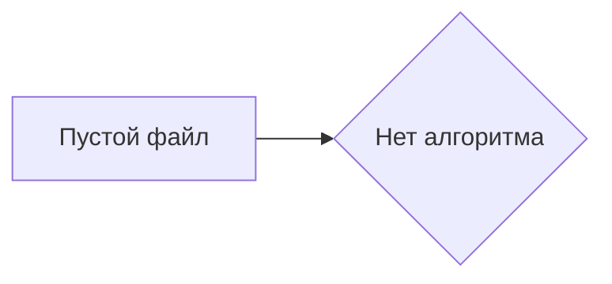

# <input code>

```python
## \file hypotez/src/_examples/quick_start.py
# -*- coding: utf-8 -*-\
#! venv/Scripts/python.exe
#! venv/bin/python/python3.12

"""
.. module: src._examples 
	:platform: Windows, Unix
	:synopsis:

"""
MODE = 'dev'

"""
	:platform: Windows, Unix
	:synopsis:

"""


"""
	:platform: Windows, Unix
	:synopsis:

"""


"""
  :platform: Windows, Unix

"""
"""
  :platform: Windows, Unix
  :platform: Windows, Unix
  :synopsis:
"""MODE = 'dev'
  
""" module: src._examples """


""" Quick start to `hypotez`

"""
```

# <algorithm>

Этот код представляет собой пустой файл Python. Он не содержит логики, а только комментарии. Алгоритм работы отсутствует, поскольку нет операций или последовательностей действий.

# <mermaid>



# <explanation>

**Импорты**: Нет импортируемых модулей.  Этот файл пуст.

**Классы**: Нет определенных классов.

**Функции**: Нет определенных функций.

**Переменные**:  Единственная переменная `MODE` имеет строковое значение 'dev'.  Она определена как константа, но не используется в коде.

**Возможные ошибки или области для улучшений**:

* **Отсутствие функциональности**:  Файл не содержит никакой полезной логики.
* **Документация**: Комментарии в стиле Sphinx (`.. module: src._examples`) не связаны с реальной функциональностью и не используются для генерации документации.
* **Избыточные комментарии**: Многие комментарии являются пустыми или дублируют друг друга.

**Цепочка взаимосвязей с другими частями проекта**:

Этот файл является частью проекта `hypotez` в папке `_examples`.  Без дополнительной информации о `hypotez`, трудно определить его роль в общем проекте.  Возможно, этот файл служит примером, но без конкретного кода или использования этой переменной `MODE`, сказать наверняка нельзя.  Для анализа взаимосвязей нужны другие файлы из проекта.