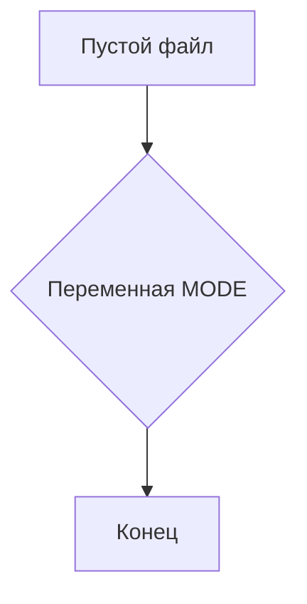
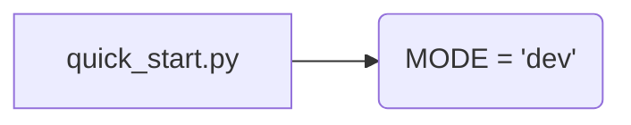

```MD
# Анализ кода hypotez/src/_examples/quick_start.py

## <input code>

```python
## \file hypotez/src/_examples/quick_start.py
# -*- coding: utf-8 -*-\
#! venv/Scripts/python.exe
#! venv/bin/python/python3.12

"""
.. module: src._examples 
	:platform: Windows, Unix
	:synopsis:

"""
MODE = 'dev'

"""
	:platform: Windows, Unix
	:synopsis:

"""


"""
	:platform: Windows, Unix
	:synopsis:

"""


"""
  :platform: Windows, Unix

"""
"""
  :platform: Windows, Unix
  :platform: Windows, Unix
  :synopsis:
"""MODE = 'dev'
  
""" module: src._examples """


""" Quick start to `hypotez`

"""
```

## <algorithm>

Код представляет собой пустой файл Python.  В нём объявляется одна переменная `MODE` со значением 'dev'. Все остальные строки содержат docstrings, которые описывают модуль и не выполняют никаких действий.

**Блок-схема:**



В данном случае, алгоритм фактически отсутствует, так как нет логических операций или вызовов функций.


## <mermaid>




## <explanation>

**Импорты:**

Файл не содержит импортов.

**Классы:**

Нет ни одного класса.

**Функции:**

Нет ни одной функции.

**Переменные:**

- `MODE`:  Строковая переменная, хранящая значение 'dev'.  Она не используется в этом коде.  Вполне вероятно, она будет использована в других частях проекта, где конфигурация `MODE`  играет роль.

**Возможные ошибки или области для улучшений:**

- **Неиспользуемый код:**  Документация (docstrings) в файле не соответствует функциональности.  Возможно, файл предназначен для будущих разработок или является частью более крупной структуры проекта, где данная конфигурация играет роль.
- **Недостаточная информация:**  Трудно понять полную роль и назначение переменной `MODE`, без контекста проекта.


**Связь с другими частями проекта:**

Переменная `MODE` вероятно используется для управления режимами работы (`dev`, `test`, `prod`) в других частях проекта.  Без доступа к остальному коду невозможно определить точные связи.  Это переменная конфигурации.

**Заключение:**

Файл `quick_start.py`  представляет собой пустой (за исключением документации) стартовый файл, возможно, для дальнейшего развития. Значение переменной `MODE` вероятно будет использоваться для управления различными аспектами работы проекта в дальнейшем.