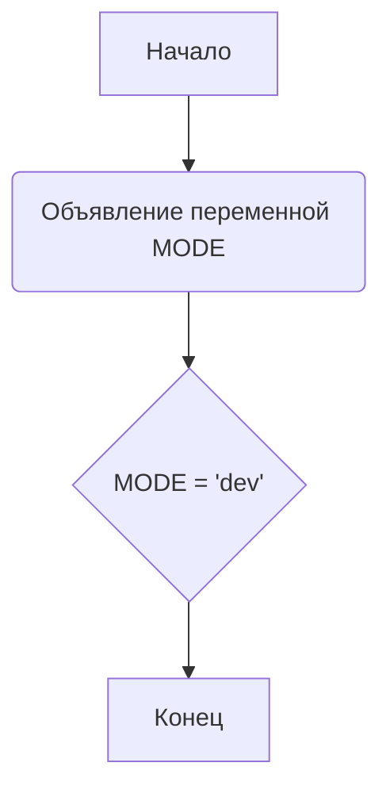

## Анализ кода `hypotez/src/_examples/quick_start.py`

### 1. <алгоритм>

1. **Начало:** Запуск скрипта `quick_start.py`.
2. **Объявление константы `MODE`**:
   - Значение переменной `MODE` устанавливается в `'dev'`.
   - *Пример:* `MODE = 'dev'`
   - *Тип:* Строка
3. **Конец:** Завершение выполнения скрипта.

### 2. <mermaid>

**Анализ диаграммы:**
- **`A` (Начало):** Обозначает начало выполнения скрипта.
- **`B` (Объявление переменной MODE):** Указывает на место в коде, где объявляется переменная `MODE`.
- **`C` (`MODE = 'dev'`):**  Указывает на присвоение строкового значения `dev` переменной `MODE`.
- **`D` (Конец):** Обозначает конец выполнения скрипта.

Импортированные зависимости отсутствуют, так как данный скрипт не импортирует никаких модулей. Диаграмма показывает простой однонаправленный поток выполнения кода, в котором объявляется и инициализируется переменная.

### 3. <объяснение>

#### Импорты:
В данном файле отсутствуют импорты.

#### Классы:
В данном файле отсутствуют объявления классов.

#### Функции:
В данном файле отсутствуют объявления функций.

#### Переменные:
- **`MODE`**:
    - Тип: Строка (`str`)
    - Значение: `'dev'`
    - Назначение: Представляет режим работы программы (в данном случае 'dev' - режим разработки).
    - Использование: Предполагается, что эта переменная может использоваться для определения поведения программы в различных условиях (например, переключение между режимами разработки и продакшена).

#### Потенциальные ошибки и области для улучшения:
- **Отсутствие функциональности:** Данный скрипт представляет собой пример очень простого файла, который только объявляет переменную. Он не выполняет никаких действий, кроме установки значения `MODE`.
- **Отсутствие поясняющих комментариев:** Большая часть комментариев является избыточной и не добавляет ясности, а скорее захламляет код.
- **Повторяющиеся Docstrings:**  Множественные пустые docstring, которые не несут смысловой нагрузки.
- **Неоднозначность значения:** Хотя `MODE` установлен как `dev`, нет кода, который бы использовал это значение. Рекомендуется добавить функционал, который бы зависел от этого значения.

#### Цепочка взаимосвязей с другими частями проекта:
- **`_examples`:** Данный файл является примером использования `hypotez`, который можно использовать для демонстрации основных функций библиотеки.
- **Другие части проекта:** Зависимости от других частей проекта нет, так как здесь не импортируются никакие модули из `src`. Однако эта константа `MODE` может использоваться для конфигурации других частей проекта, в зависимости от среды исполнения, если будет добавлено логика ее использования.

**Заключение:**
Файл `quick_start.py` является базовым примером, который устанавливает константу `MODE` в значение `dev`. Он не содержит сложной логики, классов или функций. Для того, чтобы этот файл был полезным примером, в него необходимо добавить функциональность, использующую установленное значение `MODE`.