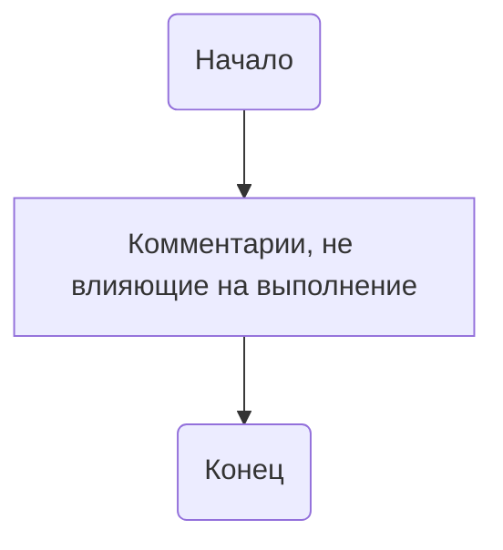

## <алгоритм>

1.  **Начало**: Запускается скрипт `quick_start.py`.
2.  **Импорт**: Не происходит импорта каких-либо модулей или библиотек.
3.  **Комментарии**: Выполняется только чтение комментариев и многострочных строк, которые не влияют на выполнение кода.
4.  **Конец**: Скрипт завершает свою работу.

## <mermaid>

## <объяснение>

Этот код представляет собой пустой Python-скрипт, содержащий только комментарии и многострочные строки документации (docstrings).

**Импорты:**

*   В данном скрипте отсутствуют импорты каких-либо модулей.

**Классы:**

*   В этом файле нет классов.

**Функции:**

*   В этом файле нет функций.

**Переменные:**

*   В этом файле нет переменных.

**Пояснения:**

*   Скрипт начинается с объявления shebang `#! venv/bin/python/python3.12`, которое указывает операционной системе использовать указанный интерпретатор Python для запуска скрипта.
*   Многострочные строки (docstrings) в начале файла используются для описания модуля и его назначения. Они не влияют на выполнение скрипта, но служат для документации.
*   Скрипт не выполняет никаких действий, кроме как чтения комментариев и docstrings.

**Потенциальные ошибки или области для улучшения:**

*   Скрипт не имеет функциональности и является, по сути, пустым. Это может быть примером начала работы над новым скриптом, но в текущем виде он не выполняет никаких полезных действий.
*   Отсутствие импортов, функций и классов делает скрипт бесполезным с точки зрения выполнения какой-либо задачи.

**Взаимосвязи с другими частями проекта:**

*   Этот файл находится в директории `src/_examples`. Обычно, файлы в таких директориях используются для демонстрации функциональности или для создания простых примеров использования кода проекта. Однако, этот конкретный файл в текущем состоянии не демонстрирует никакой функциональности.