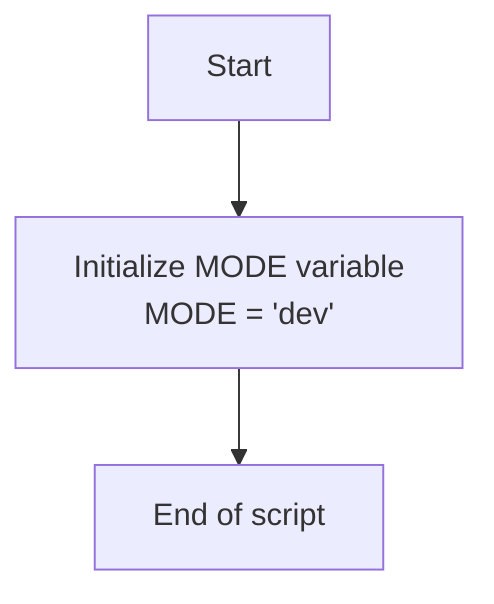

## Анализ кода `hypotez/src/_examples/quick_start.py`

### 1. <алгоритм>

**Блок-схема:**

1.  **Начало**: Запуск скрипта `quick_start.py`.
    *   *Пример*: `python quick_start.py`
2.  **Объявление `MODE`**: Объявление глобальной переменной `MODE` и присвоение ей значения `'dev'`.
    *   *Пример*: `MODE = 'dev'`
3.  **Конец**: Завершение работы скрипта.
    *   *Пример*: Скрипт завершается без дополнительных действий.

**Поток данных:**

В данном скрипте поток данных довольно простой. Значение переменной `MODE` инициализируется и остается неизменным в течение выполнения скрипта. Нет никаких функций, классов или методов, которые бы модифицировали это значение или использовали его.

### 2. <mermaid>

**Анализ зависимостей:**

В данном коде нет импортов, поэтому нет зависимостей от других модулей или пакетов. Диаграмма `mermaid` показывает простой поток управления, где скрипт начинается, объявляет переменную `MODE`, и затем завершается.

### 3. <объяснение>

**Импорты:**

В данном коде отсутствуют импорты, что означает, что этот скрипт является самодостаточным и не зависит от других модулей или пакетов проекта.

**Классы:**

В данном коде отсутствуют классы.

**Функции:**

В данном коде отсутствуют функции.

**Переменные:**

*   `MODE`:
    *   Тип: `str` (строка)
    *   Значение: `'dev'`
    *   Использование: Эта переменная, скорее всего, предназначена для обозначения режима работы скрипта (например, "разработка"). Хотя в данном скрипте она не используется, в других частях проекта она может служить флагом для определения поведения.
    *   Пример: `MODE = 'dev'`

**Детали:**

*   **Заголовок файла:** Файл содержит несколько строк, предназначенных для комментариев и docstrings, описывающих модуль, платформы и синопсис.
*   **Shebang:** `#! venv/Scripts/python.exe` и `#! venv/bin/python/python3.12` являются shebang строками, указывающими интерпретатор Python для запуска скрипта на Windows и Unix-подобных системах соответственно.
*   **Режим разработки:** Присваивание `MODE = 'dev'` указывает на то, что скрипт, вероятно, находится в режиме разработки. Эта переменная может использоваться для различных целей, таких как включение отладочных сообщений, использование тестовых данных или настройка среды исполнения.

**Потенциальные ошибки или области для улучшения:**

*   **Неиспользуемая переменная:** Переменная `MODE` объявлена, но нигде в коде не используется. Это может быть признаком неполного или примерного кода.
*   **Отсутствие функциональности:** Скрипт в текущем виде не выполняет никакой полезной работы, кроме как объявления переменной `MODE`. Это пример "скелета" для более сложного кода.
*   **Избыточность комментариев:** Присутствует несколько docstring'ов без содержания.
*   **Пустые строки:** В коде много пустых строк, которые не несут смысловой нагрузки.

**Взаимосвязи с другими частями проекта:**

Поскольку данный скрипт не имеет импортов, явных взаимосвязей с другими частями проекта нет. Однако переменная `MODE` предполагает, что скрипт является частью более крупного проекта, где эта переменная используется для управления поведением других модулей. Этот скрипт, скорее всего, является примером, который демонстрирует базовую конфигурацию или начало разработки проекта.