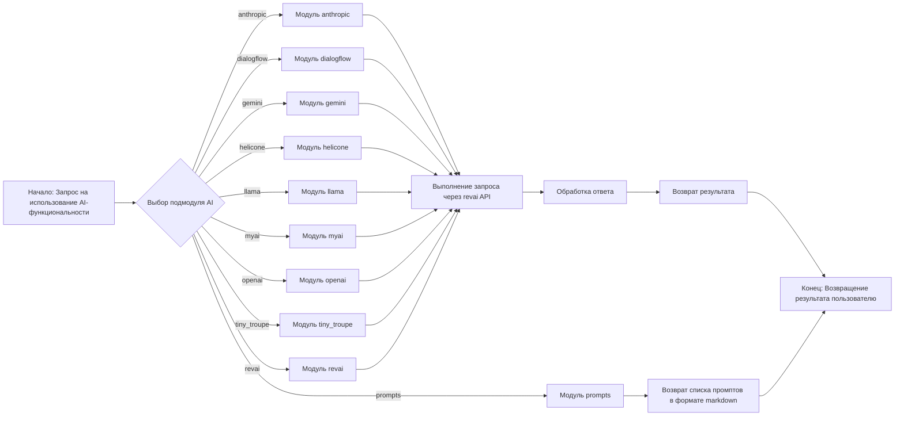
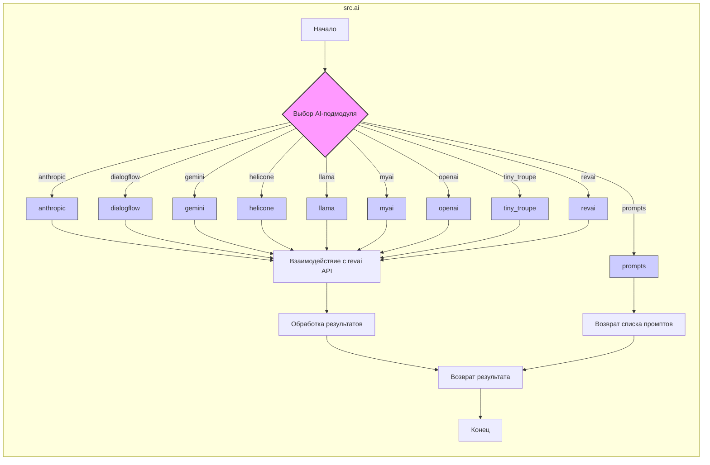

# Анализ модуля `src.ai`

## 1. <алгоритм>

Модуль `src.ai` предназначен для управления различными моделями искусственного интеллекта (ИИ) и обеспечивает интеграцию с внешними API. Он структурирован в виде набора подмодулей, каждый из которых отвечает за взаимодействие с конкретной ИИ-платформой или моделью.

**Блок-схема:**

**Примеры:**

*   **Логический блок B**: Пользователь хочет использовать GPT модель от OpenAI для генерации текста. Выбор подмодуля `openai`.
*   **Логические блоки C1-C9**: Выбранный подмодуль `openai` получает запрос на генерацию текста.
*  **Логический блок D**: `openai` подмодуль взаимодействует с API OpenAI, отправляя запрос и получая ответ.
*   **Логический блок E**:  Ответ от OpenAI API обрабатывается, извлекается сгенерированный текст.
*   **Логический блок F**:  Сгенерированный текст возвращается пользователю.
*  **Логический блок G**: Пользователь запрашивает список промптов. Выбор подмодуля `prompts`.
*  **Логический блок H**: Возврат списка промптов.

## 2. <mermaid>

**Анализ зависимостей:**

Диаграмма показывает основную структуру модуля `src.ai` и его подмодулей.  Основные зависимости:
   - Запрос на использование AI-функциональности направляет пользователя к выбору конкретного AI-подмодуля.
   - Каждый из подмодулей (`anthropic`, `dialogflow`, `gemini`, `helicone`, `llama`, `myai`, `openai`, `tiny_troupe`,`revai`) отвечает за взаимодействие со своим API или собственной реализацией, и не имеет прямых зависимостей друг от друга, за исключением использования общих элементов обработки результатов.
   - Модуль `prompts` предоставляет промпты для моделей, он не связан с остальными подмодулями напрямую, кроме как общего использования в контексте AI.
   - Выбор подмодуля (`B`) - основная точка разветвления, определяющая, как именно будет обрабатываться запрос.

## 3. <объяснение>

### Импорты
В данном `README.MD` файле нет явных импортов, так как это файл документации, а не кода. Однако он описывает структуру и назначения модулей и подмодулей в каталоге `src.ai`. Зависимости и импорты есть внутри подмодулей.

### Классы
В данном файле нет описаний классов, так как `README.MD` файл предназначен для описания структуры каталога и его модулей. Описание классов будет находиться в соответствующих `README.MD` файлах в подмодулях, если таковые имеются.

### Функции
Аналогично классам, в данном файле не описаны функции. Функции будут определены и описаны в коде соответствующих модулей, на которые ссылаются подмодули, описанные в этом файле.

### Переменные
В этом файле не используются переменные. Файл служит документацией и общим описанием структуры модуля `ai`.

**Подробное объяснение структуры модуля `src.ai`:**

- **Назначение:** Модуль `src.ai` выступает как централизованное место для управления и использования различных AI моделей. Это позволяет разработчику переключаться между разными AI решениями, не меняя основную структуру проекта.
- **Подмодули:** Каждый подмодуль представляет собой интеграцию с конкретной AI платформой или моделью.
  -  `anthropic`:  Интеграция с моделями Anthropic (например, Claude), специализируется на генерации и понимании текста.
  - `dialogflow`: Интеграция с Google Dialogflow для обработки естественного языка и создания диалоговых систем.
  -  `gemini`: Управление моделями Gemini AI.
  - `helicone`: Интеграция с Helicone для кастомизации и расширения функциональности AI.
  -  `llama`: Интеграция с LLaMA для задач генерации и понимания естественного языка.
  -  `myai`: Пользовательский модуль для кастомных AI решений, специфичных для проекта.
  -  `openai`:  Интеграция с OpenAI API (например, GPT-3, GPT-4, ChatGPT) для генерации текста, перевода и т.д.
  -  `tiny_troupe`:  Интеграция с моделями Microsoft, ориентированными на малые и оптимизированные модели.
  -  `revai`: Интеграция с rev.com для работы с аудио файлами.
-  `prompts`: Каталог с промптами в markdown формате.

**Взаимосвязь с другими частями проекта:**
  -  Модуль `src.ai` является ключевым элементом для использования AI-функциональности в проекте.
  -  Он может быть связан с модулями, которые занимаются обработкой данных (`src.data`) или пользовательским интерфейсом (`src.ui`), поскольку именно эти модули могут инициировать запросы к моделям AI.

**Потенциальные области для улучшения:**
-  **Единая структура**: Можно стандартизировать интерфейсы между подмодулями, чтобы обеспечить большую гибкость и переносимость.
-  **Абстракция API**: Добавить слой абстракции для работы с разными API.
- **Контроль версий**: Отслеживать версии моделей для обеспечения воспроизводимости результатов.

Этот анализ предоставляет полное понимание структуры и назначения модуля `src.ai`, а также его места в общем контексте проекта.