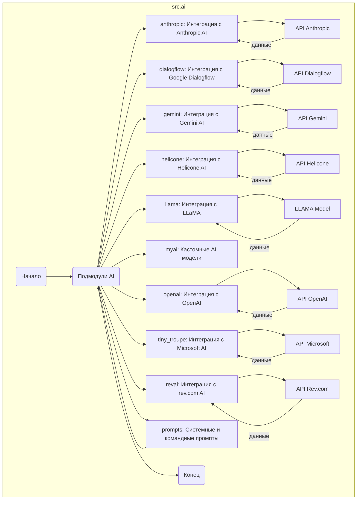

## Анализ модуля `src.ai`

### 1. <алгоритм>

Модуль `src.ai` представляет собой центральную точку для управления различными AI моделями и интеграциями. Он не содержит явного алгоритма в смысле последовательности действий, как в обычном коде, а скорее служит контейнером для организации и управления доступом к подмодулям, каждый из которых реализует интеграцию с определенным AI сервисом или моделью.

**Общая логика работы модуля `src.ai`:**

1.  **Организация подмодулей:**
    *   Модуль `src.ai` содержит поддиректории (подмодули) для каждой AI модели или сервиса, с которым он интегрируется (например, `anthropic`, `dialogflow`, `gemini`, `openai`, `llama` и т.д.).
2.  **Абстракция доступа к AI моделям:**
    *   Каждый подмодуль инкапсулирует логику взаимодействия с конкретным AI API или моделью.
    *   Подмодули предоставляют интерфейс для вызова функций, связанных с конкретной AI моделью, например, для выполнения генерации текста, обработки естественного языка, классификации и т.д.
3.  **Конфигурация и настройки:**
    *   Подмодули могут предоставлять средства для настройки параметров AI моделей, ключей API, и других параметров, необходимых для взаимодействия с AI сервисами.
4.  **Логика использования:**
    *   Внешние модули и приложения обращаются к функциям подмодулей `src.ai` для выполнения конкретных задач, связанных с ИИ.

**Примеры использования (для гипотетических подмодулей):**

*   **Модуль `openai`:**
    *   Приложение вызывает функцию `openai.generate_text(prompt, parameters)` для генерации текста на основе заданного запроса (`prompt`) и параметров.
    *   Функция `openai.generate_text()` использует API OpenAI для отправки запроса и получения ответа.
*   **Модуль `dialogflow`:**
    *   Приложение вызывает функцию `dialogflow.detect_intent(text, session_id)` для определения намерения пользователя из введенного текста.
    *   Функция `dialogflow.detect_intent()` использует API Google Dialogflow для анализа текста и определения намерения.
*   **Модуль `llama`:**
    *   Приложение вызывает `llama.process_text(text)` для обработки текста через LLaMA модель.

**Поток данных:**

1.  Приложение вызывает функцию из одного из подмодулей, например, `src.ai.openai.generate_text()`.
2.  Подмодуль `openai` принимает запрос и параметры.
3.  Подмодуль отправляет запрос в API OpenAI.
4.  API OpenAI обрабатывает запрос и возвращает результат.
5.  Подмодуль `openai` возвращает результат в вызывающее приложение.

### 2. <mermaid>

**Анализ `mermaid` диаграммы:**

1.  **`src.ai`:**
    *   Это контейнер для всех подмодулей, отвечающих за интеграцию с различными AI моделями и сервисами.
2.  **Подмодули:**
    *   `Anthropic`, `Dialogflow`, `Gemini`, `Helicone`, `Llama`, `Myai`, `Openai`, `TinyTroupe`, `Revai`  - Каждый из этих подмодулей отвечает за взаимодействие с соответствующей AI моделью или сервисом.
    *   `Prompts` -  хранит системные и командные промпты в формате markdown для AI моделей
3.  **Внешние API (Ext_API):**
    *   `API Anthropic`, `API Dialogflow`, `API Gemini`, `API Helicone`, `API OpenAI`, `API Microsoft`, `API Rev.com`  - представляют собой внешние API, с которыми взаимодействуют соответствующие подмодули.
    *   `LLAMA Model` -  представляет модель LLaMA
4. **Поток данных:**
    *   Стрелки указывают на взаимодействие между подмодулями и внешними API, а также на поток данных между ними.

Диаграмма наглядно показывает структуру модуля `src.ai` и его связь с различными внешними AI сервисами. Все имена переменных и блоков являются осмысленными и описательными.

### 3. <объяснение>

**Импорты:**

*   В представленном описании модуля `src.ai` нет явных импортов. Это говорит о том, что модуль `src.ai` является родительским и не зависит от других модулей напрямую. Каждый подмодуль (например, `anthropic`, `openai`) имеет свои собственные импорты, которые не видны на уровне `src.ai`.

**Структура модуля:**

*   Модуль `src.ai` действует как агрегатор подмодулей, каждый из которых реализует специфическую функциональность взаимодействия с конкретным AI сервисом или моделью.
*   Каждый подмодуль (например, `src.ai.openai`, `src.ai.dialogflow` и т.д.) скорее всего, содержит классы и функции, необходимые для работы с соответствующим API или моделью.

**Подмодули:**

*   **`anthropic`:** Предоставляет интерфейс для работы с моделями Anthropic AI. Это включает в себя, скорее всего, функции для генерации текста, ответа на вопросы и других задач, связанных с обработкой естественного языка.
*   **`dialogflow`:** Интеграция с Google Dialogflow для разработки диалоговых систем. Вероятно, содержит функции для определения намерения пользователя, извлечения сущностей и управления диалогом.
*   **`gemini`:** Интерфейс для работы с моделями Gemini AI, обеспечивая функции, аналогичные `anthropic` и `openai`.
*   **`helicone`:**  Соединение с моделями Helicone, что подразумевает специализированный функционал, скорее всего, связанный с кастомизацией AI решений.
*   **`llama`:** Обеспечивает работу с моделью LLaMA, предоставляя функции для обработки и генерации текста.
*   **`myai`:** Пользовательский подмодуль, который может содержать уникальные реализации и модели, не входящие в другие подмодули.
*   **`openai`:** Интеграция с API OpenAI, предоставляющая доступ к моделям GPT для генерации текста, классификации, перевода и т.д.
*   **`tiny_troupe`:** Интеграция с моделями Microsoft AI, вероятно, ориентированными на выполнение задач NLP и анализа данных с использованием оптимизированных моделей.
*   **`revai`:** Интеграция с rev.com, ориентированная на работу с аудиозаписями, такими как расшифровка встреч, конференций, звонков и т.д.
*    **`prompts`:**  Хранит системные и командные промпты в формате markdown для AI моделей.

**Общие замечания:**

*   **Централизованное управление AI:** Модуль `src.ai` централизует управление различными AI моделями, что упрощает их использование и переключение между ними.
*   **Абстракция API:** Каждый подмодуль абстрагирует детали взаимодействия с конкретным API, что позволяет разработчикам работать с AI моделями на более высоком уровне.
*   **Расширяемость:** Модуль `src.ai` легко расширяется добавлением новых подмодулей для интеграции с другими AI сервисами.

**Потенциальные области для улучшения:**

*   **Единый интерфейс:** Можно рассмотреть возможность создания единого интерфейса (например, абстрактного класса или интерфейса в стиле Go) для всех подмодулей, чтобы унифицировать их использование и упростить их замену.
*   **Обработка ошибок:** Каждый подмодуль должен обрабатывать ошибки, которые могут возникнуть при взаимодействии с внешними API (например, сетевые ошибки, ошибки авторизации).
*   **Кеширование:** Можно рассмотреть возможность кеширования результатов запросов к API, чтобы снизить нагрузку и ускорить работу.
*   **Асинхронность:**  Использование асинхронных вызовов к API может повысить производительность и отзывчивость приложения.

**Цепочка взаимосвязей:**

1.  **`src`:** Модуль `src.ai` является частью более крупного модуля `src`, который, вероятно, содержит другие подсистемы проекта.
2.  **Приложения:** Приложения, использующие AI, будут импортировать и использовать функциональность из соответствующих подмодулей в `src.ai`.
3.  **Внешние API:** Модуль `src.ai` взаимодействует с внешними API для реализации функциональности AI моделей.

**Заключение:**

Модуль `src.ai` является важной частью проекта, обеспечивающей интеграцию с различными AI сервисами. Структура с подмодулями делает его гибким и расширяемым, позволяя легко добавлять новые AI интеграции по мере необходимости.