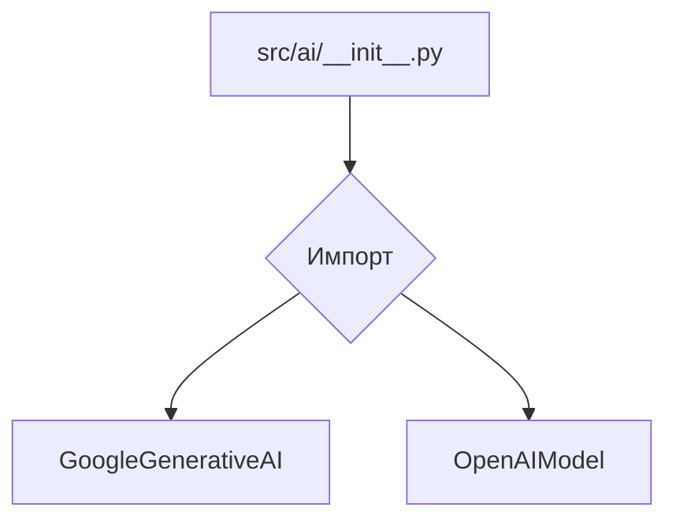
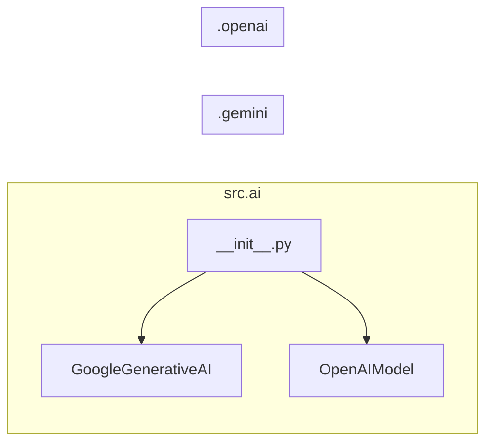

# <input code>

```python
## \file /src/ai/__init__.py
# -*- coding: utf-8 -*-
#! venv/Scripts/python.exe
#! venv/bin/python/python3.12

"""
module: src.ai
	:platform: Windows, Unix
	:synopsis: Модуль интерфейса моделей ИИ.
	"""
MODE = 'dev'

from .gemini import GoogleGenerativeAI
from .openai import OpenAIModel
```

# <algorithm>

Алгоритм работы данного файла сводится к импорту модулей, определяющих интерфейсы к моделям ИИ, таких как Google Generative AI и OpenAI.  Внутри `__init__.py` файла нет сложных алгоритмов.

**Блок-схема:**



**Примеры данных:**

- При импорте `from .gemini import GoogleGenerativeAI`, переменная `GoogleGenerativeAI` будет содержать ссылку на класс из модуля `gemini.py`, находящегося в том же каталоге, что и `__init__.py`.
- Аналогично, `OpenAIModel` будет содержать ссылку на класс из модуля `openai.py`.


# <mermaid>



# <explanation>

**Импорты:**

Файл `src/ai/__init__.py` — это инициализирующий файл для пакета `ai`.  Он содержит импорты, которые позволяют использовать классы моделей ИИ, определённые в подмодулях `gemini` и `openai`. Импорт `from .gemini import GoogleGenerativeAI` указывает на то, что класс `GoogleGenerativeAI` расположен в подпапке `gemini` текущего проекта.  Аналогично с импортом `from .openai import OpenAIModel`.  Это типичная структура для организации кода в Python пакетах.


**Классы:**

Этот файл не содержит определения каких-либо классов.  Он только импортирует классы из модулей `gemini.py` и `openai.py`, которые предположительно содержат реализации классов, предоставляющих интерфейсы к моделям Google Generative AI и OpenAI соответственно.  


**Функции:**

Нет функций в данном файле.


**Переменные:**

`MODE = 'dev'` — переменная, определяющая режим работы. Вероятно, она используется для выбора различных конфигураций (например, в `dev`-режиме используются другие настройки).


**Возможные ошибки или области для улучшений:**

- Отсутствие документации внутри файла.  Добавление более подробных комментариев, поясняющих назначение переменных и импортов, существенно улучшит читаемость и понимание кода.
- Отсутствие проверки на существование импортируемых файлов.  В случае отсутствия  модулей `gemini` и `openai`, код будет вызывать ошибку. Добавление проверки (например, с помощью `try...except`) улучшит надёжность кода.


**Цепочка взаимосвязей:**

Инициализирующий файл `src/ai/__init__.py` является частью пакета `src/ai`.  Этот пакет, скорее всего, отвечает за взаимодействие с различными моделями ИИ.  Другие части проекта могут использовать классы, импортированные из `src/ai/__init__.py` для взаимодействия с выбранной моделью ИИ, например, для получения ответов от модели или генерации текста. Подмодули `gemini` и `openai` скорее всего содержат реализацию работы с API соответствующих моделей.