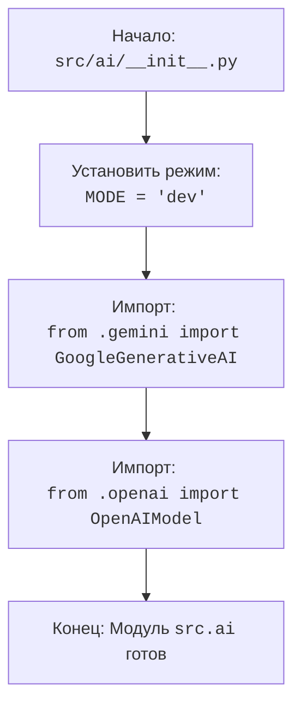

## АНАЛИЗ КОДА: `hypotez/src/ai/__init__.py`

### <алгоритм>

1. **Начало**: Инициализация модуля `src.ai`.
2. **Установка режима**: Установка переменной `MODE` в значение `'dev'`.
    - *Пример*:  `MODE = 'dev'` указывает, что модуль работает в режиме разработки.
3. **Импорт моделей ИИ**: Импорт классов `GoogleGenerativeAI` из модуля `gemini` и `OpenAIModel` из модуля `openai`.
    - *Пример*: `from .gemini import GoogleGenerativeAI` - импорт класса для работы с моделью Google Gemini.
    - *Пример*: `from .openai import OpenAIModel` - импорт класса для работы с моделью OpenAI.
4. **Завершение**: Модуль `src.ai` готов к использованию, предоставляя интерфейсы для различных моделей ИИ.

### <mermaid>

### <объяснение>

#### Импорты
- `from .gemini import GoogleGenerativeAI`: Импортирует класс `GoogleGenerativeAI` из модуля `gemini`, находящегося в том же пакете `src.ai`. Этот класс, предположительно, предоставляет интерфейс для взаимодействия с моделями Google Gemini. Этот импорт позволяет использовать функциональность, связанную с Google Gemini, в текущем модуле.
- `from .openai import OpenAIModel`: Импортирует класс `OpenAIModel` из модуля `openai`, находящегося в том же пакете `src.ai`. Этот класс, вероятно, предоставляет интерфейс для взаимодействия с моделями OpenAI. Этот импорт позволяет использовать функциональность, связанную с OpenAI, в текущем модуле.

#### Переменные
- `MODE = 'dev'`: Глобальная переменная, определяющая режим работы модуля. В данном случае, установлена в режим разработки (`dev`). Эта переменная может использоваться для изменения поведения кода в зависимости от текущей среды.

#### Общее описание
Файл `__init__.py` в пакете `src.ai` служит для инициализации этого пакета, делая его модулем. Основная функция этого модуля - предоставление интерфейсов для различных моделей ИИ. В данном случае, модуль импортирует и предоставляет доступ к классам для работы с моделями Google Gemini и OpenAI.
- Он устанавливает глобальный режим `MODE` в `'dev'`, что говорит о работе в режиме разработки.
- Использование `from .gemini` и `from .openai` указывает на то, что модули `gemini` и `openai` находятся в том же каталоге что и `__init__.py` (то есть, `src/ai`).
- Импортированные классы `GoogleGenerativeAI` и `OpenAIModel` вероятно являются основными точками входа для работы с соответствующими моделями ИИ.

#### Потенциальные улучшения

-   **Конфигурация режима**: Вместо жесткой установки `MODE = 'dev'`,  можно добавить механизм для изменения режима через переменные окружения или файл конфигурации. Это сделает систему более гибкой.
-   **Обработка ошибок**: На данном уровне импорты не обрабатывают возможные ошибки. В производственной среде необходимо добавить обработку `ImportError` или других исключений, чтобы предотвратить сбои приложения.
-   **Типизация**: Добавление аннотации типов для переменных и функций улучшит читаемость и поддерживаемость кода.

#### Цепочка взаимосвязей
Модуль `src.ai` является ключевым в структуре проекта, поскольку он обеспечивает интерфейс для работы с различными моделями ИИ.  
- Модуль `gemini` и `openai` внутри `src.ai`  предоставляют конкретные реализации интерфейсов для работы с моделями Google Gemini и OpenAI соответственно.
- Остальные части проекта, использующие ИИ, будут импортировать `GoogleGenerativeAI` или `OpenAIModel` из `src.ai` для выполнения задач, связанных с ИИ.