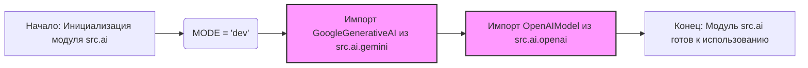

## Анализ кода `src/ai/__init__.py`

### <алгоритм>
1. **Начало**: Инициализация модуля `src.ai`.
   * Пример: Загрузка модуля при импорте `from src import ai`.
2. **Установка режима `MODE`**: Задание режима работы модуля. В данном случае, установлен режим `dev`.
   * Пример: Переменная `MODE` получает значение 'dev'.
3. **Импорт `GoogleGenerativeAI`**: Импорт класса `GoogleGenerativeAI` из модуля `src.ai.gemini`.
   * Пример: `GoogleGenerativeAI` используется для создания экземпляра модели Gemini.
4. **Импорт `OpenAIModel`**: Импорт класса `OpenAIModel` из модуля `src.ai.openai`.
   * Пример: `OpenAIModel` используется для создания экземпляра модели OpenAI.
5. **Конец**: Модуль `src.ai` готов к использованию, предоставляя классы `GoogleGenerativeAI` и `OpenAIModel` для взаимодействия с моделями ИИ.

### <mermaid>

**Объяснение зависимостей `mermaid`:**

- `graph LR`: Определяет тип диаграммы как направленный граф, идущий слева направо.
- `A`, `B`, `C`, `D`, `E`: Узлы графа, представляющие шаги процесса.
- `-->`: Обозначает направленные связи между шагами.
- `classDef import fill:#f9f,stroke:#333,stroke-width:2px`: Задает стиль для классов, которые представляют импорт.
- `class C,D import`: Применяет стиль `import` к узлам `C` и `D`.

**Анализ:**

- Диаграмма показывает последовательность действий при инициализации модуля `src.ai`.
- Сначала устанавливается режим `MODE`, затем импортируются классы `GoogleGenerativeAI` и `OpenAIModel`.
- Все узлы имеют осмысленные и описательные имена.

### <объяснение>

**Импорты:**
- `from .gemini import GoogleGenerativeAI`:
    -  Импортирует класс `GoogleGenerativeAI` из подмодуля `gemini` внутри пакета `src.ai`. 
    - `GoogleGenerativeAI` вероятно предназначен для взаимодействия с моделями Google Gemini.
    - Это позволяет использовать функционал Gemini через этот класс в других частях проекта.
- `from .openai import OpenAIModel`:
    -  Импортирует класс `OpenAIModel` из подмодуля `openai` внутри пакета `src.ai`.
    - `OpenAIModel` вероятно предназначен для взаимодействия с моделями OpenAI.
    - Это позволяет использовать функционал OpenAI через этот класс в других частях проекта.

**Переменные:**
- `MODE = 'dev'`:
    -  Глобальная строковая переменная, устанавливающая режим работы модуля.
    -  В данном случае, установлен режим разработки (`dev`). 
    -  Может использоваться для управления поведением модуля, например, при выборе моделей или подключении к определенным сервисам.

**Цепочка взаимосвязей:**
- Модуль `src.ai` выступает в роли интерфейса к моделям ИИ, предоставляя классы `GoogleGenerativeAI` и `OpenAIModel`.
- Подмодули `gemini` и `openai` предположительно содержат детали реализации взаимодействия с соответствующими API моделей.
-  Другие части проекта (например, модули, отвечающие за обработку данных или пользовательский интерфейс) могут импортировать `GoogleGenerativeAI` и `OpenAIModel` для использования моделей ИИ.
-  Переменная `MODE` может влиять на то, какие настройки или модели будут использованы в этих классах.

**Потенциальные ошибки и области для улучшения:**
- В настоящее время жестко задан режим `'dev'`. Возможно, следует реализовать механизм конфигурации для выбора режима работы (например, через переменные окружения или файлы конфигурации).
- Отсутствует обработка ошибок импорта. В случае проблем с импортом `GoogleGenerativeAI` или `OpenAIModel`, модуль может не работать должным образом.
- Было бы полезно добавить документацию, описывающую назначение каждого класса и их методы.
- Хорошей практикой было бы добавить явный импорт `os` для управления режимами отладки.