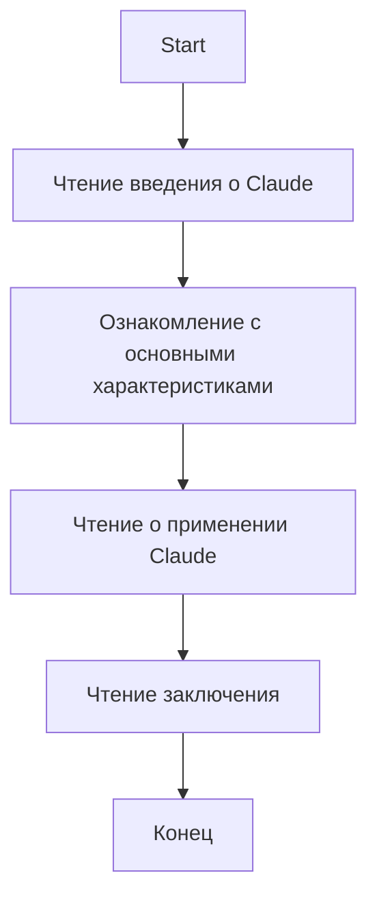

## АНАЛИЗ КОДА: hypotez/src/ai/anthropic/about.ru.md

### 1. <алгоритм>

Этот файл не содержит исполняемого кода, а представляет собой markdown-документ с описанием модели Claude от Anthropic. Алгоритмической блок-схемы для данного файла не требуется. Однако, мы можем представить процесс чтения и понимания данного документа пользователем:

1. **Начало:** Пользователь открывает `about.ru.md`.
2. **Чтение введения:** Пользователь читает вводный абзац, узнавая, что Claude — это семейство языковых моделей от Anthropic, предназначенных для обработки естественного языка.
3. **Ознакомление с основными характеристиками:** Пользователь читает раздел с основными характеристиками, включая:
    * Мощные языковые модели.
    * Гибкость и адаптивность.
    * Поддержку множества языков.
    * Безопасность и этику.
    * Интеграцию с другими инструментами.
4. **Чтение о применении Claude:** Пользователь изучает примеры применения Claude:
    * Генерация текста.
    * Анализ тональности.
    * Перевод.
    * Чат-боты и голосовые ассистенты.
    * Обработка данных.
5. **Чтение заключения:** Пользователь читает заключительный абзац, подводящий итог возможностям и преимуществам Claude.
6. **Конец:** Пользователь завершает чтение и понимание документа.

### 2. <mermaid>

Поскольку данный файл является markdown-документом и не содержит исполняемого кода, диаграмму `mermaid` строить не требуется. Файл содержит информацию о модели Claude и не подразумевает никаких программных зависимостей.

*   **Start**: Начало процесса чтения и понимания markdown-файла.
*   **ReadIntroduction**: Блок представляет чтение вводной части документа, где дается общая информация о Claude.
*   **ReadFeatures**: Блок представляет этап ознакомления с основными характеристиками модели Claude.
*   **ReadApplications**: Блок представляет этап изучения примеров применения модели Claude.
*   **ReadConclusion**: Блок представляет чтение заключительной части документа, подводящей итог.
*   **End**: Завершение процесса чтения и понимания документа.

### 3. <объяснение>

**Импорты:**
Поскольку это файл markdown, в нем нет импортов.

**Классы:**
В файле нет определений классов.

**Функции:**
В файле нет определений функций.

**Переменные:**
В файле нет переменных, используемых в программном коде. Все содержимое файла – это статический текст.

**Объяснение:**

Файл `about.ru.md` – это документация в формате Markdown, описывающая языковую модель Claude от компании Anthropic. Он предназначен для предоставления информации о возможностях, характеристиках и применении этой модели. Структура файла:

1.  **Введение:** Представляет общую информацию о Claude, его предназначении и целях.
2.  **Основные характеристики:**
    *   **Мощные языковые модели:** Описывается архитектура и возможности модели в обработке и генерации текста.
    *   **Гибкость и адаптивность:** Указывается на возможность настройки модели для различных задач и областей.
    *   **Поддержка множества языков:** Подчеркивается многоязычность модели.
    *   **Безопасность и этика:** Упоминается о принципах ответственного использования ИИ при разработке Claude.
    *   **Интеграция с другими инструментами:** Описывается возможность интеграции Claude с другими сервисами.
3.  **Применение Claude:** Рассматриваются примеры практического применения модели:
    *   Генерация текста.
    *   Анализ тональности.
    *   Перевод.
    *   Чат-боты и голосовые ассистенты.
    *   Обработка данных.
4.  **Заключение:** Подводится итог возможностям и преимуществам модели Claude.

**Взаимосвязь с другими частями проекта:**
Так как этот файл является документацией, он не имеет прямой связи с исполняемым кодом проекта. Он, скорее, служит для описания функциональности и возможностей, которые могут быть реализованы в других частях проекта.

**Потенциальные ошибки или области для улучшения:**

*   **Актуальность:** Информация в файле должна поддерживаться в актуальном состоянии, чтобы отражать последние изменения в модели Claude.
*   **Подробность:** Можно добавить больше технических деталей, ссылок на документацию или примеры кода для более глубокого понимания.

**Заключение:**

`about.ru.md` является важным элементом документации проекта, предоставляя пользователям информацию о языковой модели Claude. Файл четко структурирован и легко читается, но требует регулярного обновления и возможного расширения для более подробного описания.