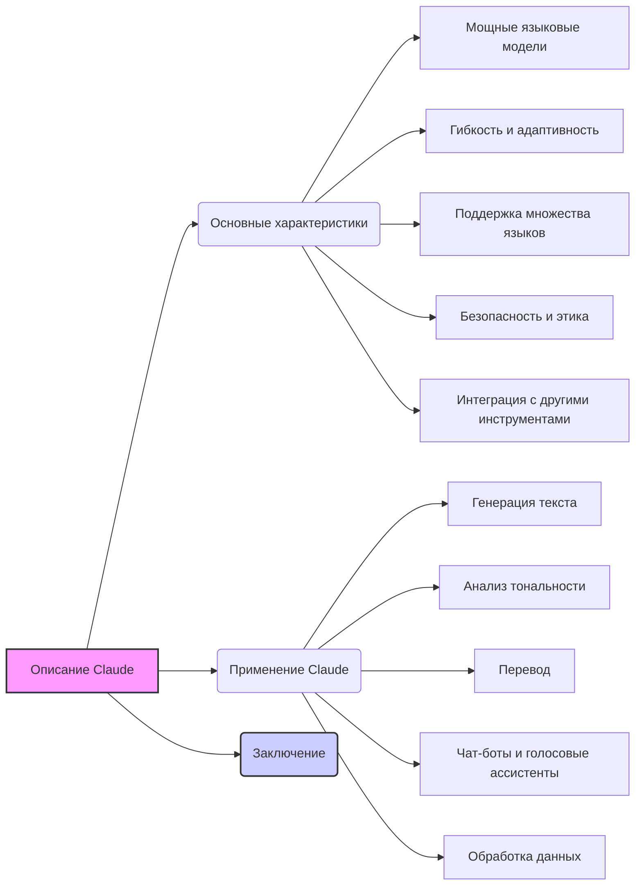

## Анализ кода: `hypotez/src/ai/anthropic/about.ru.md`

### <алгоритм>

1. **Начало**: Документ начинается с общего описания Claude от Anthropic, подчеркивая его назначение как семейства мощных языковых моделей для обработки естественного языка (NLP).
   *Пример: "Claude от Anthropic — это семейство мощных языковых моделей..."*

2. **Общие характеристики**: Описываются ключевые особенности Claude, включая мощные языковые модели, гибкость, адаптивность, поддержку нескольких языков, безопасность и интеграцию с другими инструментами.
    *Пример: "Мощные языковые модели: Claude основан на архитектуре, которая позволяет модели обрабатывать и генерировать текст с высокой точностью..."*

3.  **Применение Claude**: Рассматриваются различные способы использования Claude, такие как генерация текста, анализ тональности, перевод, создание чат-ботов и обработка данных.
    *Пример: "Генерация текста: Claude может использоваться для генерации текста, включая создание статей, отчетов, и других документов..."*

4. **Заключение**: Документ завершается кратким повторением основных преимуществ Claude и его надежности как инструмента для разработчиков и бизнеса.
    *Пример: "Claude от Anthropic — это мощный инструмент для решения задач, связанных с обработкой естественного языка..."*

### <mermaid>

**Зависимости:**

Диаграмма показывает логическую структуру документа `about.ru.md`, представляя иерархию информации о Claude. 
Начальный блок "Описание Claude" (A) является точкой входа, откуда информация разделяется на "Основные характеристики" (B) и "Применение Claude" (H). Далее, каждый из этих блоков подразделяется на более специфические детали, такие как "Мощные языковые модели" (C), "Генерация текста" (I) и т.д. Завершается все блоком "Заключение" (N).
Диаграмма показывает, что все характеристики и приложения вытекают из основного описания Claude, а заключение подводит итог.

### <объяснение>

**Импорты:**
В данном документе импорты не применяются, так как это Markdown файл, а не программный код. Он представляет собой текстовое описание.

**Классы:**
Классы также не используются, так как это текстовый документ.

**Функции:**
Функции также не применяются, так как это текстовый документ.

**Переменные:**
Переменные не применяются, так как это текстовый документ.

**Детальное объяснение:**

- Файл `about.ru.md` представляет собой описание языковой модели Claude от Anthropic на русском языке.
- **Основные характеристики:** Раздел выделяет ключевые особенности модели:
    - **Мощные языковые модели**: Claude использует передовую архитектуру для генерации и обработки текста с высокой точностью.
    - **Гибкость и адаптивность**: Модель настраиваема для различных задач и может интегрироваться в различные платформы.
    - **Поддержка множества языков**: Claude поддерживает несколько языков, что делает его пригодным для глобальных приложений.
    - **Безопасность и этика**: Anthropic придает большое значение этическому и безопасному использованию ИИ.
    - **Интеграция с другими инструментами**: Claude легко интегрируется с различными сервисами и платформами (Google Cloud, AWS и другие).
- **Применение Claude**: Раздел описывает основные сценарии использования модели:
    - **Генерация текста**: Создание текстов, статей, отчетов и рекламных материалов.
    - **Анализ тональности**: Определение эмоционального окраса текста.
    - **Перевод**: Перевод текста с одного языка на другой.
    - **Чат-боты и голосовые ассистенты**: Создание интерфейсов для взаимодействия с пользователями.
    - **Обработка данных**: Анализ больших объемов текстовых данных.
- **Заключение**: Подводит итог, подчеркивая надежность и универсальность Claude для разработчиков и бизнеса.

**Потенциальные ошибки и области для улучшения:**
- **Нет интерактивности**: Так как это текстовый файл, нет возможности взаимодействовать с моделью напрямую.
- **Отсутствие технических деталей**: Описание нацелено на общую аудиторию и не содержит детальных технических характеристик.
- **Может быть дополнено примерами**: Раздел с примерами использования мог бы сделать материал более наглядным и понятным.

**Взаимосвязь с другими частями проекта:**
Файл `about.ru.md` представляет собой часть документации о Claude в проекте `hypotez`. Он дополняет другие файлы, содержащие информацию о Claude, и может использоваться для ознакомления пользователей с возможностями и характеристиками модели.