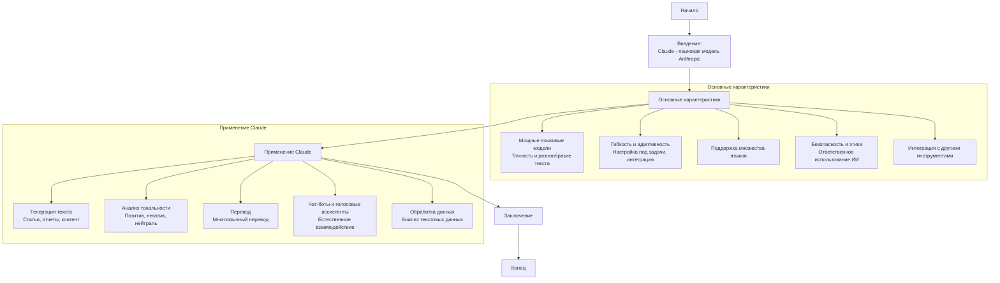

## Анализ кода

### <алгоритм>

Этот код представляет собой markdown документ, описывающий языковую модель Claude от компании Anthropic. Здесь нет исполняемого кода, поэтому анализ сводится к разбору содержания и его логической структуры.

1.  **Введение:**
    *   Документ начинается с вводной информации о том, что Claude — это семейство языковых моделей от Anthropic.
    *   Упоминается, что модели предназначены для задач обработки естественного языка (NLP).

2.  **Основные характеристики:**
    *   Этот раздел описывает ключевые особенности моделей Claude:
        *   **Мощные языковые модели:**  Утверждается, что Claude основан на архитектуре, обеспечивающей высокую точность генерации текста.
        *   **Гибкость и адаптивность:**  Подчеркивается, что модели могут настраиваться под конкретные задачи и интегрироваться в различные системы.
        *   **Поддержка множества языков:**  Отмечается мультиязычность Claude.
        *   **Безопасность и этика:**  Упоминается, что Anthropic придает большое значение этике и безопасности при разработке моделей.
        *   **Интеграция с другими инструментами:**  Описана возможность интеграции Claude с облачными платформами.

3.  **Применение Claude:**
    *   Этот раздел описывает конкретные применения моделей Claude:
        *   **Генерация текста:**  Использование для создания статей, отчетов, маркетингового контента.
        *   **Анализ тональности:**  Возможность анализа текста для определения тональности.
        *   **Перевод:**  Использование для перевода текста между языками.
        *   **Чат-боты и голосовые ассистенты:**  Интеграция для создания интерактивных интерфейсов.
        *   **Обработка данных:**  Применение для анализа больших объемов текстовых данных.

4.  **Заключение:**
    *   Документ заканчивается кратким обобщением, подчеркивающим мощь, гибкость и надежность Claude.

### <mermaid>

**Анализ зависимостей:**

Диаграмма `mermaid` представляет собой блок-схему, описывающую логическую структуру текста. Она показывает последовательность разделов документа.

*   **Start**: Начальная точка документа.
*   **Introduction**: Вводная часть, описывающая Claude.
*   **Features**: Раздел, описывающий основные характеристики модели.
    *   **PowerfulModels**: Описывает мощные языковые возможности.
    *   **Flexibility**: Описывает гибкость и адаптивность.
    *   **Multilingual**: Описывает поддержку нескольких языков.
    *   **Ethics**: Подчеркивает аспекты безопасности и этики.
    *   **Integration**: Описывает интеграционные возможности.
*   **Applications**: Раздел, описывающий конкретные применения.
    *   **TextGeneration**: Описывает применение для генерации текста.
    *   **SentimentAnalysis**: Описывает применение для анализа тональности.
    *   **Translation**: Описывает применение для перевода.
    *   **Chatbots**: Описывает применение для создания чат-ботов.
    *   **DataProcessing**: Описывает применение для обработки данных.
*   **Conclusion**: Заключительная часть.
*   **End**: Конечная точка документа.

### <объяснение>

Этот документ является текстовым описанием языковой модели Claude от Anthropic. Он не содержит исполняемого кода, поэтому мы не анализируем импорты, классы, функции и переменные в обычном понимании. Вместо этого мы сосредоточимся на логической структуре и содержании документа.

*   **Импорты**: Отсутствуют, так как это markdown документ.
*   **Классы**: Отсутствуют, так как это markdown документ.
*   **Функции**: Отсутствуют, так как это markdown документ.
*   **Переменные**: Отсутствуют, так как это markdown документ.
* **Логическая структура**:
    *   Документ четко структурирован, начиная с введения, переходя к описанию характеристик и применений, и заканчивая заключением.
    *   Основные разделы и подразделы выделены для лучшего понимания.

**Потенциальные ошибки или области для улучшения**:

*   **Глубина деталей**: Описание применения и характеристик можно было бы углубить, предоставляя более технические детали (например, архитектура модели, метрики производительности), если это было бы целесообразно для целевой аудитории.
*   **Ссылки и ресурсы**: Добавление ссылок на официальную документацию Anthropic или другие ресурсы могло бы быть полезным для заинтересованных читателей.
*   **Визуализация**: Добавление визуальных элементов (диаграмм, схем) могло бы сделать информацию более наглядной.

**Взаимосвязь с другими частями проекта**:

Этот файл (`about.ru.md`) скорее всего используется как часть документации или информационного раздела в проекте, где используется или обсуждается модель Claude. Он может быть связан с файлами конфигурации, где прописаны параметры для API вызовов к Claude, или с файлами, где реализованы функции работы с Claude. Этот файл служит для представления общей информации о модели Claude, чтобы другие части проекта могли использовать эту информацию для своих задач.