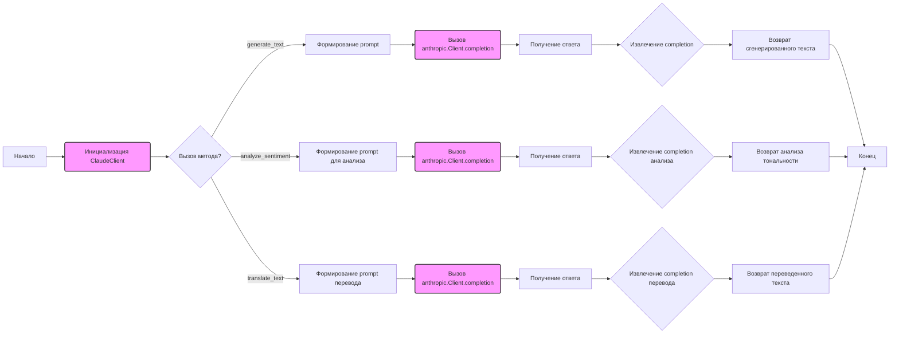

## <алгоритм>

1.  **Инициализация `ClaudeClient`:**
    *   При создании экземпляра `ClaudeClient` (например, `claude_client = ClaudeClient(api_key)`), вызывается метод `__init__`.
    *   Метод `__init__` принимает `api_key` и создает клиент `anthropic.Client` (пример: `self.client = anthropic.Client(api_key)`).
    *   `api_key` используется для аутентификации при обращении к API Anthropic.

2.  **Генерация текста (`generate_text`)**:
    *   Метод `generate_text` принимает `prompt` (текст запроса) и `max_tokens_to_sample` (максимальное количество токенов для генерации). Пример: `generated_text = claude_client.generate_text("Write a short story about a robot learning to love.", max_tokens_to_sample=150)`.
    *   Вызывает метод `completion` клиента `anthropic.Client`, передавая `prompt`, модель "claude-v1", `max_tokens_to_sample` и стоп-последовательность `"\\n\\nHuman:"`.
    *   Получает `response` от API.
    *   Извлекает сгенерированный текст из `response['completion']` и возвращает его.

3.  **Анализ тональности (`analyze_sentiment`)**:
    *   Метод `analyze_sentiment` принимает `text` (текст для анализа). Пример: `sentiment_analysis = claude_client.analyze_sentiment("I am very happy today!")`.
    *   Формирует `prompt` для анализа тональности, добавляя префикс "Analyze the sentiment of the following text: ".
    *   Вызывает метод `completion` клиента `anthropic.Client`, передавая сформированный `prompt`, модель "claude-v1", `max_tokens_to_sample=50` и стоп-последовательность `"\\n\\nHuman:"`.
    *   Получает `response` от API.
    *   Извлекает результат анализа тональности из `response['completion']` и возвращает его.

4.  **Перевод текста (`translate_text`)**:
    *   Метод `translate_text` принимает `text` (текст для перевода), `source_language` (исходный язык) и `target_language` (целевой язык). Пример: `translated_text = claude_client.translate_text("Hello, how are you?", "en", "es")`.
    *   Формирует `prompt` для перевода, добавляя префикс "Translate the following text from {source_language} to {target_language}: ".
    *   Вызывает метод `completion` клиента `anthropic.Client`, передавая сформированный `prompt`, модель "claude-v1", `max_tokens_to_sample=100` и стоп-последовательность `"\\n\\nHuman:"`.
    *   Получает `response` от API.
    *   Извлекает переведенный текст из `response['completion']` и возвращает его.

5.  **Пример использования (блок `if __name__ == "__main__":`)**:
    *   Устанавливает `api_key`.
    *   Создает экземпляр `ClaudeClient` (пример: `claude_client = ClaudeClient(api_key)`).
    *   Вызывает метод `generate_text` для генерации текста.
    *   Вызывает метод `analyze_sentiment` для анализа тональности.
    *   Вызывает метод `translate_text` для перевода текста.
    *   Выводит результаты на консоль.

## <mermaid>

**Объяснение `mermaid`:**

*   **`graph LR`**:  Указывает, что это ориентированный граф, где стрелки идут слева направо.
*   **`A[Начало]`**, **`S[Конец]`**: Начало и конец процесса.
*   **`B(Инициализация ClaudeClient)`**:  Создание экземпляра класса `ClaudeClient`, что включает инициализацию клиента `anthropic.Client`.
*   **`C{Вызов метода?}`**: Условный блок, представляющий выбор одного из методов `generate_text`, `analyze_sentiment`, или `translate_text`.
*   **`D[Формирование prompt]`**, **`I[Формирование prompt для анализа]`**, **`N[Формирование prompt перевода]`**:  Создание строк запросов для каждого метода.
*   **`E(Вызов anthropic.Client.completion)`**, **`J(Вызов anthropic.Client.completion)`**, **`O(Вызов anthropic.Client.completion)`**: Вызов API Anthropic для получения ответа.
*    **`F[Получение ответа]`**, **`K[Получение ответа]`**, **`P[Получение ответа]`**: Получение ответа от API в виде JSON.
*   **`G{Извлечение completion}`**, **`L{Извлечение completion анализа}`**, **`Q{Извлечение completion перевода}`**: Извлечение текста (`completion`) из ответа API.
*   **`H[Возврат сгенерированного текста]`**, **`M[Возврат анализа тональности]`**, **`R[Возврат переведенного текста]`**:  Возврат результата работы каждого из методов.
*   **`classDef classFill fill:#f9f,stroke:#333,stroke-width:2px`**: Определение стиля заливки для некоторых блоков (в данном случае, инициализация и вызов API).
*   **`class B,E,J,O classFill`**: Применение стиля к блокам `B`, `E`, `J`, и `O`.

**Зависимости**:
    *   Диаграмма показывает поток выполнения программы, начиная с инициализации клиента,  и заканчивая возвратом результата. Она также отображает взаимосвязь между вызовами API и обработкой ответов.
    *    Используются стрелки для визуализации потока данных и контроля, что делает понимание логики приложения более наглядным.
    *    Зависимость от `anthropic` модуля для связи с API.
## <объяснение>

**Импорты:**

*   `import anthropic`: Импортируется библиотека `anthropic`, которая предоставляет интерфейс для работы с API Anthropic. Эта библиотека необходима для взаимодействия с моделями Claude.
    *   **Взаимосвязь с `src.`**: Так как этот файл находится в `src/ai/anthropic/claude.py`, все импорты внутри него  являются относительно `src`.  Библиотека `anthropic` обычно устанавливается отдельно и не является частью проекта `src` .

**Классы:**

*   **`ClaudeClient`**:
    *   **Роль**: Класс `ClaudeClient` является оберткой над клиентом `anthropic.Client`, предоставляя удобный интерфейс для генерации текста, анализа тональности и перевода текста с использованием моделей Claude.
    *   **Атрибуты**:
        *   `self.client`: Экземпляр класса `anthropic.Client`, используемый для отправки запросов к API.
    *   **Методы**:
        *   `__init__(self, api_key)`: Конструктор класса, инициализирующий клиента `anthropic.Client` с заданным API-ключом.
        *   `generate_text(self, prompt, max_tokens_to_sample=100)`: Метод для генерации текста на основе заданного запроса.
        *   `analyze_sentiment(self, text)`: Метод для анализа тональности текста.
        *   `translate_text(self, text, source_language, target_language)`: Метод для перевода текста с одного языка на другой.
    *   **Взаимодействие**: Класс `ClaudeClient` взаимодействует с библиотекой `anthropic` для отправки запросов к API и обработки ответов.

**Функции:**

*   `__init__(self, api_key)`:
    *   **Аргументы**:
        *   `api_key` (str): API-ключ для аутентификации при обращении к API Anthropic.
    *   **Возвращаемое значение**: Нет.
    *   **Назначение**: Инициализирует экземпляр класса `ClaudeClient`, создавая клиент `anthropic.Client` для работы с API.
    *   **Пример**: `client = ClaudeClient(api_key="your_api_key")`
*   `generate_text(self, prompt, max_tokens_to_sample=100)`:
    *   **Аргументы**:
        *   `prompt` (str): Текст запроса для генерации.
        *   `max_tokens_to_sample` (int, optional): Максимальное количество токенов для генерации (по умолчанию 100).
    *   **Возвращаемое значение**: `str`: Сгенерированный текст.
    *   **Назначение**: Отправляет запрос к API для генерации текста на основе заданного запроса.
    *   **Пример**: `text = client.generate_text(prompt="Write a poem about cats", max_tokens_to_sample=120)`
*   `analyze_sentiment(self, text)`:
    *   **Аргументы**:
        *   `text` (str): Текст для анализа тональности.
    *   **Возвращаемое значение**: `str`: Результат анализа тональности.
    *   **Назначение**: Отправляет запрос к API для анализа тональности заданного текста.
    *   **Пример**: `sentiment = client.analyze_sentiment(text="I am feeling happy")`
*   `translate_text(self, text, source_language, target_language)`:
    *   **Аргументы**:
        *   `text` (str): Текст для перевода.
        *   `source_language` (str): Код языка оригинала (например, "en" для английского).
        *   `target_language` (str): Код целевого языка (например, "es" для испанского).
    *   **Возвращаемое значение**: `str`: Переведенный текст.
    *   **Назначение**: Отправляет запрос к API для перевода текста с одного языка на другой.
    *   **Пример**: `translated_text = client.translate_text(text="Hello", source_language="en", target_language="fr")`

**Переменные:**

*   `MODE` (str): Переменная для определения режима работы. В данном случае имеет значение `'dev'`.
    *   **Использование**: В текущем коде не используется, но может быть использована для определения поведения программы в зависимости от режима работы (например, в development или production).
*    `api_key` (str): API-ключ для доступа к API Anthropic.
    *   **Использование**: Используется при создании экземпляра `ClaudeClient`. В коде есть комментарий "your-api-key", что является **потенциальной ошибкой**, т.к. пользователь должен заменить его на реальный ключ API.
*   `prompt` (str): Текст запроса для генерации текста.
    *   **Использование**: Используется в примере вызова метода `generate_text`.
*   `generated_text` (str): Сгенерированный текст.
    *    **Использование**: Используется для хранения и вывода результата генерации текста.
*   `text_to_analyze` (str): Текст для анализа тональности.
    *    **Использование**: Используется в примере вызова метода `analyze_sentiment`.
*    `sentiment_analysis` (str): Результат анализа тональности.
     *   **Использование**: Используется для хранения и вывода результата анализа тональности.
*   `text_to_translate` (str): Текст для перевода.
    *   **Использование**: Используется в примере вызова метода `translate_text`.
*    `source_language` (str): Исходный язык для перевода.
    *    **Использование**: Используется в примере вызова метода `translate_text`.
*   `target_language` (str): Целевой язык для перевода.
    *    **Использование**: Используется в примере вызова метода `translate_text`.
*   `translated_text` (str): Переведенный текст.
    *    **Использование**: Используется для хранения и вывода результата перевода текста.

**Потенциальные ошибки и области для улучшения:**

*   **Жестко заданный API-ключ**: Ключ `api_key` задан в коде как `"your-api-key"`, что является **потенциальной ошибкой безопасности**. API-ключи не должны храниться в коде и должны быть получены из переменных окружения или конфигурационного файла.
*   **Обработка ошибок**: Код не обрабатывает возможные ошибки при обращении к API (например, сетевые ошибки, ошибки аутентификации). Необходимо добавить обработку исключений.
*   **Конфигурация**: Параметры модели (`model="claude-v1"`) и `max_tokens_to_sample` заданы жестко. Их можно вынести в конфигурацию, чтобы сделать код более гибким.
*   **Отсутствие документации**:  Хотя в коде есть docstrings, для некоторых важных параметров можно добавить дополнительную документацию.
*   **Неиспользуемая переменная `MODE`**: Переменная `MODE` определена, но нигде не используется. Это может быть упущением или предполагается для дальнейшего использования.
*   **Типизация**: Отсутствие явной типизации усложняет чтение кода.

**Взаимосвязь с другими частями проекта:**

*   Этот модуль предназначен для интеграции с моделями Anthropic Claude. Он может использоваться в других частях проекта, где требуется генерация текста, анализ тональности или перевод.
*    Этот модуль может быть импортирован другими модулями проекта (например `src.controllers`), где требуется использовать функциональность Claude API.
*   Зависит от установленного пакета `anthropic`.
*    Переменная `MODE` может в будущем использоваться для настройки окружения.

**Цепочка взаимосвязей:**

1.  Другие модули проекта (например, `src.controllers`) могут импортировать `ClaudeClient` из `src.ai.anthropic.claude`.
2.  Экземпляр `ClaudeClient` используется для отправки запросов к API Anthropic через библиотеку `anthropic`.
3.  API Anthropic возвращает ответы, которые обрабатываются `ClaudeClient` и возвращаются вызывающему коду.
4.  Вызывающий код (например, контроллер) использует возвращенные данные для дальнейшей обработки или представления пользователю.